# DDD学习指南

> 基于《DDD实战课》和《DDD微服务落地实战》两个专栏内容整理

## 目录

1. [DDD学习路线图](#1-ddd学习路线图)
2. [DDD学习的重点和难点](#2-ddd学习的重点和难点)
3. [DDD适合的场景](#3-ddd适合的场景)
4. [如何进行实战](#4-如何进行实战)
5. [DDD如何进行中台构建和设计](#5-ddd如何进行中台构建和设计)
6. [精华图片和精炼总结](#6-精华图片和精炼总结)

---

## 博客来源说明

本文档整合了两个DDD相关专栏的内容：

- **博客1（DDD实战课）**：作者欧创新，共22讲，侧重DDD战略设计、中台业务建模、事件风暴等领域建模方法
  - 来源：https://learn.lianglianglee.com/专栏/DDD实战课/
  
- **博客2（DDD微服务落地实战）**：作者范钢，共18讲，侧重DDD战术设计、技术中台、代码落地等实践方法
  - 来源：https://learn.lianglianglee.com/专栏/DDD%20微服务落地实战/

文档中会标注内容来源，帮助读者理解不同视角的DDD实践。

---

## 1. DDD学习路线图

### 1.1 总体学习路径

DDD学习可以分为三个阶段：**基础篇**、**进阶篇**和**实战篇**，共22讲内容。每个阶段都有明确的学习目标和成果要求。

**DDD学习路径全景图：**

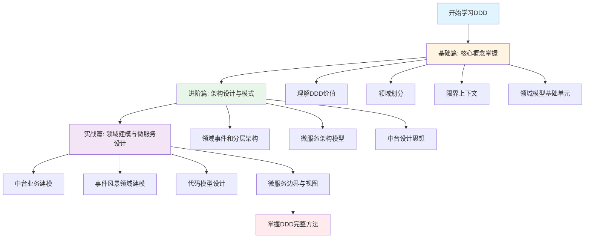

**DDD核心概念关系全景图：**

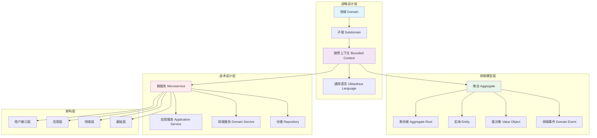

### 1.2 基础篇：核心概念掌握（第00-05讲）

#### 学习节点1：理解DDD的价值和定位（第00-01讲）

**学习内容：**
- DDD的历史背景和与微服务、中台的关系
- 微服务设计为什么要选择DDD
- DDD、微服务和中台的铁三角关系

**学习成果：**

**成果1：能够清晰阐述DDD的核心价值：解决微服务边界划分难题**

**详细展开：**
- **核心问题**：微服务设计过程中最尖锐的问题是"微服务到底怎么拆分和设计才算合理，拆多小才叫微服务？"微服务的边界历来是最容易产生争议的地方。
  - **来源：博客1（第01讲）**
- **DDD的解决方案**：DDD通过三步划定领域模型和微服务的边界：
  1. 在事件风暴中梳理业务过程中的用户操作、事件以及外部依赖关系，梳理出领域实体
  2. 根据领域实体之间的业务关联性，将业务紧密相关的实体组合形成聚合
  3. 根据业务及语义边界，将一个或多个聚合划定在一个限界上下文内，形成领域模型
  - **来源：博客1（第01讲）**
- **核心价值**：DDD战略设计可以建立领域模型，划定领域边界，解决微服务设计过程中边界难以划定的难题。
  - **来源：博客1（第01讲）**

**补充观点（博客2）：**
- **来源：博客2（第08讲）**：微服务的拆分原则就是"小而专"，即微服务内高内聚、微服务间低耦合。通过DDD进行业务建模，再基于领域模型进行限界上下文划分，就能保证系统的设计，在限界上下文内高内聚，在限界上下文间低耦合。

**成果2：理解DDD是一种设计思想，微服务是架构风格，中台是业务模型**

**详细展开：**
- **DDD的本质**：DDD是一种架构设计方法，主要关注从业务领域视角划分领域边界，构建通用语言进行高效沟通，通过业务抽象，建立领域模型，维持业务和代码的逻辑一致性。
  - **来源：博客1（第01讲）**
- **微服务的本质**：微服务是一种架构风格，主要关注运行时的进程间通信、容错和故障隔离，实现去中心化数据管理和去中心化服务治理，关注微服务的独立开发、测试、构建和部署。
  - **来源：博客1（第01讲）**
- **中台的本质**：中台是抽象出来的业务模型，本质是提炼各个业务板块的共同需求，进行业务和系统抽象，形成通用的可复用的业务模型。
  - **来源：博客1（第09讲）**
- **三者关系**：中台本质是业务模型，微服务是业务模型的系统落地，DDD是一种设计思想，它可以同时指导中台业务建模和微服务设计，它们之间是铁三角关系。
  - **来源：博客1（第10讲）**

**补充观点（博客2）：**
- **来源：博客2（第00讲）**：要让DDD在团队中用得好，还需要一个支持DDD与微服务的技术中台。有了这个技术中台的支持，开发团队就可以把更多的精力放到对用户业务的理解，对业务痛点的理解，快速开发用户满意的功能并快速交付上。

**成果3：掌握DDD战略设计和战术设计的基本概念**

**详细展开：**
- **战略设计**：建立领域模型，划定业务领域的边界，建立通用语言和限界上下文，确定领域模型中各个领域对象的关系。这个过程同时也基本确定了应用端的微服务边界。
- **战术设计**：从领域模型转向微服务设计和落地。将领域模型中的领域对象与代码模型中的代码对象建立映射关系，将业务架构和系统架构进行绑定。

**核心概念关系图：**

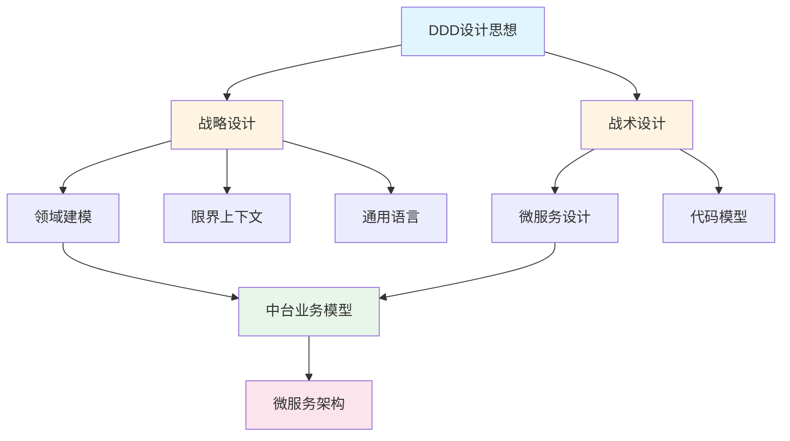

#### 学习节点2：领域划分基础（第02讲）

**学习内容：**
- 领域、子域的概念和划分方法
- 核心域、通用域、支撑域的识别和区分
- 领域细分的方法论（类似自然科学研究方法）

**学习成果：**

**成果1：能够将复杂业务领域进行逐级细分**

**详细展开：**
- **领域的定义**：领域是用来确定范围的，范围即边界。DDD的领域就是这个边界内要解决的业务问题域。
- **子域的概念**：领域可以进一步划分为子领域。每个子域对应一个更小的问题域或更小的业务范围。
- **细分方法**：DDD的研究方法与自然科学研究方法类似，将问题一步一步地细分，再针对细分出来的问题域，逐个深入研究。
- **实际案例**：以保险领域为例，可以将保险领域细分为：承保、收付、再保以及理赔等子域，而承保子域还可以继续细分为投保、保全（寿险）、批改（财险）等子子域。

**成果2：能够识别和区分核心域、通用域和支撑域**

**详细展开：**
- **核心域**：决定产品和公司核心竞争力的子域，是业务成功的主要因素和公司的核心竞争力。例如：电商平台的商品推荐算法、保险公司的承保核保能力。
- **通用域**：没有太多个性化的诉求，同时被多个子域使用的通用功能子域。例如：认证、权限等系统，这类应用很容易买到，不需要做太多的定制化。
- **支撑域**：必需的功能子域，但既不包含决定产品和公司核心竞争力的功能，也不包含通用功能。例如：数据代码类的数据字典等系统，具有企业特性，但不具有通用性。
- **识别方法**：需要结合公司战略重点和商业模式来识别。不同商业模式会导致核心域划分结果的不同。例如：淘宝的核心域可能在客户服务，京东的核心域可能在物流。

**成果3：理解领域细分的目的：降低业务理解和系统实现的复杂度**

**详细展开：**
- **核心思想**：将问题域逐级细分，来降低业务理解和系统实现的复杂度。
- **实现方式**：通过领域细分，逐步缩小微服务需要解决的问题域，构建合适的领域模型，而领域模型映射成系统就是微服务了。
- **资源投入策略**：由于预算和资源有限，对不同类型的子域应有不同的关注度和资源投入策略。核心域的建设排在首位，最好有绝对的掌控能力和自主研发能力。

**领域细分层次图：**

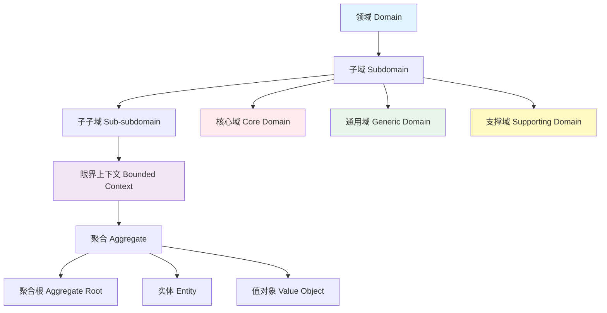

**领域细分示例图（保险领域）：**

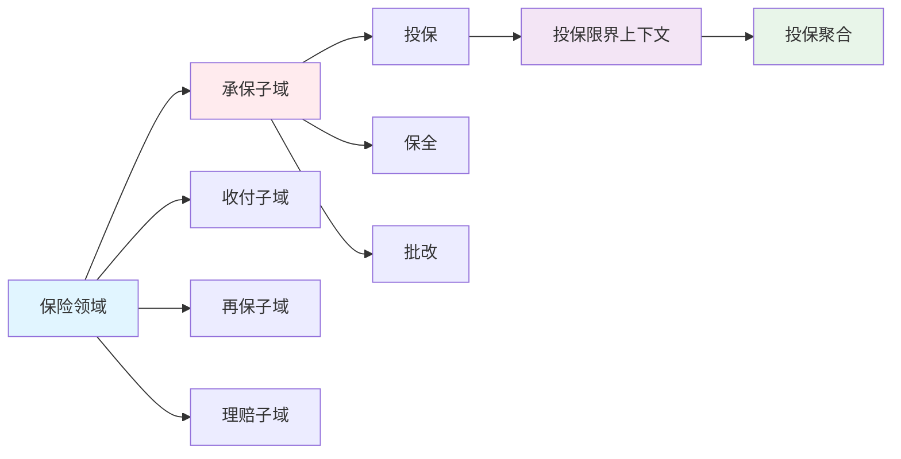

#### 学习节点3：限界上下文（第03讲）

**学习内容：**
- 通用语言的概念和价值
- 限界上下文的定义和作用
- 限界上下文与微服务边界的关系

**学习成果：**

**成果1：能够建立团队统一的通用语言**

**详细展开：**
- **通用语言的定义**：在事件风暴过程中，通过团队交流达成共识的，能够简单、清晰、准确描述业务涵义和规则的语言。
- **通用语言的价值**：解决交流障碍，使领域专家和开发人员能够协同合作，确保业务需求的正确表达。
- **通用语言的组成**：
  - **名词**：可以给领域对象命名，如商品、订单等，对应实体对象
  - **动词**：表示一个动作或事件，如商品已下单、订单已付款等，对应领域事件或者命令
- **通用语言的应用**：贯穿DDD的整个设计过程，从事件风暴建立通用语言到领域对象设计和代码落地。基于统一语言，能够开发出可读性更好的代码，将业务需求准确转化为代码设计。
- **实践方法**：用表格记录事件风暴和微服务设计过程中产生的领域对象及其属性，包括领域对象在DDD分层架构中的位置、属性、依赖关系以及与代码模型对象的映射关系。

**成果2：理解限界上下文是定义领域边界的利器**

**详细展开：**
- **限界上下文的定义**：用来封装通用语言和领域对象，提供上下文环境，保证在领域之内的一些术语、业务相关对象等（通用语言）有一个确切的含义，没有二义性。
- **限界和上下文**：
  - **限界**：领域的边界
  - **上下文**：语义环境
- **为什么需要限界上下文**：语言都有它的语义环境，同样，通用语言也有它的上下文环境。为了避免同样的概念或语义在不同的上下文环境中产生歧义。
- **实际案例**：
  - **保险领域**：投保单、保单、批单、赔案等术语虽然都跟保单有关，但不能将保单这个术语作用在保险全业务领域，因为术语有它的边界。
  - **电商领域**：商品在不同的阶段有不同的术语，在销售阶段是商品，而在运输阶段则变成了货物。同样的东西，由于业务领域的不同，赋予了不同的涵义和职责边界。

**成果3：掌握限界上下文与微服务的一对一映射关系**

**详细展开：**
- **映射关系**：理论上限界上下文就是微服务的边界。我们将限界上下文内的领域模型映射到微服务，就完成了从问题域到软件的解决方案。
- **设计原则**：如果不考虑技术异构、团队沟通等其它外部因素，一个限界上下文理论上就可以设计为一个微服务。
- **实际应用**：限界上下文是微服务设计和拆分的主要依据。在领域模型中，限界上下文确定了微服务的设计和拆分方向。

**限界上下文与微服务关系图：**

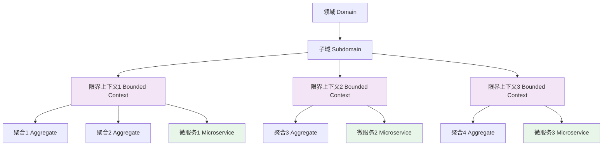

**通用语言到代码的映射流程：**

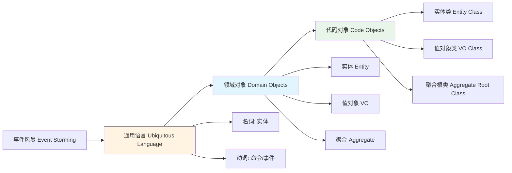

#### 学习节点4：领域模型基础单元（第04-05讲）

**学习内容：**
- 实体和值对象的概念和区别
- 聚合和聚合根的设计原则
- 如何设计合理的聚合

**学习成果：**

**成果1：能够区分实体和值对象**

**详细展开：**
- **实体的特征**：
  - 有唯一标识（ID）
  - 通过ID来区分不同的实体
  - 实体有生命周期，可以被创建、修改、删除
  - 实体的状态会发生变化
  - **来源：博客1（第04讲）**
- **值对象的特征**：
  - 没有唯一标识
  - 通过属性值来区分
  - 值对象是不可变的（immutable）
  - 值对象没有生命周期，只是被使用
  - **来源：博客1（第04讲）**
- **判断标准**：如果一个对象需要通过ID来区分，那就是实体；如果通过属性值来区分，那就是值对象。
- **实际案例**：
  - **实体示例**：用户（User）、订单（Order）、商品（Product）
  - **值对象示例**：地址（Address）、金额（Money）、日期范围（DateRange）

**补充观点（博客2）：**
- **来源：博客2（第04讲）**：在实际项目中，我们可以根据业务需求的不同，灵活选用实体还是值对象。比如，在线订餐系统中，根据业务需求的不同，菜单既可以设计成实体，也可以设计成值对象。如果将其按照值对象设计，则整个系统中"宫保鸡丁"只有一条记录；如果按照实体进行设计，则是认为每个饭店的"宫保鸡丁"都是不同的，每个饭店都是使用自己的"宫保鸡丁"。

**成果2：掌握聚合设计的基本原则**

**详细展开：**
- **聚合的定义**：聚合是一组相关对象的集合，作为一个整体来维护数据一致性。
- **聚合根**：聚合中有一个聚合根，外部只能通过聚合根来访问聚合内的对象。
- **聚合的设计原则**：
  1. **一致性边界**：聚合是数据一致性边界，聚合内的数据必须保持一致
  2. **事务边界**：一个事务只能修改一个聚合
  3. **引用原则**：聚合之间只能通过ID引用，不能直接引用对象
  4. **大小原则**：聚合应该尽可能小，只包含必须保持一致的实体和值对象
- **聚合根的作用**：
  - 作为聚合的唯一入口
  - 保证聚合内数据的一致性
  - 控制聚合内对象的访问

**成果3：理解聚合是领域模型的一致性边界**

**详细展开：**
- **一致性边界**：聚合是保证数据一致性的最小单元。聚合内的所有对象必须保持一致。
- **事务边界**：一个事务只能修改一个聚合。如果需要修改多个聚合，需要通过领域事件来实现最终一致性。
- **实际应用**：在订单聚合中，订单总金额必须与所有订单明细的金额之和保持一致。这种一致性由聚合根来保证。

**实体、值对象、聚合关系图：**

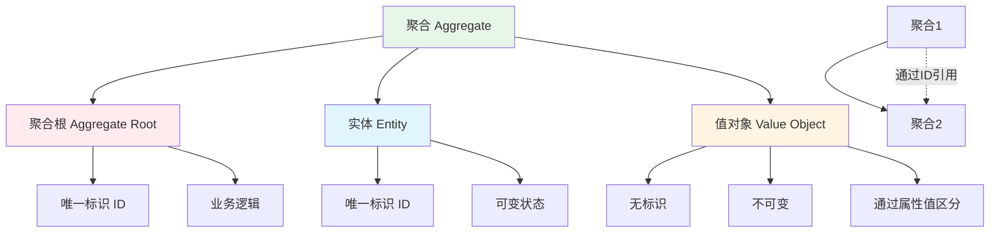

**聚合设计示例（订单聚合）：**

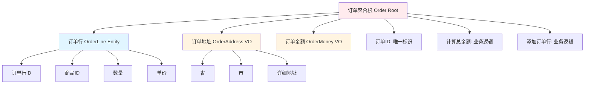

### 1.3 进阶篇：架构设计与模式（第06-10讲）

#### 学习节点5：领域事件和分层架构（第06-07讲）

**学习内容：**
- 领域事件的作用：解耦微服务
- DDD分层架构的设计
- 层与层之间的依赖关系

**学习成果：**

**成果1：掌握领域事件驱动的设计模式**

**详细展开：**
- **领域事件的定义**：领域事件是领域模型中发生的重要业务事件，表示业务状态的变化。
  - **来源：博客1（第06讲）**
- **领域事件的作用**：
  1. **解耦微服务**：微服务之间通过领域事件进行异步通信，避免直接调用
  2. **实现最终一致性**：通过事件驱动实现跨聚合、跨微服务的数据最终一致性
  3. **提高系统响应性**：异步处理可以提高系统的响应速度和吞吐量
  - **来源：博客1（第06讲）**
- **事件驱动的两种场景**：
  - **微服务内**：通过事件总线（EventBus）完成聚合之间的异步处理
  - **微服务间**：通过消息中间件完成事件传递
  - **来源：博客1（第06讲）**
- **实际应用**：订单创建后发布"订单已创建"事件，库存服务订阅该事件，自动扣减库存。

**补充观点（博客2）：**
- **来源：博客2（第08讲）**：最有效的方式就是通过消息队列，实现领域事件在微服务间的通知。当"用户下单"微服务在完成下单并保存订单以后，将该订单做成一个消息发送到消息队列中；这时，"饭店接单"微服务就会有一个守护进程不断监听消息队列；一旦有消息就会触发接收消息，并向饭店发送"接收订单"的通知。这样的设计就实现了微服务之间的解耦，使得日后变更的成本降低。

**成果2：理解DDD四层架构：用户接口层、应用层、领域层、基础层**

**详细展开：**
- **用户接口层（User Interface Layer）**：
  - 职责：处理用户请求，数据转换和组装
  - 主要组件：Facade服务、DTO转换
  - 特点：不包含业务逻辑，只负责数据格式转换
- **应用层（Application Layer）**：
  - 职责：服务的组合、编排和转发，处理业务用例的执行顺序
  - 主要组件：应用服务、事件发布和订阅服务
  - 特点：协调领域对象完成业务用例，不包含核心业务逻辑
- **领域层（Domain Layer）**：
  - 职责：实现核心业务逻辑，表达领域模型业务概念、业务状态和业务规则
  - 主要组件：实体、值对象、聚合、领域服务、领域事件
  - 特点：这是DDD的核心层，包含所有业务逻辑
- **基础层（Infrastructure Layer）**：
  - 职责：提供基础资源服务（数据库、缓存等），实现各层的解耦
  - 主要组件：仓储服务、数据访问对象
  - 特点：通过依赖倒置提供基础资源服务

**成果3：能够设计符合DDD原则的分层架构**

**详细展开：**
- **分层原则**：每层只能与位于其下方的层发生耦合。
- **两种分层架构**：
  1. **严格分层架构**：任何层只能与位于其直接下方的层发生依赖
  2. **松散分层架构**：任何层可以与其任意下方的层发生依赖
- **服务依赖关系**：
  - 领域层的实体方法和领域服务可以暴露给应用层
  - 应用服务可以调用领域服务和仓储服务
  - Facade服务可以调用应用服务
- **数据对象转换**：
  - 用户接口层：DTO ↔ DO
  - 应用层：DO（领域对象）
  - 领域层：DO（领域对象）
  - 基础层：DO ↔ PO（持久化对象）

**DDD分层架构图：**

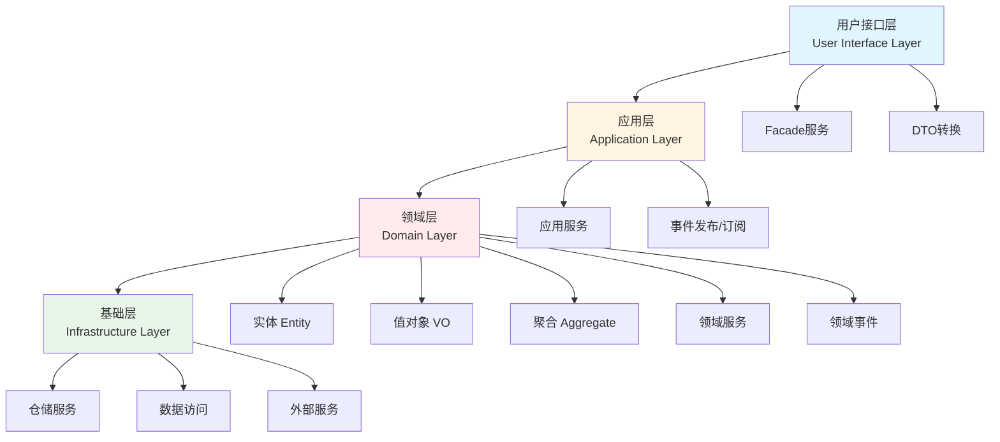

**领域事件驱动流程：**

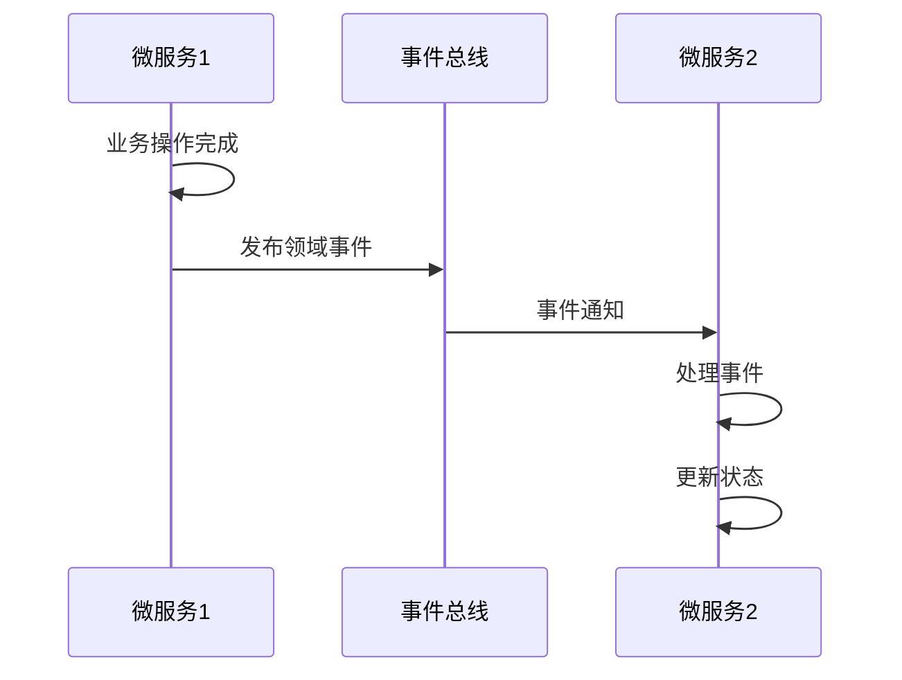

#### 学习节点6：微服务架构模型（第08讲）

**学习内容：**
- 几种常见微服务架构模型的对比
- 领域模型在微服务架构中的作用
- 不同架构模型的适用场景

**学习成果：**
- 能够对比分析不同微服务架构模型
- 理解领域模型对微服务架构的指导作用
- 能够根据业务特点选择合适的架构模型

#### 学习节点7：中台设计思想（第09-10讲）

**学习内容：**
- 中台的本质和设计思想
- DDD、中台和微服务的协作模式
- 如何用DDD指导中台设计

**学习成果：**

**成果1：理解中台是企业级能力复用平台**

**详细展开：**
- **中台的本质**：提炼各个业务板块的共同需求，进行业务和系统抽象，形成通用的可复用的业务模型，打造成组件化产品，供前台部门使用。
- **中台的价值**：前台要做什么业务，需要什么资源，可以直接找中台，不需要每次都去改动自己的底层。
- **中台的分类**：
  - **通用中台**：提供通用能力，如订单、支付、客户、用户等
  - **核心中台**：提供核心业务能力，如营销、承保、理赔等
- **中台的设计原则**：高内聚、低耦合，按照"高内聚、松耦合"的原则，实现企业级的能力复用。

**成果2：掌握DDD在中台业务建模中的应用**

**详细展开：**
- **DDD的两把利器**：
  1. **战略设计**：用于中台业务建模，最擅长领域建模
  2. **战术设计**：用于中台微服务设计，指导微服务建设
- **中台建模的五步流程**：
  1. 将业务域细分为多个中台，归类到核心中台或通用中台
  2. 选取中台，完成事件风暴，找出实体、聚合和限界上下文
  3. 以主领域模型为基础，扫描其它中台领域模型，提炼并重构主领域模型
  4. 选择其它主领域模型重复第三步，直到所有主领域模型完成比对和重构
  5. 基于领域模型完成微服务设计，完成系统落地

**成果3：能够设计通用中台和核心中台**

**详细展开：**
- **通用中台设计**：
  - 对应DDD的通用域和支撑域
  - 站在企业高度考虑共享和复用能力
  - 例如：用户中台、客户中台、订单中台
- **核心中台设计**：
  - 对应DDD的核心域
  - 设计时要考虑核心竞争力
  - 例如：承保中台、理赔中台
- **映射关系**：子域与中台是一致的，领域模型所在的限界上下文对应微服务。

**DDD、中台、微服务关系图：**

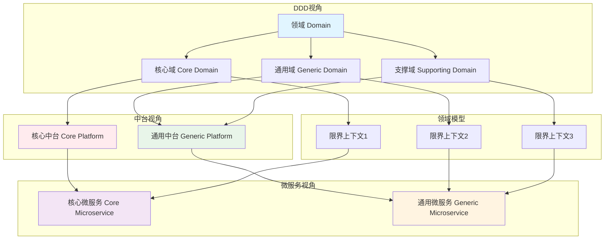

**中台建模流程图：**

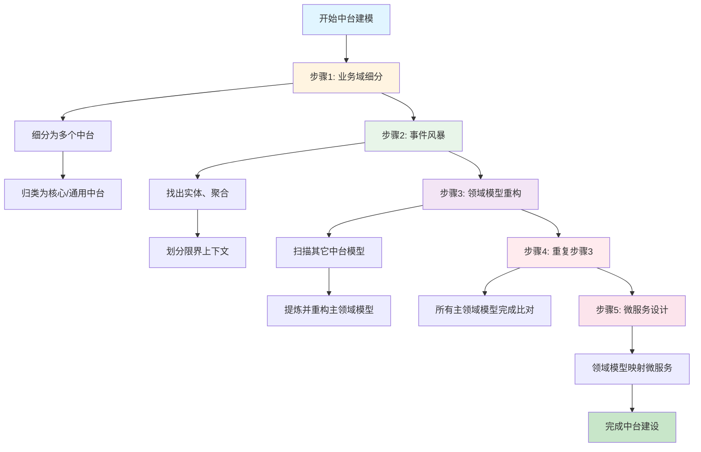

### 1.4 实战篇：领域建模与微服务设计（第11-20讲）

#### 学习节点8：中台业务建模实战（第11讲）

**学习内容：**
- 传统企业中台转型的挑战
- 自顶向下和自底向上两种建模策略
- 中台业务模型重构的过程

**学习成果：**
- 能够识别重复建设和业务能力分散的问题
- 掌握中台业务模型构建的完整流程
- 能够完成领域模型的重组和重构

#### 学习节点9：事件风暴领域建模（第12讲）

**学习内容：**
- 事件风暴工作坊的准备和流程
- 如何用事件风暴构建领域模型
- 从产品愿景到微服务设计的完整过程

**学习成果：**

**成果1：能够组织和参与事件风暴工作坊**

**详细展开：**
- **参与者要求**：
  - **领域专家**：必不可少的核心参与者，对业务或问题域有深刻见解
  - **项目团队成员**：DDD专家、架构师、产品经理、项目经理、开发人员、测试人员
  - **团队规模**：中型项目5-10人，大型项目10-20人
- **材料准备**：
  - **即时贴**：不同颜色区分不同领域行为
    - 蓝色：命令（Command）
    - 绿色：实体（Entity）
    - 橙色：领域事件（Domain Event）
    - 黄色：补充信息（注意事项、外部依赖等）
  - **水笔**：用于在即时贴上书写
  - **胶带或磁扣**：用于将即时贴贴在墙上
- **场地要求**：
  - 足够长的墙（建议8米长）
  - 足够大的空间，方便参与者四处走动
  - 撤掉会议桌和椅子，采用站立式工作坊

**成果2：掌握事件风暴的四个阶段：产品愿景、业务场景分析、领域建模、微服务拆分**

**详细展开：**
- **阶段1：产品愿景**
  - **目的**：对产品顶层价值的设计，使产品目标用户、核心价值、差异化竞争点等信息达成一致
  - **参与角色**：领域专家、业务需求方、产品经理、项目经理、开发经理
  - **关键问题**：
    - 产品能够做什么？
    - 业务范围、目标用户、核心价值是什么？
    - 与同类产品的差异和优势在哪里？
  - **输出**：产品愿景墙
  
- **阶段2：业务场景分析**
  - **目的**：从用户视角出发，根据业务流程或用户旅程，找出领域事件、实体和命令等领域对象
  - **参与角色**：领域专家、产品经理、需求分析人员、架构师、项目经理、开发经理、测试经理
  - **方法**：按照业务流程，一步一步搜寻用户业务流程中的关键领域事件
  - **输出**：命令列表、领域事件列表、实体列表
  
- **阶段3：领域建模**
  - **目的**：根据场景分析过程中产生的领域对象，找出实体之间的依赖关系组成聚合，为聚合划定限界上下文
  - **参与角色**：领域专家、产品经理、需求分析人员、架构师、项目经理、开发经理、测试经理
  - **步骤**：
    1. 从命令和事件中提取产生这些行为的实体
    2. 根据聚合根的管理性质找出聚合根，将聚合根以及它关联的实体和值对象组合为聚合
    3. 划定限界上下文，根据上下文语义将聚合归类
  - **输出**：领域模型、限界上下文划分
  
- **阶段4：微服务拆分与设计**
  - **目的**：将领域模型映射为微服务，考虑技术、团队等非业务因素
  - **参与角色**：领域专家、产品经理、需求分析人员、架构师、项目经理、开发经理、测试经理
  - **考虑因素**：
    - 服务粒度、分层、边界划分
    - 敏态与稳态业务的分离
    - 非功能性需求（弹性伸缩、安全性等）
    - 团队组织和沟通效率
    - 技术异构
  - **输出**：微服务设计方案

**成果3：能够通过事件风暴完成领域建模**

**详细展开：**
- **时间投入**：中型规模项目，领域建模的时间大概在两周左右
- **关键要点**：
  - 团队成员全员参与，在项目开发之前就建立共同语言
  - 要尽可能遍历所有业务细节，充分发表意见，不要遗漏业务要点
  - 用表格记录领域对象及其属性、依赖关系等
- **实际案例**：用户中台领域建模
  - 提取了7个实体：用户、账户、认证票据、系统、菜单、岗位、用户日志
  - 组成6个聚合：系统功能、岗位、用户信息、用户日志、账户、认证票据
  - 划分为3个限界上下文：用户信息、认证、权限

**事件风暴完整流程：**

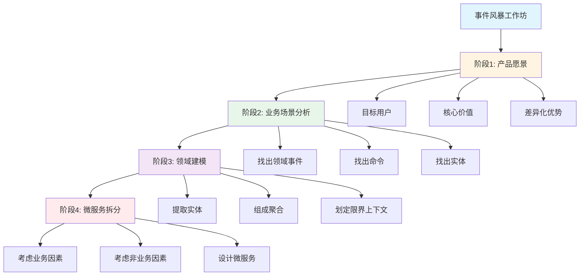

**事件风暴示例（用户中台）：**

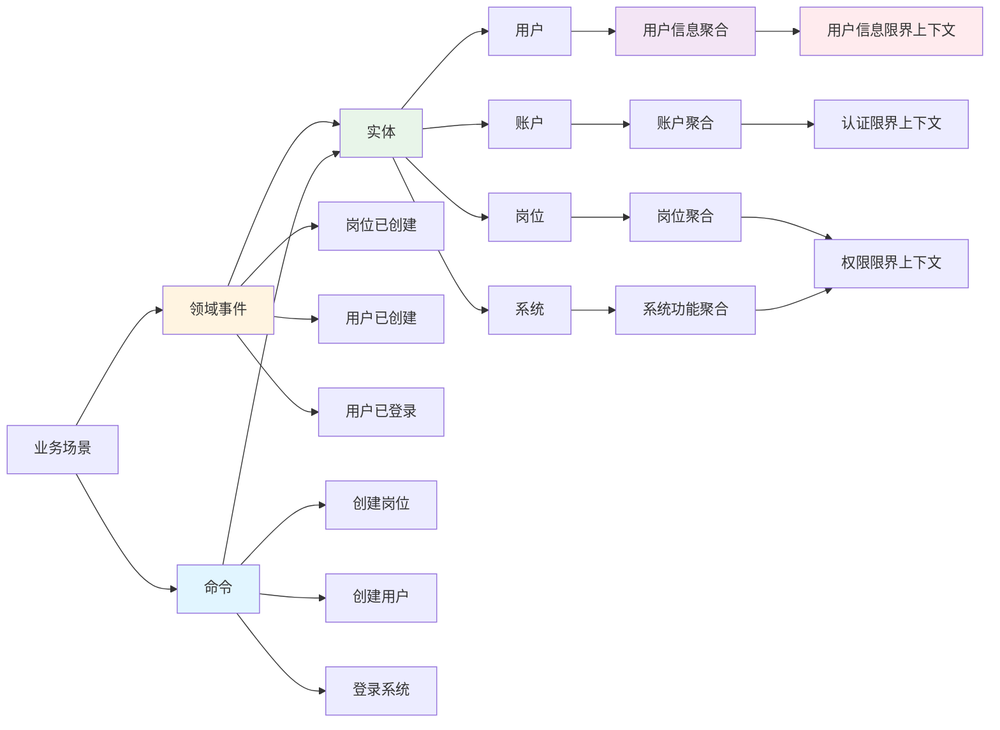

#### 学习节点10：代码模型设计（第13-14讲）

**学习内容：**
- 如何使用DDD设计微服务代码模型
- 领域模型与代码模型的映射关系
- 如何保证领域模型与代码模型的一致性

**学习成果：**
- 能够将领域模型映射为代码结构
- 掌握领域对象与代码对象的对应关系
- 能够建立业务模型和代码模型的一致性

#### 学习节点11：微服务边界与视图（第15-16讲）

**学习内容：**
- 微服务的各种边界在架构演进中的作用
- 服务和数据在微服务各层的协作
- 严格分层架构和松散分层架构

**学习成果：**
- 理解微服务边界的多种类型和作用
- 掌握微服务内各层服务的协作方式
- 能够选择合适的分层架构模式

#### 学习节点12：前端设计与总结（第17-20讲）

**学习内容：**
- 微服务后前端如何设计
- 基于DDD的微服务设计实例
- 微服务设计和拆分的原则
- 分布式架构关键设计要点

**学习成果：**
- 能够设计微服务架构下的前端应用
- 掌握微服务设计的核心原则
- 能够识别和解决分布式架构的关键问题

---

## 2. DDD学习的重点和难点

### 2.1 对于DDD初学者的重点

#### 2.1.1 核心概念的理解

**重点1：统一语言的构建**

- **重要性**：统一语言是DDD的基础，贯穿整个设计过程
- **难点**：需要领域专家和开发人员协同合作，达成共识
- **学习方法**：
  - 通过事件风暴工作坊建立统一语言
  - 用表格记录领域对象及其属性
  - 确保限界上下文内术语的统一

**重点2：限界上下文的划分**

- **重要性**：限界上下文是微服务边界的主要依据
- **难点**：如何准确识别业务边界，避免过度拆分或拆分不足
- **学习方法**：
  - 理解限界上下文是语义环境，不是技术边界
  - 通过事件风暴找出领域对象，确定聚合，划分限界上下文
  - 一个限界上下文理论上可以设计为一个微服务

**重点3：领域模型的建立**

- **重要性**：领域模型是DDD的核心，直接关乎微服务的设计水平
- **难点**：如何从复杂业务中抽象出清晰的领域模型
- **学习方法**：
  - 掌握事件风暴方法
  - 理解领域、子域、聚合、实体的层次关系
  - 先有领域模型，然后才有微服务

#### 2.1.2 思维方式的转变

**从技术驱动到业务驱动**

- **传统思维**：先设计数据库表结构，再设计业务逻辑
- **DDD思维**：先理解业务领域，建立领域模型，再映射到代码
- **转变要点**：
  - 关注业务领域而非技术实现
  - 与领域专家密切合作
  - 用业务语言描述系统
  - **来源：博客1（第01讲）**

**补充观点（博客2）：**
- **来源：博客2（第09讲）**：DDD的真谛是领域建模，即深入理解业务。过去，我们认为软件就是，用户怎么提需求，软件就怎么开发。这种开发模式使得我们对需求的认知浅薄，不得不随着用户的需求变动反复地改来改去。正是DDD改变了这一切，它要求我们更加主动地去理解业务，掌握业务领域知识。这时就不再是客户提需求了，而是我们主动地提需求、主动地改进功能、去解决客户的痛点。

**从数据模型到领域模型**

- **传统方式**：关注数据的CRUD操作
- **DDD方式**：关注业务行为和业务规则
- **转变要点**：
  - 实体采用充血模型，包含业务逻辑
  - 聚合保证业务一致性
  - 领域事件表达业务变化

### 2.2 对于有技术管理经验人员的重点

#### 2.2.1 战略设计的重要性

**重点把握：战略设计优先于战术设计**

- **原因**：战略设计建立领域模型，划分领域边界，这是微服务设计的基础
- **实践要点**：
  - 投入足够时间进行领域建模（中型项目约2周）
  - 全员参与领域建模，建立共同语言
  - 先有边界清晰的领域模型，才能设计出清晰的微服务边界

**重点把握：领域模型与微服务的一体性**

- **核心思想**：先有领域模型然后才有微服务，而不是脱离领域模型来谈微服务设计
- **实践要点**：
  - 通过战略设计建立领域模型，划分微服务边界
  - 通过战术设计从领域模型转向微服务设计和落地
  - 建立领域对象和代码对象的映射关系

#### 2.2.2 中台与微服务的结合

**重点把握：DDD是中台和微服务的桥梁**

- **关系理解**：
  - 中台本质是业务模型
  - 微服务是业务模型的系统落地
  - DDD可以同时指导中台业务建模和微服务设计

**实践要点**：
- 用DDD战略设计完成中台业务建模
- 用DDD战术设计指导微服务建设
- 建立子域与中台的映射关系

#### 2.2.3 团队协作与沟通

**重点把握：领域专家的重要性**

- **角色定位**：领域专家是对业务或问题域有深刻见解的主题专家
- **如何寻找**：可以从业务人员、需求分析人员、产品经理或有多年经验的开发人员中选择
- **协作方式**：通过事件风暴工作坊，领域专家与项目团队一起建立领域模型

**重点把握：统一语言的价值**

- **价值**：解决交流障碍，使领域专家和开发人员能够协同合作
- **实践**：
  - 通用语言贯穿DDD的整个设计过程
  - 通用语言中的名词对应实体对象，动词对应领域事件或命令
  - 基于统一语言开发可读性更好的代码

### 2.3 对于有丰富设计开发经验人员的融会贯通

#### 2.3.1 与现有设计模式的结合

**DDD分层架构与经典架构模式的融合**

- **相似性**：DDD分层架构与经典三层架构有相似之处，但更强调领域层的核心地位
- **融合要点**：
  - 用户接口层对应表现层
  - 应用层对应业务逻辑层（但更关注服务编排）
  - 领域层是核心，包含业务实体和业务规则
  - 基础层对应数据访问层

**领域事件与事件驱动架构**

- **结合点**：领域事件是DDD解耦微服务的关键，与事件驱动架构（EDA）理念一致
- **实践要点**：
  - 微服务内通过事件总线完成聚合之间的异步处理
  - 微服务之间通过消息中间件完成事件传递
  - 领域事件驱动是一种间接的服务访问方式

#### 2.3.2 微服务设计原则的深化

**高内聚、低耦合原则在DDD中的体现**

- **聚合内高内聚**：聚合内的实体和值对象紧密协作，保证业务一致性
- **聚合间低耦合**：聚合之间通过领域事件解耦，避免直接依赖
- **限界上下文边界**：限界上下文定义了清晰的边界，保证微服务的独立性

**演进式架构的设计**

- **DDD的演进性**：DDD强调根据业务发展，合理划分领域边界，持续调整现有架构
- **实践要点**：
  - 领域模型可以随着业务变化而演进
  - 微服务边界可以根据业务发展进行调整
  - 保持架构和代码的生命力

#### 2.3.3 复杂业务场景的处理

**中台业务模型的重构**

- **挑战**：传统企业存在多个渠道应用，存在重复建设和业务能力分散的问题
- **解决方案**：
  - 自顶向下策略：适用于全新应用系统建设
  - 自底向上策略：适用于遗留系统业务模型的演进式重构
  - 核心思想：分域建模型，找准基准域，划定上下文，聚合重归类

**领域模型与代码模型的一致性**

- **挑战**：如何保证领域模型与代码模型的一致性
- **解决方案**：
  - 建立领域对象与代码对象的映射关系
  - 用表格记录领域对象及其属性
  - 确保通用语言在代码中的体现

---

## 3. DDD适合的场景

### 3.1 DDD适用的业务复杂度

#### 3.1.1 高度复杂的业务领域

**适用特征：**

- **业务逻辑复杂**：业务规则多，业务场景复杂，业务变化频繁
- **领域知识丰富**：需要深入理解业务领域，有大量领域知识需要沉淀
- **业务边界模糊**：传统方式难以清晰划分业务边界
- **来源：博客1（第01讲）**

**典型行业和场景：**

1. **金融保险行业**
   - 承保、理赔、再保等复杂业务流程
   - 大量业务规则和风控逻辑
   - 多个渠道需要共享核心能力

2. **电商平台**
   - 商品、订单、支付、物流等复杂业务域
   - 不同业务域之间的复杂交互
   - 需要支持多种业务模式（B2C、C2C等）

3. **企业级应用**
   - ERP、CRM等企业管理系统
   - 多个业务模块之间的复杂关系
   - 需要支持企业级能力复用

**适用理由：**

- DDD善于处理与领域相关的拥有高复杂度业务的产品开发
- 可以建立一个核心而稳定的领域模型
- 有利于领域知识的传递与传承

#### 3.1.2 中等到大型业务规模

**适用特征：**

- **业务规模**：中等规模以上，不是简单的CRUD应用
- **团队规模**：有足够的团队资源支持DDD的实施
- **项目周期**：长期项目，不是短期临时项目

**规模判断标准：**

- **小型项目**：功能简单，业务逻辑清晰，团队规模小（<10人）
  - **不适用DDD**：投入产出比不高，DDD的复杂度反而增加开发成本

- **中型项目**：功能中等复杂，有一定业务规则，团队规模中等（10-50人）
  - **适用DDD**：可以通过DDD建立清晰的领域模型，提升代码质量

- **大型项目**：功能复杂，业务规则多，团队规模大（>50人）
  - **强烈适用DDD**：DDD可以帮助管理复杂度，建立清晰的业务边界

### 3.2 DDD适用的业务量级

#### 3.2.1 企业级应用

**特征：**
- 需要支持多个业务渠道
- 需要企业级能力复用
- 存在中台建设的需求

**适用场景：**
- **中台建设**：DDD是中台业务建模的最佳方法
- **多渠道支持**：不同渠道共享核心业务能力
- **能力复用**：避免重复建设，实现企业级能力复用

#### 3.2.2 微服务架构转型

**特征：**
- 从单体架构向微服务架构转型
- 需要清晰的微服务边界划分
- 需要解决微服务拆分难题

**适用场景：**
- **新项目微服务设计**：用DDD指导微服务设计
- **遗留系统重构**：将单体系统演进到微服务
- **微服务边界划分**：解决"微服务到底应该拆多小"的难题

### 3.3 DDD不适用的场景

#### 3.3.1 简单CRUD应用

**特征：**
- 业务逻辑简单，主要是数据的增删改查
- 没有复杂的业务规则
- 业务需求稳定，变化少

**不适用理由：**
- DDD的复杂度对于简单应用来说过高
- 投入产出比不高
- 传统的三层架构或MVC架构已经足够

**典型场景：**
- 简单的后台管理系统
- 数据展示类应用
- 简单的数据采集系统

#### 3.3.2 短期项目

**特征：**
- 项目周期短（<3个月）
- 临时性项目
- 不需要长期维护

**不适用理由：**
- DDD需要时间进行领域建模（中型项目约2周）
- 领域建模的学习成本较高
- 短期项目的投入难以收回

#### 3.3.3 技术驱动型项目

**特征：**
- 以技术实现为主，业务逻辑简单
- 主要解决技术问题而非业务问题
- 业务领域知识少

**不适用理由：**
- DDD强调业务驱动，关注业务领域
- 技术驱动型项目不需要复杂的领域建模
- 传统的技术架构已经足够

**典型场景：**
- 技术工具类应用
- 基础设施类系统
- 纯技术性项目

### 3.4 适用性对比分析

#### 3.4.1 业务复杂度对比

| 业务复杂度 | 适用性 | 理由 |
|----------|--------|------|
| 简单（CRUD为主） | ❌ 不适用 | DDD复杂度高，投入产出比低 |
| 中等（有一定业务规则） | ✅ 适用 | DDD可以建立清晰的领域模型 |
| 复杂（业务规则多，场景复杂） | ✅✅ 强烈适用 | DDD的核心价值所在 |

#### 3.4.2 业务规模对比

| 业务规模 | 适用性 | 理由 |
|----------|--------|------|
| 小型（功能简单，团队<10人） | ❌ 不适用 | 团队规模小，难以支撑DDD实施 |
| 中型（功能中等，团队10-50人） | ✅ 适用 | 有足够资源支持DDD实施 |
| 大型（功能复杂，团队>50人） | ✅✅ 强烈适用 | DDD可以帮助管理复杂度 |

#### 3.4.3 项目周期对比

| 项目周期 | 适用性 | 理由 |
|----------|--------|------|
| 短期（<3个月） | ❌ 不适用 | DDD需要时间进行领域建模 |
| 中期（3-12个月） | ✅ 适用 | 有足够时间进行领域建模和微服务设计 |
| 长期（>12个月） | ✅✅ 强烈适用 | DDD的长期价值可以充分发挥 |

#### 3.4.4 架构类型对比

| 架构类型 | 适用性 | 理由 |
|----------|--------|------|
| 单体架构（简单业务） | ❌ 不适用 | 简单业务不需要DDD |
| 单体架构（复杂业务） | ⚠️ 谨慎适用 | DDD也适用于单体应用，但价值不如微服务场景 |
| 微服务架构 | ✅✅ 强烈适用 | DDD是微服务设计的最佳方法 |
| 中台架构 | ✅✅ 强烈适用 | DDD是中台业务建模的最佳方法 |

---

## 4. 如何进行实战

### 4.1 实战准备

#### 4.1.1 团队准备

**必需角色：**

1. **领域专家**
   - 对业务或问题域有深刻见解
   - 可以从业务人员、需求分析人员、产品经理或有多年经验的开发人员中选择

2. **DDD专家/架构师**
   - 熟悉DDD的设计思想和方法
   - 能够指导团队进行领域建模

3. **项目团队成员**
   - 产品经理、项目经理、开发人员、测试人员等
   - 应尽早参与到领域建模中

**团队规模建议：**
- 中型项目：5-10人参与事件风暴
- 大型项目：10-20人参与事件风暴

#### 4.1.2 材料准备

**事件风暴工作坊材料：**

- **即时贴**：不同颜色区分不同领域行为
  - 蓝色：命令
  - 绿色：实体
  - 橙色：领域事件
  - 黄色：补充信息（注意事项、外部依赖等）

- **水笔**：用于在即时贴上书写

- **胶带或磁扣**：用于将即时贴贴在墙上，方便随时更换位置

#### 4.1.3 场地准备

**场地要求：**

- **足够长的墙**：用于贴即时贴（建议8米长）
- **足够大的空间**：方便参与者四处走动，进行协作
- **不需要**：会议桌、椅子、投影仪等传统会议设备

**场地布置：**
- 撤掉会议桌和椅子，采用站立式工作坊
- 这样可以提高参与者的效率和互动性

### 4.2 实战流程

**DDD实战完整流程图：**

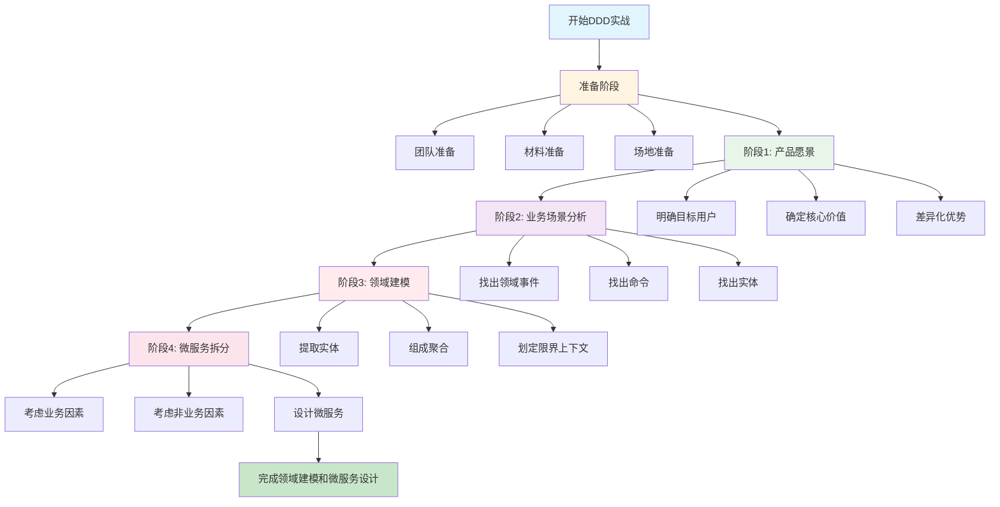

#### 4.2.1 第一阶段：产品愿景（可选）

**目的：**
- 对产品顶层价值的设计
- 使产品目标用户、核心价值、差异化竞争点等信息达成一致
- 避免产品偏离方向

**参与角色：**
- 领域专家、业务需求方、产品经理、项目经理、开发经理

**步骤：**

1. **思考关键问题：**
   - 产品能够做什么？
   - 业务范围、目标用户、核心价值是什么？
   - 与同类产品的差异和优势在哪里？

2. **建立产品愿景墙：**
   - 参与者对每个点发表意见
   - 写在黄色即时贴上
   - 贴在墙上，形成产品愿景墙

3. **统一意见：**
   - 将发散的意见统一为通用语言
   - 建立产品愿景

**时间投入：**
- 如果产品愿景已经很清晰，可以跳过此阶段
- 如果需要，建议半天时间

#### 4.2.2 第二阶段：业务场景分析

**目的：**
- 从用户视角出发，根据业务流程或用户旅程
- 采用用例和场景分析，探索领域中的典型场景
- 找出领域事件、实体和命令等领域对象

**参与角色：**
- 领域专家、产品经理、需求分析人员、架构师、项目经理、开发经理、测试经理

**步骤：**

1. **识别业务场景：**
   - 列出所有典型的业务场景
   - 按照业务流程或用户旅程组织场景

2. **找出领域事件：**
   - 对每个业务场景，找出关键领域事件
   - 用橙色即时贴表示领域事件
   - 例如："用户已创建"、"订单已支付"等

3. **找出命令：**
   - 找出导致领域事件的命令
   - 用蓝色即时贴表示命令
   - 例如："创建用户"、"支付订单"等

4. **找出实体：**
   - 找出产生命令的实体
   - 用绿色即时贴表示实体
   - 例如："用户"、"订单"等

5. **标注补充信息：**
   - 标注外部依赖、注意事项等
   - 用黄色即时贴表示补充信息

**注意事项：**
- 要尽可能遍历所有业务细节
- 充分发表意见，不要遗漏业务要点
- 事件风暴参与者要尽可能地遍历所有业务细节

**时间投入：**
- 中型项目：2-3天
- 大型项目：3-5天

#### 4.2.3 第三阶段：领域建模

**领域建模详细流程图：**

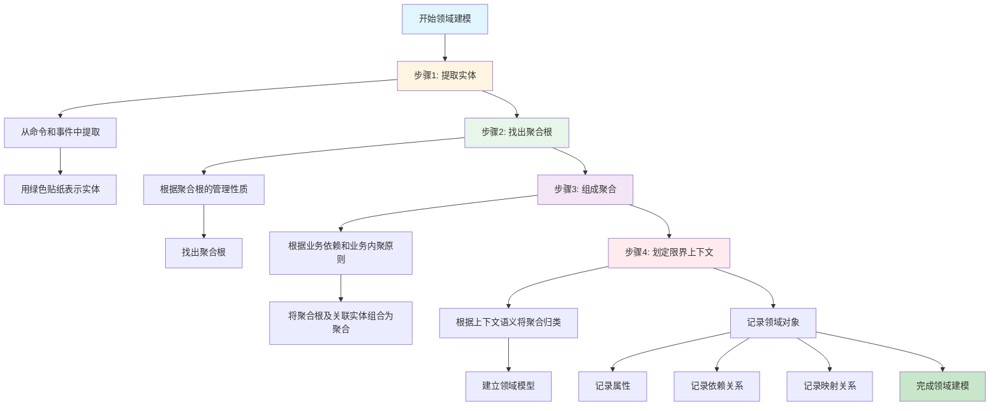

**目的：**
- 根据场景分析过程中产生的领域对象
- 找出实体之间的依赖关系，组成聚合
- 为聚合划定限界上下文，建立领域模型

**参与角色：**
- 领域专家、产品经理、需求分析人员、架构师、项目经理、开发经理、测试经理

**步骤：**

1. **提取实体：**
   - 从命令和事件中提取产生这些行为的实体
   - 用绿色即时贴表示实体

2. **找出聚合根：**
   - 根据聚合根的管理性质，从实体中找出聚合根
   - 例如：用户管理用户相关实体，系统管理菜单等实体

3. **组成聚合：**
   - 根据业务依赖和业务内聚原则
   - 将聚合根以及它关联的实体和值对象组合为聚合
   - 例如：系统和菜单实体可以组合为"系统功能"聚合

4. **划定限界上下文：**
   - 根据上下文语义将聚合归类
   - 例如：用户基本信息和用户日志信息共同构成用户信息域
   - 认证票据和账户共同构成认证域

5. **建立领域模型：**
   - 完成领域模型的构建
   - 记录领域对象及其属性、依赖关系等

**记录方式：**
- 用表格记录领域对象及其属性
- 记录领域对象在DDD分层架构中的位置
- 记录领域对象与代码模型对象的映射关系

**时间投入：**
- 中型项目：3-5天
- 大型项目：5-7天

#### 4.2.4 第四阶段：微服务拆分与设计

**目的：**
- 将领域模型映射为微服务
- 考虑技术、团队等非业务因素
- 完成微服务的设计和拆分

**参与角色：**
- 领域专家、产品经理、需求分析人员、架构师、项目经理、开发经理、测试经理

**步骤：**

1. **初步拆分：**
   - 原则上，一个领域模型可以设计为一个微服务
   - 但需要考虑业务因素和非业务因素

2. **考虑非业务因素：**
   - **服务粒度**：不宜过度拆分
   - **分层设计**：考虑微服务的分层架构
   - **边界划分**：确定微服务的边界
   - **依赖关系**：处理微服务之间的依赖
   - **集成关系**：设计微服务之间的集成方式

3. **考虑其他因素：**
   - **敏态与稳态业务分离**：区分快速变化和稳定的业务
   - **非功能性需求**：弹性伸缩、安全性等
   - **团队组织和沟通效率**：考虑团队结构
   - **软件包大小**：考虑部署和运维成本
   - **技术异构**：不同微服务可能需要不同技术栈

4. **完成微服务设计：**
   - 确定微服务的边界和职责
   - 设计微服务之间的接口
   - 完成微服务的架构设计

**时间投入：**
- 中型项目：2-3天
- 大型项目：3-5天

### 4.3 实战案例：用户中台领域建模

#### 4.3.1 业务场景分析

**典型业务场景：**

1. **系统和岗位设置**
   - 设置系统中岗位的菜单权限
   - 领域事件："岗位已创建"、"菜单权限已设置"

2. **用户权限配置**
   - 为用户建立账户和密码，设置用户岗位
   - 领域事件："用户已创建"、"账户已创建"

3. **用户登录系统和权限校验**
   - 生成用户登录和操作日志
   - 领域事件："用户已登录"、"操作日志已记录"

**提取的领域对象：**

- **实体**：用户、账户、认证票据、系统、菜单、岗位、用户日志
- **命令**：创建用户、创建账户、登录系统等
- **领域事件**：用户已创建、账户已创建、用户已登录等

#### 4.3.2 领域建模结果

**聚合设计：**

1. **系统功能聚合**
   - 聚合根：系统
   - 实体：菜单

2. **岗位聚合**
   - 聚合根：岗位

3. **用户信息聚合**
   - 聚合根：用户
   - 实体：用户基本信息

4. **用户日志聚合**
   - 聚合根：用户日志

5. **账户聚合**
   - 聚合根：账户

6. **认证票据聚合**
   - 聚合根：认证票据

**限界上下文划分：**

1. **用户信息限界上下文**
   - 包含：用户信息聚合、用户日志聚合
   - 职责：管理用户基本信息、用户登录和操作日志

2. **认证限界上下文**
   - 包含：认证票据聚合、账户聚合
   - 职责：实现不同方式的登录和认证

3. **权限限界上下文**
   - 包含：系统功能聚合、岗位聚合
   - 职责：系统和菜单管理、系统的岗位配置

#### 4.3.3 微服务设计

**不考虑非业务因素的设计：**
- 用户微服务（对应用户信息限界上下文）
- 认证微服务（对应认证限界上下文）
- 权限微服务（对应权限限界上下文）

**考虑技术异构的设计：**
- 如果用户日志数据量巨大，需要采用大数据技术
- 可以将用户信息聚合和用户日志聚合拆分为两个微服务
- 用户微服务：管理用户基本信息
- 用户日志微服务：管理用户登录和操作日志（采用大数据技术）

### 4.4 实战注意事项

#### 4.4.1 时间管理

**领域建模时间投入：**
- 中型规模项目：约2周时间
- 与传统需求分析和系统设计的时间基本差不多
- 但如果在领域建模过程中，团队成员全员参与，在项目开发之前就建立了共同语言，这对于后续的微服务设计与开发是很有帮助的，时间成本也可以视情况降低

#### 4.4.2 常见误区

**误区1：只关注战术设计，忽略战略设计**

- **错误做法**：直接学习DDD的代码实现，忽略领域建模
- **正确做法**：先有边界清晰的领域模型，才能设计出清晰的微服务边界
- **原因**：战略设计是比战术设计更为重要的，这是DDD的核心设计思想

**误区2：过度拆分微服务**

- **错误做法**：将每个聚合都拆分为一个微服务
- **正确做法**：考虑业务因素和非业务因素，合理拆分微服务
- **原因**：微服务的拆分还是有很多限制因素的，在设计中不宜过度拆分

**误区3：忽略统一语言**

- **错误做法**：领域建模过程中不建立统一语言
- **正确做法**：在事件风暴过程中建立统一语言，确保团队沟通一致
- **原因**：统一语言是DDD的基础，贯穿整个设计过程

#### 4.4.3 成功要素

**要素1：领域专家的参与**

- 领域专家是事件风暴中必不可少的核心参与者
- 如果没有专门的领域专家角色，可以从业务人员、需求分析人员、产品经理或有多年经验的开发人员中选择

**要素2：全员参与**

- 项目团队应尽早地参与到领域建模中
- 这样才能高效建立起团队的通用语言
- 到了微服务建设时，领域模型也更容易和系统架构保持一致

**要素3：持续迭代**

- 领域模型可以随着业务变化而演进
- 微服务边界可以根据业务发展进行调整
- 保持架构和代码的生命力

### 4.5 实战工具和方法

#### 4.5.1 事件风暴工作坊

**工具：**
- 即时贴、水笔、胶带或磁扣
- 足够长的墙和足够大的空间

**方法：**
- 采用可视化、高互动的方式
- 一步一步将领域模型设计出来

#### 4.5.2 领域对象记录表

**用途：**
- 记录事件风暴和微服务设计过程中产生的领域对象及其属性
- 记录领域对象在DDD分层架构中的位置
- 记录领域对象与代码模型对象的映射关系

**内容：**
- 领域对象名称
- 领域对象类型（实体、值对象、聚合根等）
- 领域对象属性
- 领域对象依赖关系
- 代码模型对象映射关系

#### 4.5.3 领域模型图

**用途：**
- 可视化展示领域模型
- 展示聚合之间的关系
- 展示限界上下文的划分

**工具：**
- 可以使用UML图、领域模型图等工具
- 也可以直接在墙上用即时贴展示

### 4.6 实战成果

#### 4.6.1 领域模型

**成果内容：**
- 领域对象清单（实体、值对象、聚合、聚合根）
- 限界上下文划分
- 领域模型之间的关系

**价值：**
- 清晰的业务边界
- 统一的团队语言
- 可复用的领域知识

#### 4.6.2 微服务设计

**成果内容：**
- 微服务边界划分
- 微服务职责定义
- 微服务之间的接口设计
- 微服务架构设计

**价值：**
- 清晰的微服务边界
- 可独立开发、测试、部署的微服务
- 可演进的微服务架构

#### 4.6.3 代码模型

**成果内容：**
- 代码目录结构
- 领域对象与代码对象的映射关系
- 代码分层架构

**价值：**
- 业务模型与代码模型的一致性
- 可读性更好的代码
- 易于维护和演进的代码结构

---

## 5. DDD如何进行中台构建和设计

> 整合两个博客的中台相关内容，系统阐述DDD在中台建设中的应用

### 5.1 中台的本质与分类

#### 5.1.1 中台的定义

**来源：博客2（第12讲）**

中台是将以往业务系统中可以复用的前台与后台代码，剥离个性、提取共性，形成的公用组件。有了这些组件，就可以使日后的系统开发降本增效、提高交付速度。

**来源：博客1（第09讲）**

中台的本质是提炼各个业务板块的共同需求，进行业务和系统抽象，形成通用的可复用的业务模型，打造成组件化产品，供前台部门使用。

#### 5.1.2 中台的分类

**来源：博客2（第12讲）**

从分类上看，中台分为**业务中台**、**技术中台**与**数据中台**：

- **业务中台**：将抽象的业务组件，如用户权限、会员管理、仓储管理、物流管理等公用组件，做成微服务，各个业务系统都可以使用。
- **技术中台**：封装各个业务系统所要采用的技术框架，设计出统一的API，使上层的业务开发技术门槛降低、开发工作量减少、提升交付速度。
- **数据中台**：整理各个业务系统的数据，建立数据存储与运算的平台，为各个系统的数据的分析与利用提供支持。

**来源：博客1（第09讲）**

传统企业可以将需要共享的公共能力进行领域建模，建设可共享的**通用中台**。除此之外，传统企业还会将核心能力进行领域建模，建设面向不同渠道的可复用的**核心中台**。

### 5.2 DDD与中台的关系

#### 5.2.1 DDD是中台和微服务的桥梁

**来源：博客1（第10讲）**

DDD有两把利器，那就是它的战略设计和战术设计方法：

- **战略设计**：用于中台业务建模，最擅长领域建模
- **战术设计**：用于中台微服务设计，指导微服务建设

**关系图：**

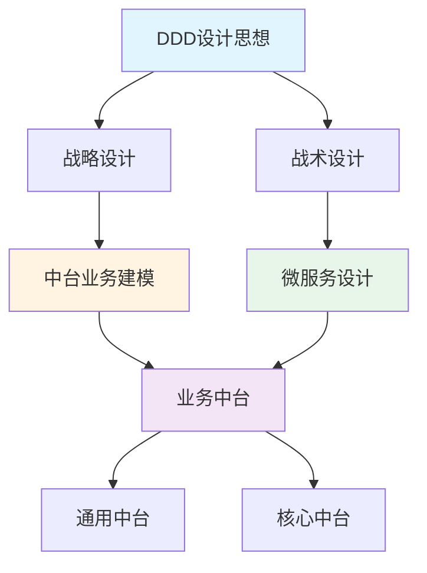

#### 5.2.2 中台建模的五步流程

**来源：博客1（第10讲）**

**第一步：**按照业务流程（通常适用于核心域）或者功能属性、集合（通常适用于通用域或支撑域），将业务域细分为多个中台，再根据功能属性或重要性归类到核心中台或通用中台。

**第二步：**选取中台，根据用例、业务场景或用户旅程完成事件风暴，找出实体、聚合和限界上下文。依次进行领域分解，建立领域模型。

**第三步：**以主领域模型为基础，扫描其它中台领域模型，检查并确定是否存在重复或者需要重组的领域对象、功能，提炼并重构主领域模型，完成最终的领域模型设计。

**第四步：**选择其它主领域模型重复第三步，直到所有主领域模型完成比对和重构。

**第五步：**基于领域模型完成微服务设计，完成系统落地。

### 5.3 技术中台的设计

#### 5.3.1 技术中台的战略目标

**来源：博客2（第12讲）**

打造支持快速交付的技术中台，应当具备以下特征：

1. **简单易用、快速便捷的技术中台**
   - 能够明显降低软件开发的工作量
   - 使软件系统易于变更、易于维护、易于技术更迭
   - 明显降低业务开发人员的技术门槛

2. **易于技术架构演化**
   - 帮助开发团队调整技术架构，进行技术架构演化
   - 有效地降低技术架构演化的成本
   - 将技术框架与业务代码解耦

3. **支持领域驱动与微服务的技术架构**
   - 支持领域驱动设计的思想落地
   - 支持微服务技术架构

#### 5.3.2 整洁架构的设计思想

**来源：博客2（第11讲）**

整洁架构（Clean Architecture）的核心设计思路：

- **中心层**：业务实体（黄色部分）与业务应用（红色部分），即通过领域模型形成的业务代码的实现
- **适配器层**：通过适配器将核心的业务代码，与外围的技术框架进行解耦
- **外层**：各种技术框架，包括UI交互、网络交互、数据库交互、外部系统交互

**整洁架构分层图：**

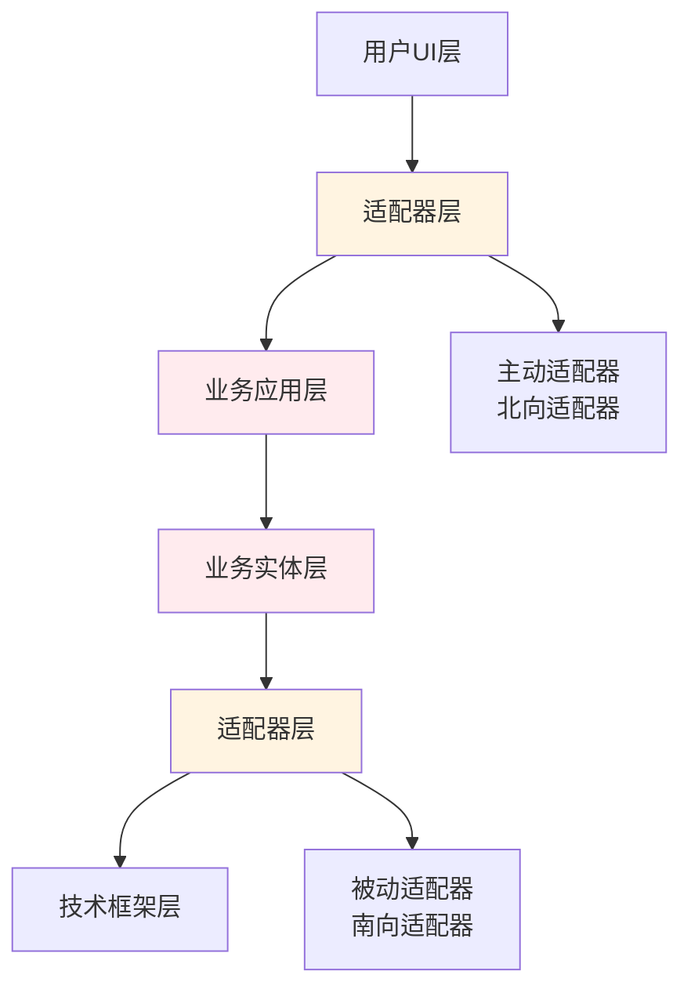

#### 5.3.3 单Controller、单DAO的设计

**来源：博客2（第13讲）**

**单Controller设计：**

- 前端所有功能的增删改操作，统一访问`OrmController`
- 前端传递参数：`bean`（Service的bean.id）、`method`（方法名）、JSON对象
- Controller通过反射调用Service方法，实现前后端解耦

**单DAO设计：**

- 所有Service统一注入`BasicDao`
- 通过`vObj.xml`配置文件建立值对象与数据库表的映射关系
- BasicDao根据配置自动生成SQL，完成数据持久化

**架构图：**

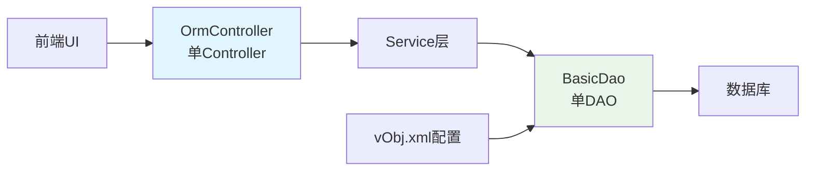

### 5.4 支持DDD的技术中台

#### 5.4.1 通用仓库与通用工厂

**来源：博客2（第14讲）**

**通用仓库的设计：**

- 在BasicDao的基础上扩展DDD功能
- 采用装饰者模式，Repository装饰BasicDao
- 支持关联查询、数据补填、聚合操作

**通用工厂的设计：**

- 根据vObj.xml中的join配置，自动装配领域对象
- 支持oneToOne、manyToOne、oneToMany三种关联类型
- 通过isAggregation=true标识聚合关系

**配置示例：**

```xml
<vo class="com.demo2.order.entity.Order" tableName="Order">
    <property name="id" column="id" isPrimaryKey="true"></property>
    <join name="orderItems" joinKey="order_id" 
          joinType="oneToMany" 
          isAggregation="true" 
          class="com.demo2.order.entity.OrderItem">
    </join>
</vo>
```

#### 5.4.2 内置聚合功能

**来源：博客2（第14讲）**

聚合是领域驱动设计中一个非常重要的概念，代表在真实世界中的整体与部分的关系。

**聚合的实现：**

- 在vObj.xml中通过`isAggregation=true`标识聚合关系
- 加载聚合时，自动加载聚合内的所有对象
- 保存聚合时，自动保存聚合内的所有对象，并置于同一事务中

**示例：订单与订单明细的聚合**

```mermaid
graph TB
    A[订单 Order] --> B[订单明细 OrderItem]
    A --> C[订单明细 OrderItem]
    A --> D[订单明细 OrderItem]
    
    A --> A1[保存订单]
    A1 --> A2[保存订单明细]
    A2 --> A3[同一事务]
    
    style A fill:#ffebee
    style B fill:#e1f5ff
    style C fill:#e1f5ff
    style D fill:#e1f5ff
```

### 5.5 支持微服务的技术中台

#### 5.5.1 微服务远程调用

**来源：博客2（第15讲）**

**Feign接口设计：**

- 在消费者端编写与生产者API一模一样的接口
- 添加@FeignClient注解，实现远程调用
- 业务代码调用本地接口，接口通过Feign实现远程调用

**ref标签配置：**

在vObj.xml中，将join标签改为ref标签，实现跨微服务的数据装配：

```xml
<ref name="supplier" 
     refKey="supplier_id" 
     refType="manyToOne" 
     bean="com.demo2.product.service.SupplierService" 
     method="loadSupplier" 
     listMethod="loadSuppliers">
</ref>
```

#### 5.5.2 技术不确定性的解决

**来源：博客2（第15讲）**

**解耦策略：**

- 单Controller接收前端请求，只有Controller与MVC框架耦合
- Service通过Feign接口调用其他微服务，只有Feign接口与Spring Cloud耦合
- 业务代码与技术框架解耦，便于未来技术架构演化

**架构演化路径：**

```mermaid
graph LR
    A[Spring Cloud] --> B[Service Mesh]
    C[业务代码] -.解耦.-> A
    C -.解耦.-> B
    
    style C fill:#e8f5e9
    style A fill:#fff4e1
    style B fill:#fff4e1
```

### 5.6 中台建设的实践路径

#### 5.6.1 自顶向下策略

**来源：博客1（第11讲）**

**适用场景：**全新的应用系统建设，或旧系统推倒重建的情况

**步骤：**

1. 将领域分解为子域，子域可以分为核心域、通用域和支撑域
2. 对子域建模，划分领域边界，建立领域模型和限界上下文
3. 根据限界上下文进行微服务设计

#### 5.6.2 自底向上策略

**来源：博客1（第11讲）**

**适用场景：**遗留系统业务模型的演进式重构

**步骤：**

1. 锁定系统所在业务域，构建领域模型
2. 对齐业务域，构建中台业务模型
3. 中台归类，根据领域模型设计微服务

**核心思想：**分域建模型，找准基准域，划定上下文，聚合重归类

### 5.7 中台建设的价值

#### 5.7.1 业务价值

**来源：博客1（第09讲）**

- **能力复用**：将通用的可复用的业务能力沉淀到中台业务模型，实现企业级能力复用
- **快速响应**：前台要做什么业务，需要什么资源，可以直接找中台，不需要每次都去改动自己的底层
- **降低重复建设**：避免多个渠道应用的重复建设问题

#### 5.7.2 技术价值

**来源：博客2（第12讲）**

- **降低技术门槛**：业务开发人员不必过于关注技术，而是将更多的精力集中在对业务的理解
- **提高交付速度**：通过技术中台的封装，减少开发工作量，提高开发速度
- **易于技术更迭**：业务代码与技术框架解耦，便于未来技术架构演化

---

## 6. 精华图片和精炼总结

> 按照递进关系罗列两个博客中的精华图片和精炼总结，标注原文URL

### 6.1 DDD核心思想递进图

#### 6.1.1 DDD的真谛

**来源：博客2（第09讲）**

**核心思想：**

```
深刻理解业务 → 绘制领域模型 → 指导数据库和程序设计
```

**图片：**


**图片说明：**领域驱动设计的真谛图 - 深刻理解业务 → 绘制领域模型 → 指导数据库和程序设计

**原文URL：**https://learn.lianglianglee.com/专栏/DDD%20微服务落地实战/09%20%20DDD%20是如何落地微服务设计实现的？.md

**精炼总结：**

> DDD的真谛是领域建模，即深入理解业务。只有深入理解业务，将对业务的深入理解设计到领域模型中，设计出来的软件才更加专业，让用户的使用更满意。

#### 6.1.2 软件退化的根源

**来源：博客2（第01讲）**

**核心思想：**

```
软件变更 → 在原有程序结构上塞代码 → 软件退化
```

**解决方案：**

```
软件变更 → 调整程序结构（两顶帽子） → 保持设计质量
```

**图片：**


**图片说明：**软件退化的根源图 - 软件变更 → 在原有程序结构上塞代码 → 软件退化

**原文URL：**https://learn.lianglianglee.com/专栏/DDD%20微服务落地实战/01%20%20DDD%20：杜绝软件退化的利器.md

**精炼总结：**

> 软件退化的根源不是软件变更，软件变更只是一个诱因。如果每次软件变更时，适时地进行解耦，进行功能扩展，再实现新的功能，就能保持高质量的软件设计。

#### 6.1.3 真实世界与软件世界的对应

**来源：博客2（第01讲）**

**对应关系：**

- 真实世界有什么事物，软件世界就有什么对象
- 真实世界中这些事物都有哪些行为，软件世界中这些对象就有哪些方法
- 真实世界中这些事物间都有哪些关系，软件世界中这些对象间就有什么关联

**图片：**


**图片说明：**真实世界与软件世界的对应图 - 真实世界有什么事物，软件世界就有什么对象

**原文URL：**https://learn.lianglianglee.com/专栏/DDD%20微服务落地实战/01%20%20DDD%20：杜绝软件退化的利器.md

### 6.2 DDD设计流程递进图

#### 6.2.1 领域建模到微服务设计的完整流程

**来源：博客1（第01讲）**

**三步划定边界：**

1. 在事件风暴中梳理业务过程中的用户操作、事件以及外部依赖关系，梳理出领域实体
2. 根据领域实体之间的业务关联性，将业务紧密相关的实体组合形成聚合
3. 根据业务及语义边界，将一个或多个聚合划定在一个限界上下文内，形成领域模型

**图片：**


**图片说明：**领域模型和微服务边界划定图 - 三步划定边界：事件风暴梳理实体 → 组合形成聚合 → 划定限界上下文

**原文URL：**https://learn.lianglianglee.com/专栏/DDD实战课/01%20领域驱动设计：微服务设计为什么要选择DDD.md

**精炼总结：**

> 通过DDD战略设计可以建立领域模型，划定领域边界，解决微服务设计过程中边界难以划定的难题。

#### 6.2.2 事件风暴完整流程

**来源：博客1（第12讲）**

**四个阶段：**

1. **产品愿景**：对产品顶层价值的设计
2. **业务场景分析**：从用户视角出发，找出领域事件、实体和命令
3. **领域建模**：找出实体之间的依赖关系组成聚合，为聚合划定限界上下文
4. **微服务拆分与设计**：将领域模型映射为微服务

**图片：**


**图片说明：**事件风暴四个阶段的流程图 - 产品愿景 → 业务场景分析 → 领域建模 → 微服务拆分与设计

**原文URL：**https://learn.lianglianglee.com/专栏/DDD实战课/12%20%20领域建模：如何用事件风暴构建领域模型？.md

**精炼总结：**

> 事件风暴是一项团队活动，领域专家与项目团队通过头脑风暴的形式，罗列出领域中所有的领域事件，整合之后形成最终的领域事件集合，然后对每一个事件，标注出导致该事件的命令，再为每一个事件标注出命令发起方的角色。

### 6.3 DDD架构设计递进图

#### 6.3.1 DDD分层架构

**来源：博客1（第07讲）**

**四层架构：**

- **用户接口层**：处理用户请求，数据转换和组装
- **应用层**：服务的组合、编排和转发
- **领域层**：实现核心业务逻辑
- **基础层**：提供基础资源服务

**图片：**


**图片说明：**DDD分层架构图 - 用户接口层、应用层、领域层、基础层四层架构

**原文URL：**https://learn.lianglianglee.com/专栏/DDD实战课/07%20%20DDD分层架构：有效降低层与层之间的依赖.md

**精炼总结：**

> DDD分层架构确定了微服务的总体架构，微服务内的主要对象有服务和实体等，它们一起协作完成业务逻辑。

#### 6.3.2 整洁架构设计

**来源：博客2（第11讲）**

**核心思想：**

- **中心层**：业务实体与业务应用（通过领域模型形成的业务代码）
- **适配器层**：将核心的业务代码与外围的技术框架进行解耦
- **外层**：各种技术框架

**图片：**


**图片说明：**整洁架构的洋葱头架构图 - 中心是业务实体和业务应用，外层是技术框架，中间是适配器层

**原文URL：**https://learn.lianglianglee.com/专栏/DDD%20微服务落地实战/11%20%20解决技术改造困局的钥匙：整洁架构.md

**精炼总结：**

> 整洁架构最核心的是业务，即我们通过领域模型分析，最后形成的那些Service、Entity与Value Object。整洁架构最关键的设计思想是通过一系列的适配器，将业务代码与技术框架解耦。

### 6.4 微服务设计递进图

#### 6.4.1 微服务拆分原则

**来源：博客2（第08讲）**

**核心原则：**

- **微服务内高内聚**：单一职责原则，每个微服务中的代码都是软件变化的一个原因
- **微服务间低耦合**：通过接口调用，实现微服务间的解耦

**图片：**


**图片说明：**微服务拆分原则图 - 微服务内高内聚、微服务间低耦合

**原文URL：**https://learn.lianglianglee.com/专栏/DDD%20微服务落地实战/08%20%20DDD%20是如何解决微服务拆分难题的？.md

**精炼总结：**

> 微服务的拆分原则就是"小而专"，即微服务内高内聚、微服务间低耦合。通过DDD进行业务建模，再基于领域模型进行限界上下文划分，就能保证系统的设计，在限界上下文内高内聚，在限界上下文间低耦合。

#### 6.4.2 领域事件通知机制

**来源：博客2（第08讲）**

**设计思路：**

- 通过消息队列实现领域事件在微服务间的通知
- "用户下单"微服务只负责发送消息
- "饭店接单"微服务只负责接收消息

**图片：**


**图片说明：**在线订餐系统的领域事件通知图 - 通过消息队列实现微服务间的异步通知

**原文URL：**https://learn.lianglianglee.com/专栏/DDD%20微服务落地实战/08%20%20DDD%20是如何解决微服务拆分难题的？.md

**精炼总结：**

> 最有效的方式就是通过消息队列，实现领域事件在微服务间的通知。这样的设计就实现了微服务之间的解耦，使得日后变更的成本降低。

### 6.5 技术中台设计递进图

#### 6.5.1 单Controller、单DAO架构

**来源：博客2（第13讲）**

**设计思想：**

- 前端所有功能统一调用一个Controller
- 所有Service统一注入一个DAO
- 通过vObj.xml配置文件建立值对象与数据库表的映射关系

**图片：**


**图片说明：**增删改部分的技术中台架构设计图 - 单Controller、单DAO的设计架构

**原文URL：**https://learn.lianglianglee.com/专栏/DDD%20微服务落地实战/13%20%20如何实现支持快速交付的技术中台设计？.md

**精炼总结：**

> 通过单Controller、单DAO的设计，开发工作量将极大地降低。在业务开发时，每个功能都不用再编写MVC层了，就不会将业务代码写到Controller中，而是规范地将业务代码编写到Service或值对象中。

#### 6.5.2 通用仓库与通用工厂

**来源：博客2（第14讲）**

**设计思想：**

- 在BasicDao的基础上扩展DDD功能
- 采用装饰者模式，Repository装饰BasicDao
- 根据vObj.xml中的join配置，自动装配领域对象

**图片：**


**图片说明：**通用仓库与通用工厂的设计图 - 在BasicDao基础上扩展DDD功能，采用装饰者模式

**原文URL：**https://learn.lianglianglee.com/专栏/DDD%20微服务落地实战/14%20%20如何设计支持%20DDD%20的技术中台？.md

**精炼总结：**

> 通用仓库就是在Dao的基础上扩展了一些新的功能。例如在装载或查询订单时，不仅要查询订单表，还要补填与订单相关的订单明细与客户信息、商品信息，并装配成一个订单对象。

#### 6.5.3 支持微服务的技术中台

**来源：博客2（第15讲）**

**设计思想：**

- 通过Feign接口实现微服务间的远程调用
- 在vObj.xml中使用ref标签替代join标签
- 业务代码与技术框架解耦，便于未来技术架构演化

**图片：**


**图片说明：**支持微服务的技术中台设计图 - 通过Feign接口实现微服务间远程调用，业务代码与技术框架解耦

**原文URL：**https://learn.lianglianglee.com/专栏/DDD%20微服务落地实战/15%20%20如何设计支持微服务的技术中台？.md

**精炼总结：**

> 采用Feign实现微服务间调用时，不修改模块A与B的任何代码，而是在该微服务的本地再制作一个模块C的接口C′。该接口与模块C一模一样，拥有模块C的所有方法，因此模块A与B还可以像以前一样在本地调用接口C′。

### 6.6 中台建设递进图

#### 6.6.1 DDD、中台和微服务的协作模式

**来源：博客1（第10讲）**

**关系图：**

- 中台本质是业务模型
- 微服务是业务模型的系统落地
- DDD可以同时指导中台业务建模和微服务设计

**图片：**


**图片说明：**DDD、中台和微服务的关系图 - DDD战略设计用于中台业务建模，战术设计指导微服务建设

**原文URL：**https://learn.lianglianglee.com/专栏/DDD实战课/10%20%20DDD、中台和微服务：它们是如何协作的？.md

**精炼总结：**

> DDD的战略设计可用于中台业务建模，战术设计可指导中台微服务设计。相信DDD与中台的完美结合，可以让你的中台建设如虎添翼！

#### 6.6.2 中台业务模型重构

**来源：博客1（第11讲）**

**重构过程：**

1. 锁定系统所在业务域，构建领域模型
2. 对齐业务域，构建中台业务模型
3. 中台归类，根据领域模型设计微服务

**图片：**


**图片说明：**中台业务模型重构流程图 - 锁定业务域 → 对齐业务域 → 中台归类

**原文URL：**https://learn.lianglianglee.com/专栏/DDD实战课/11%20%20DDD实践：如何用DDD重构中台业务模型？.md

**精炼总结：**

> 中台业务模型的重构过程，也是微服务架构演进的过程。业务边界即微服务边界，业务边界做好了，微服务的边界自然就会很好。

### 6.7 关键设计原则总结

#### 6.7.1 两顶帽子原则

**来源：博客2（第01讲）**

**核心思想：**

1. 在不添加新功能的前提下，重构代码，调整原有程序结构，以适应新功能
2. 实现新的功能

**原文URL：**https://learn.lianglianglee.com/专栏/DDD%20微服务落地实战/01%20%20DDD%20：杜绝软件退化的利器.md

**精炼总结：**

> 保持软件设计不退化的关键在于每次需求变更的设计，只有保证每次需求变更时做出正确的设计，才能保证软件以一种良性循环的方式不断维护下去。这种正确的设计方式就是"两顶帽子"。

#### 6.7.2 单一职责原则

**来源：博客2（第02讲）**

**核心思想：**

- 一个职责就是软件变化的一个原因
- 将软件变化同一个原因的代码放在一起，将软件变化不同原因的代码分开放

**原文URL：**https://learn.lianglianglee.com/专栏/DDD%20微服务落地实战/02%20%20以电商支付功能为例演练%20DDD.md

**精炼总结：**

> 单一职责原则要求我们在维护软件的过程中需要不断地进行整理，将软件变化同一个原因的代码放在一起，将软件变化不同原因的代码分开放。

#### 6.7.3 开放-封闭原则

**来源：博客2（第01讲）**

**核心思想：**

- **开放原则**：对于功能扩展是开放的
- **封闭原则**：对软件代码的修改应当是封闭的

**原文URL：**https://learn.lianglianglee.com/专栏/DDD%20微服务落地实战/01%20%20DDD%20：杜绝软件退化的利器.md

**精炼总结：**

> 在增加新功能的时候，新代码与老代码应当隔离，不能在同一个类、同一个方法中。

---

## 总结

DDD学习是一个循序渐进的过程，需要理论与实践相结合。通过系统学习DDD的核心概念、设计思想和实践方法，可以掌握一套完整而系统的基于DDD的微服务设计和拆分方法，明确从战略设计到战术设计的微服务标准设计过程，使得微服务设计思路能够更加清晰，设计过程更加规范，让中台和微服务落地如虎添翼。

**关键要点：**

1. **战略设计优先**：先有领域模型，然后才有微服务
2. **统一语言基础**：建立团队统一的通用语言
3. **限界上下文关键**：限界上下文是微服务边界的主要依据
4. **事件风暴方法**：通过事件风暴快速完成领域建模
5. **持续演进**：保持架构和代码的生命力

**学习建议：**

- 多动手参与几次DDD事件风暴工作坊
- 结合实际项目进行实践
- 持续学习和改进

相信通过系统学习和实践，你能够掌握DDD的核心设计思想，成功应用于微服务和中台设计中！

