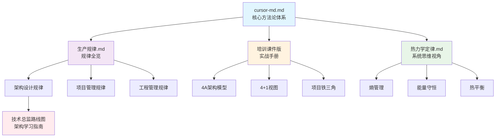

# 📚 Cursor MD 文档索引

> 本目录包含架构、项目管理相关的核心知识文档

---

## 📖 文档列表

### 1. 🏗️ [高级架构师 & 高级项目管理师](./cursor-md.md)

**定位**：技术系统长期演进的设计者 & 项目目标按期高质量达成的负责人

**内容概览**：
- 必须遵守 vs 建议遵守的规律（方法论底座）
- 架构、设计、实现领域的核心规律
- 项目管理领域的核心规律
- 4A架构模型、4+1架构视图等架构模型详解
- 项目铁三角模型等项目管理模型详解
- 工作职责、重点、难点分析

**适用人群**：高级架构师、技术负责人、项目经理、技术管理者

---

### 2. 📊 [架构、项目与工程管理核心规律全览](./生产规律.md)

**定位**：系统梳理架构、项目、工程管理三大领域的核心规律

**内容概览**：
- 规律分类总览（架构设计规律、项目管理规律、工程管理规律）
- 系统演化规律、复杂度规律、组织架构规律
- 计划执行规律、资源约束规律、风险应对规律
- 团队协作规律、质量保障规律、持续改进规律

**适用人群**：架构师、项目经理、工程管理者

---

### 3. 📘 [《高级架构师 × 项目经理实战手册》培训课件版](./《高级架构师_项目经理实战手册（培训课件版）》.md)

**定位**：培训课件结构，每一节 = 一页 PPT

**内容概览**：
- 课程总览：为什么需要"双角色视角"
- 架构师与项目经理的工作职责详解
- 架构领域重要模型和视图（4A、4+1、TOGAF等）
- 项目管理领域重要模型（铁三角、PMBOK、敏捷等）
- 实战案例和工具方法

**适用人群**：培训讲师、学员、需要快速了解核心要点的管理者

---

### 4. 🌡️ [热力学定律及其在IT架构与项目管理中的应用](./热力学定律.md)

**定位**：用热力学四大定律的视角理解IT系统的演化规律

**内容概览**：
- 🌡️ 热力学四大定律概述
  - 第零定律（热平衡定律）- 系统状态一致性
  - 第一定律（能量守恒定律）- 资源守恒
  - 第二定律（熵增定律）- 系统自然趋于混乱
  - 第三定律（绝对零度定律）- 完美系统不存在
- 🛠️ IT架构师的应用框架
  - 熵管理框架
  - 能量守恒的资源分配模型
  - 热平衡的状态管理
- 📋 项目管理师的应用框架
  - 项目熵的管理策略
  - 基于能量守恒的项目规划
  - 热平衡在团队管理中的应用
- 🔬 实战案例分析
- 📈 度量指标体系

**适用人群**：架构师、项目经理、技术管理者、对系统思维感兴趣的技术人员

**特色**：包含丰富的 Mermaid 图表和表格，可视化展示热力学概念在IT领域的应用

---

### 5. 🎯 [技术总监架构设计学习路线图](./技术总监架构设计学习路线图.md)

**定位**：针对技术总监（12年经验，擅长技术管理）的架构设计系统化学习指南

**内容概览**：
- 📊 **第一部分**：架构设计领域技能体系全景
  - 技术架构能力（系统设计、技术选型、性能优化等）
  - 业务架构能力（领域建模、业务抽象、中台设计等）
  - 架构治理能力（架构评审、技术债务管理、架构演进等）
  - 架构思维（系统思维、抽象思维、权衡思维等）
- 🎯 **第二部分**：技术总监架构发展方向深度分析
  - 企业架构师 vs 解决方案架构师 vs 技术架构师 vs 业务架构师
  - 四大方向优势劣势对比分析
  - 重点难点深度剖析
  - **推荐路径**：企业架构师 + 解决方案架构师双路径发展
- 🗺️ **第三部分**：成长路线图与学习计划
  - 第一年：基础补强期（架构理论基础、技术深度补强、架构实践）
  - 第二年：解决方案架构师实践期（业务场景分析、技术方案设计）
  - 第三年：企业架构师提升期（企业架构方法论、架构治理体系）
- 📋 **第四部分**：学习资源推荐（必读书籍、在线课程、认证考试）
- 🎯 **第五部分**：行动计划与里程碑（年度目标、月度计划、关键里程碑）
- 💡 **第六部分**：风险与应对策略

**适用人群**：技术总监、技术管理者、希望转型架构师的技术负责人

**特色**：
- 基于技术总监背景的定制化路线图
- 四大架构方向深度对比分析
- 3年详细学习计划和时间线
- 包含丰富的表格、图表和甘特图

---

## 🗂️ 文档关系图

---

## 📝 使用建议

1. **新手入门**：建议先阅读 `cursor-md.md` 了解整体框架
2. **深入学习**：阅读 `生产规律.md` 系统掌握各领域规律
3. **实战应用**：参考 `培训课件版` 获取具体方法和工具
4. **思维提升**：阅读 `热力学定律.md` 培养系统思维

---

## 🔄 更新日志

- **2024年**：创建文档索引
- 所有文档均支持 Mermaid 图表渲染
- 建议使用支持 Mermaid 的 Markdown 查看器（如 VS Code + Markdown Preview Enhanced）

---

## 📌 快速导航

| 文档 | 核心主题 | 页数/行数 | 推荐阅读顺序 |
|------|---------|----------|------------|
| [cursor-md.md](./cursor-md.md) | 方法论体系 | ~157行 | ⭐⭐⭐⭐⭐ |
| [生产规律.md](./生产规律.md) | 规律全览 | ~266行 | ⭐⭐⭐⭐ |
| [培训课件版](./《高级架构师_项目经理实战手册（培训课件版）》.md) | 实战手册 | ~243行 | ⭐⭐⭐ |
| [热力学定律.md](./热力学定律.md) | 系统思维 | ~509行 | ⭐⭐⭐⭐ |
| [技术总监架构设计学习路线图](./技术总监架构设计学习路线图.md) | 学习路线图 | ~800+行 | ⭐⭐⭐⭐⭐ |

---

**最后更新**：2024年

