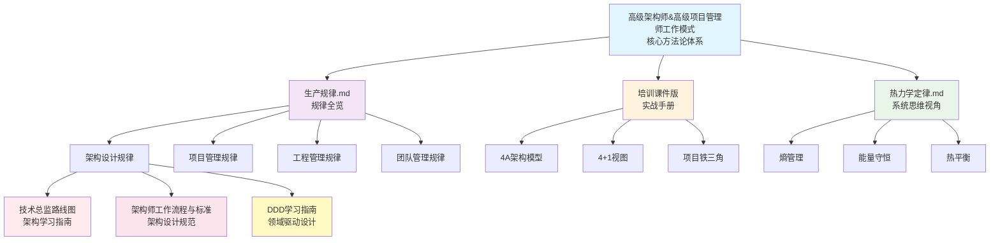

# 📚 Cursor MD 文档索引

> 本目录包含架构、项目管理相关的核心知识文档

---

## 📖 文档列表

### 1. 🏗️ [高级架构师 & 高级项目管理师](./高级架构师&高级项目管理师工作模式.md)

**定位**：技术系统长期演进的设计者 & 项目目标按期高质量达成的负责人

**内容概览**：

- 必须遵守 vs 建议遵守的规律（方法论底座）
- 架构、设计、实现领域的核心规律
- 项目管理领域的核心规律
- 4A架构模型、4+1架构视图等架构模型详解
- 项目铁三角模型等项目管理模型详解
- 工作职责、重点、难点分析

**适用人群**：高级架构师、技术负责人、项目经理、技术管理者

---

### 2. 📊 [架构、项目与工程管理核心规律全览](./生产规律.md)

**定位**：系统梳理架构、项目、工程管理三大领域的核心规律

**内容概览**：

- 规律分类总览（架构设计规律、项目管理规律、工程管理规律）
- 系统演化规律、复杂度规律、组织架构规律
- 计划执行规律、资源约束规律、风险应对规律
- 团队协作规律、质量保障规律、持续改进规律

**适用人群**：架构师、项目经理、工程管理者

---

### 3. 📘 [《高级架构师 × 项目经理实战手册》培训课件版](./《高级架构师_项目经理实战手册（培训课件版）》.md)

**定位**：培训课件结构，每一节 = 一页 PPT

**内容概览**：

- 课程总览：为什么需要"双角色视角"
- 架构师与项目经理的工作职责详解
- 架构领域重要模型和视图（4A、4+1、TOGAF等）
- 项目管理领域重要模型（铁三角、PMBOK、敏捷等）
- 实战案例和工具方法

**适用人群**：培训讲师、学员、需要快速了解核心要点的管理者

---

### 4. 🌡️ [热力学定律及其在IT架构与项目管理中的应用](./热力学定律.md)

**定位**：用热力学四大定律的视角理解IT系统的演化规律

**内容概览**：

- 🌡️ 热力学四大定律概述
  - 第零定律（热平衡定律）- 系统状态一致性
  - 第一定律（能量守恒定律）- 资源守恒
  - 第二定律（熵增定律）- 系统自然趋于混乱
  - 第三定律（绝对零度定律）- 完美系统不存在
- 🛠️ IT架构师的应用框架
  - 熵管理框架
  - 能量守恒的资源分配模型
  - 热平衡的状态管理
- 📋 项目管理师的应用框架
  - 项目熵的管理策略
  - 基于能量守恒的项目规划
  - 热平衡在团队管理中的应用
- 🔬 实战案例分析
- 📈 度量指标体系

**适用人群**：架构师、项目经理、技术管理者、对系统思维感兴趣的技术人员

**特色**：包含丰富的 Mermaid 图表和表格，可视化展示热力学概念在IT领域的应用

---

### 5. 🎯 [技术总监架构设计学习路线图](./技术总监架构设计学习路线图.md)

**定位**：针对技术总监（12年经验，擅长技术管理）的架构设计系统化学习指南

**内容概览**：

- 📊 **第一部分**：架构设计领域技能体系全景
  - 技术架构能力（系统设计、技术选型、性能优化等）
  - 业务架构能力（领域建模、业务抽象、中台设计等）
  - 架构治理能力（架构评审、技术债务管理、架构演进等）
  - 架构思维（系统思维、抽象思维、权衡思维等）
- 🎯 **第二部分**：技术总监架构发展方向深度分析
  - 企业架构师 vs 解决方案架构师 vs 技术架构师 vs 业务架构师
  - 四大方向优势劣势对比分析
  - 重点难点深度剖析
  - **推荐路径**：企业架构师 + 解决方案架构师双路径发展
- 🗺️ **第三部分**：成长路线图与学习计划
  - 第一年：基础补强期（架构理论基础、技术深度补强、架构实践）
  - 第二年：解决方案架构师实践期（业务场景分析、技术方案设计）
  - 第三年：企业架构师提升期（企业架构方法论、架构治理体系）
- 📋 **第四部分**：学习资源推荐（必读书籍、在线课程、认证考试）
- 🎯 **第五部分**：行动计划与里程碑（年度目标、月度计划、关键里程碑）
- 💡 **第六部分**：风险与应对策略

**适用人群**：技术总监、技术管理者、希望转型架构师的技术负责人

**特色**：

- 基于技术总监背景的定制化路线图
- 四大架构方向深度对比分析
- 3年详细学习计划和时间线
- 包含丰富的表格、图表和甘特图

---

### 6. 🏗️ [架构师工作流程与标准](./架构师工作流程与标准.md)

**定位**：高级架构师工作流程与标准规范

**内容概览**：

- 🎯 **第一部分**：架构设计核心思路
  - 应用架构设计：分层解耦、服务化、可扩展
  - 中台架构设计：能力复用、业务赋能、数据驱动（包含租户设计、成本分摊）
  - 基础架构设计：稳定性、可扩展性、自动化（包含可观测性、混沌工程、AIOPS）
  - 网络架构设计：高可用、高性能、安全性
- 📊 **第二部分**：架构指标与达成手段
  - 应用架构指标：SLA、MTTR、P99延迟、吞吐量、RPO/RTO
  - 中台架构指标：能力复用率、响应时间、数据质量、租户隔离、成本分摊
  - 基础架构指标：资源利用率、弹性伸缩、可观测性、混沌工程、AIOPS
  - 网络架构指标：网络延迟、网络质量、带宽利用率
- 🚀 **第三部分**：常见场景架构设计
  - 百万QPS短链系统：分布式ID、多级缓存、分库分表
  - 百万QPS IM系统：长连接、消息队列、消息存储
  - 百万QPS秒杀系统：限流、Redis原子操作、异步处理
  - 百万QPS搜索引擎系统：倒排索引、查询缓存、实时索引

**适用人群**：高级架构师、技术负责人、系统架构师

**特色**：

- 系统化的架构设计方法论
- 四大架构类型的核心思路和设计要点
- 完整的指标体系和达成手段
- 百万QPS级别的高并发场景实战案例
- 包含可观测性、混沌工程、AIOPS等现代运维手段
- 包含租户设计、成本分摊等中台架构关键内容
- 丰富的 Mermaid 架构图和表格

---

### 7. 🏛️ [DDD学习指南](./DDD学习指南.md)

**定位**：基于《DDD实战课》和《DDD微服务落地实战》两个专栏内容整理的领域驱动设计系统学习指南

**内容概览**：

- 📚 **第一部分**：DDD学习路线图
  - 基础篇：核心概念掌握（理解DDD价值、领域划分、限界上下文、领域模型基础单元）
  - 进阶篇：架构设计与模式（领域事件和分层架构、微服务架构模型）
  - 实战篇：领域建模与微服务设计
- 🎯 **第二部分**：DDD学习的重点和难点
  - 战略设计：领域划分、限界上下文识别
  - 战术设计：聚合设计、领域服务、领域事件
  - 中台设计：业务中台、技术中台、数据中台
- 💡 **第三部分**：DDD适合的场景
  - 复杂业务领域建模
  - 微服务拆分与设计
  - 中台架构构建
- 🚀 **第四部分**：实战方法与案例
  - 事件风暴工作坊
  - 领域建模实践
  - 微服务落地实战
- 🏗️ **第五部分**：DDD中台构建和设计
  - 业务中台设计方法
  - 技术中台架构
  - 数据中台建设
- 📸 **第六部分**：精华图片和精炼总结

**适用人群**：架构师、技术负责人、希望掌握DDD领域建模的开发者

**特色**：

- 整合两个权威DDD专栏内容
- 系统化的学习路径和实战方法
- 包含中台架构设计实践
- 丰富的图表和案例说明

---

## 🗂️ 文档关系图

---

## 📝 使用建议

1. **新手入门**：建议先阅读 `高级架构师&高级项目管理师工作模式.md` 了解整体框架
2. **深入学习**：阅读 `生产规律.md` 系统掌握各领域规律
3. **实战应用**：参考 `培训课件版` 获取具体方法和工具
4. **思维提升**：阅读 `热力学定律.md` 培养系统思维
5. **领域建模**：学习 `DDD学习指南.md` 掌握领域驱动设计方法

---

## 🔄 更新日志

- **2024年**：创建文档索引
- **2024年**：新增《架构师工作流程与标准》文档
  - 补充基础架构的可观测性、混沌工程、AIOPS内容
  - 补充中台架构的租户设计、成本分摊内容
  - 包含四大架构类型的设计思路和百万QPS场景实战案例
- **2024年**：新增《生产规律.md》团队管理领域规律
  - 补充团队效能规律、沟通协作规律、团队发展阶段规律
  - 补充激励与动机规律、团队规模规律、领导力与影响力规律
- **2024年**：新增《DDD学习指南.md》文档
  - 整合DDD实战课和DDD微服务落地实战两个专栏内容
  - 包含完整的DDD学习路线图和实战方法
- 所有文档均支持 Mermaid 图表渲染
- 建议使用支持 Mermaid 的 Markdown 查看器（如 VS Code + Markdown Preview Enhanced）

---

## 📌 快速导航

| 文档 | 核心主题 | 页数/行数 | 推荐阅读顺序 |
|------|---------|----------|------------|
| [高级架构师&高级项目管理师工作模式.md](./高级架构师&高级项目管理师工作模式.md) | 方法论体系 | ~157行 | ⭐⭐⭐⭐⭐ |
| [生产规律.md](./生产规律.md) | 规律全览 | ~360行 | ⭐⭐⭐⭐ |
| [培训课件版](./《高级架构师_项目经理实战手册（培训课件版）》.md) | 实战手册 | ~243行 | ⭐⭐⭐ |
| [热力学定律.md](./热力学定律.md) | 系统思维 | ~509行 | ⭐⭐⭐⭐ |
| [技术总监架构设计学习路线图.md](./技术总监架构设计学习路线图.md) | 学习路线图 | ~709行 | ⭐⭐⭐⭐⭐ |
| [架构师工作流程与标准.md](./架构师工作流程与标准.md) | 架构设计规范 | ~1200+行 | ⭐⭐⭐⭐⭐ |
| [DDD学习指南.md](./DDD学习指南.md) | 领域驱动设计 | ~2400+行 | ⭐⭐⭐⭐ |

---

**最后更新**：2024年
