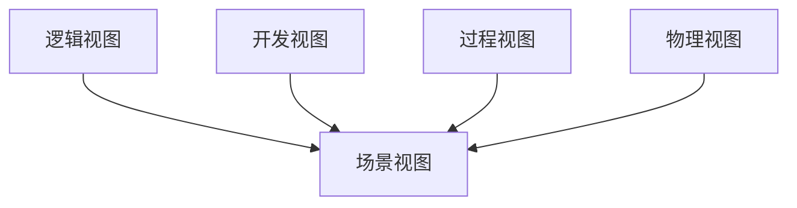
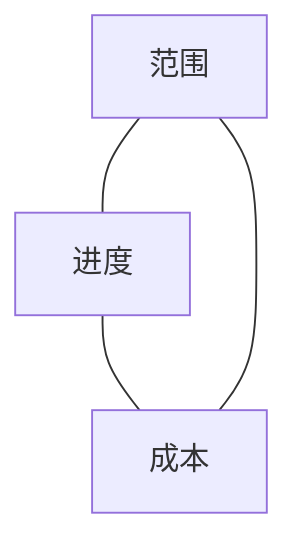
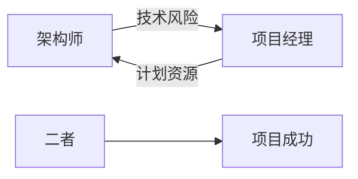

# 📘《高级架构师 × 项目经理实战手册》
## 🎓 培训课件结构（每一节 = 一页 PPT）

> **使用方式**：每个「Slide」即一页 PPT，包含【核心要点 / 方法工具 / 实战示例 / 讲师提示】  
> **目标人群**：高级架构师、技术负责人、项目经理、技术管理者

---

## Slide 1｜课程总览：为什么需要“双角色视角”？

**核心要点**
- 架构失败 ≠ 项目失败；但二者高度耦合
- 架构关注 **长期正确性**，项目关注 **短期确定性**
- 真正复杂的问题出现在“取舍区”

**方法工具**
- 双目标权衡模型（长期 vs 短期）

**实战示例**
- 技术方案正确，但项目延期 → 商业失败

**讲师提示**
- 强调：不是“谁更重要”，而是“如何协同”

---

## Slide 2｜两大角色的核心使命

| 角色 | 核心使命 | 成功标准 |
|---|---|---|
| 高级架构师 | 构建可演进系统 | 3–5 年仍可扩展 |
| 高级项目经理 | 确保目标达成 | 按期、按质、可交付 |

**讲师提示**
- 一个负责“做对的事”，一个负责“把事做完”

---

## Slide 3｜必须遵守 vs 建议遵守（架构/设计/实现）

| 类型 | 必须遵守（红线） | 建议遵守（经验） |
|---|---|---|
| 架构 | 高内聚低耦合 依赖倒置 分层隔离 | KISS YAGNI |
| 实现 | 代码评审 自动化测试 CI/CD | 静态扫描 代码规范 |

**实战示例**
- 无自动化测试 → 架构再好也会被破坏

---

## Slide 4｜必须遵守 vs 建议遵守（项目管理）

| 类型 | 必须遵守 | 建议遵守 |
|---|---|---|
| 约束 | 范围 / 进度 / 成本受控 | 价值最大化 |
| 变更 | 评估 + 审批 | 变更缓冲池 |
| 风险 | 风险登记 | 情景推演 |

**讲师提示**
- 项目失控，80% 源于“软规则当成可忽略”

---

## Slide 5｜架构师职责全景图

| 层级 | 关注点 | 典型产出 |
|---|---|---|
| 战略层 | 技术方向 | 技术路线图 |
| 架构层 | 系统拆分 | 架构图 |
| 设计层 | 技术决策 | ADR 决策记录 |
| 治理层 | 长期健康 | 架构评审结论 |

**实战示例**
- ADR：为何选择微服务而非单体

---

## Slide 6｜架构师的三大难点

**难点**
1. 抽象过度 vs 抽象不足
2. 长期收益 vs 短期交付
3. 技术正确 ≠ 商业正确

**反模式**
- 为未来 5 年设计，当前 6 个月无法落地

---

## Slide 7｜项目经理职责全景图

| 知识域 | 核心问题 | 工具 |
|---|---|---|
| 范围 | 做什么、不做什么 | WBS |
| 进度 | 何时完成 | 甘特图 / CPM |
| 成本 | 花多少钱 | EV |
| 风险 | 哪会出事 | 风险矩阵 |

---

## Slide 8｜项目经理的三大难点

**难点**
- 干系人博弈
- 不确定性管理
- 技术不可控因素

**实战示例**
- 架构重构是否算“需求变更”？

---

## Slide 9｜4A 架构模型（是什么 & 何时用）

| A | 关注点 | 回答问题 |
|---|---|---|
| Application | 应用结构 | 系统如何拆 |
| Data | 数据 | 数据如何流 |
| Technology | 技术平台 | 用什么技术 |
| Integration | 集成 | 系统如何协作 |

**讲师提示**
- 非常适合做“技术蓝图”

---

## Slide 10｜4+1 架构视图（是谁在看？）

| 视图 | 主要受众 |
|---|---|
| 逻辑 | 业务 / 开发 |
| 开发 | 开发人员 |
| 过程 | 架构师 |
| 物理 | 运维 |

---

## Slide 11｜架构模型横向对比

| 模型 | 强项 | 弱项 | 适用 |
|---|---|---|---|
| C4 | 易沟通 | 无治理 | 微服务 |
| TOGAF | 企业级 | 偏流程 | 集团 |
| Zachman | 全覆盖 | 难落地 | 蓝图 |
| DDD | 贴业务 | 成本高 | 复杂域 |

---

## Slide 12｜项目铁三角（必考模型）

**核心结论**
- 三者不可同时无限制扩大

---

## Slide 13｜项目管理模型全景对比

| 模型 | 关注点 | 场景 |
|---|---|---|
| PMBOK | 全流程 | 传统项目 |
| 敏捷价值三角 | 价值 | 软件研发 |
| PRINCE2 | 治理 | 政企 |
| EV | 量化 | 大项目 |
| RACI | 职责 | 多角色 |

---

## Slide 14｜架构师 × 项目经理协同机制

**协同抓手**
- 架构评审会
- 技术风险清单
- 路线图对齐

---

## Slide 15｜真实失败案例复盘

**案例**
- 架构升级未纳入项目计划

**问题**
- 技术债未量化
- 项目风险未同步

**改进**
- 技术债 = 项目风险

---

## Slide 16｜实战 Checklist（落地工具）

**架构师**
- 是否有清晰边界？
- 是否记录关键决策？

**项目经理**
- 是否冻结范围？
- 是否量化风险？

---

## Slide 17｜终极心法

> **架构师不是画图的**  
> **项目经理不是催进度的**  
> **高手，永远在做权衡**

---

## Slide 18｜课程总结 & 行动建议

**行动清单**
- 建立架构 × 项目联合评审
- 技术风险进入项目风险池
- 长短期目标定期对齐

**结束语**
> 系统成功 = 技术正确 × 项目可控

