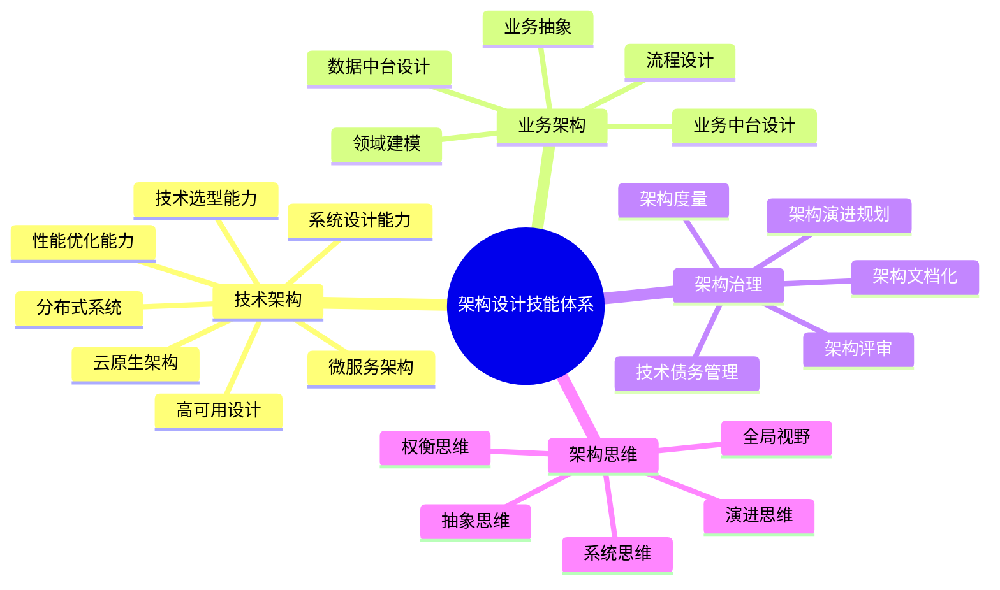
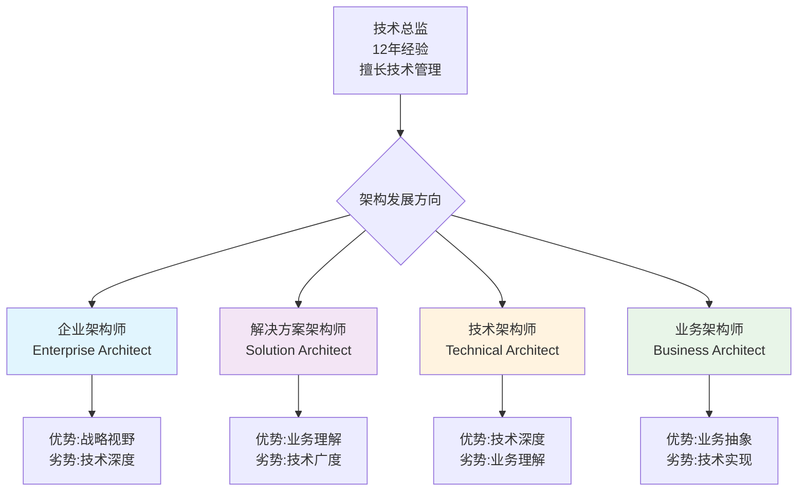
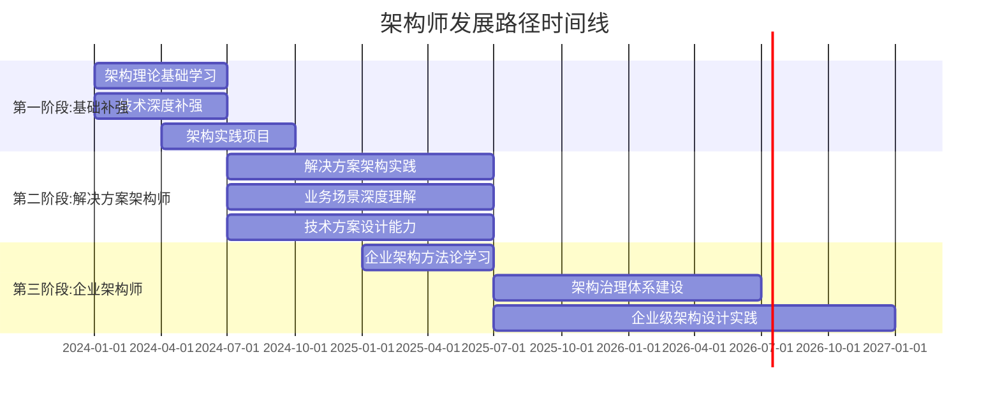
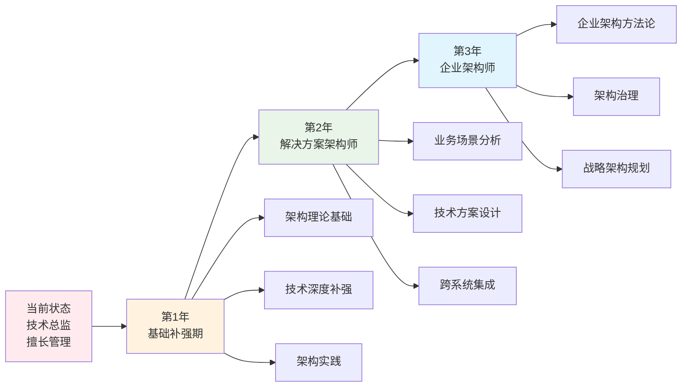
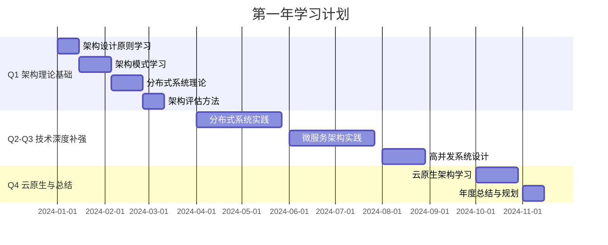
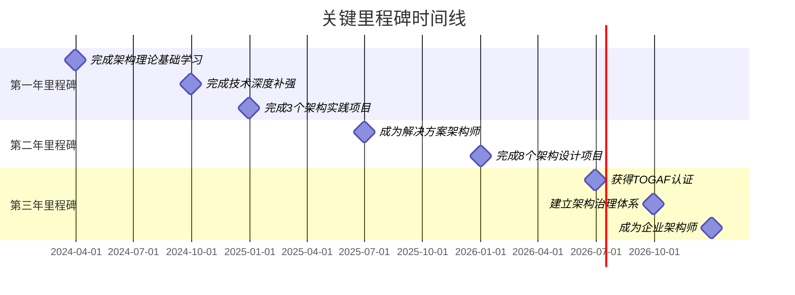

# 🎯 技术总监架构设计学习路线图

> **背景**：技术总监，12年工作经验，擅长技术管理，希望系统化学习架构设计  
> **目标**：从技术管理视角转向架构设计专家，构建完整的架构能力体系

---

## 📊 第一部分：架构设计领域技能体系全景

### 1.1 架构设计核心技能树

### 1.2 架构设计技能详细分解

#### 🔧 **一、技术架构能力（Technical Architecture）**

| 技能维度 | 核心能力 | 掌握程度要求 | 实践场景 |
|---------|---------|------------|---------|
| **系统设计** | 能够设计大规模分布式系统 | ⭐⭐⭐⭐⭐ | 设计支撑千万级用户的系统架构 |
| **技术选型** | 基于场景选择合适技术栈 | ⭐⭐⭐⭐⭐ | 微服务框架、消息队列、数据库选型 |
| **性能优化** | 系统性能瓶颈分析与优化 | ⭐⭐⭐⭐ | 高并发场景下的性能调优 |
| **高可用设计** | 设计99.99%+可用性系统 | ⭐⭐⭐⭐⭐ | 多活架构、容灾方案设计 |
| **分布式系统** | 分布式一致性、CAP理论应用 | ⭐⭐⭐⭐⭐ | 分布式事务、分布式锁设计 |
| **微服务架构** | 微服务拆分、治理、监控 | ⭐⭐⭐⭐⭐ | 微服务架构设计与落地 |
| **云原生架构** | 容器化、K8s、Service Mesh | ⭐⭐⭐⭐ | 云原生架构设计与实施 |

#### 💼 **二、业务架构能力（Business Architecture）**

| 技能维度 | 核心能力 | 掌握程度要求 | 实践场景 |
|---------|---------|------------|---------|
| **领域建模** | DDD领域驱动设计 | ⭐⭐⭐⭐ | 复杂业务领域的建模与设计 |
| **业务抽象** | 业务能力抽象与复用 | ⭐⭐⭐⭐⭐ | 业务中台、能力平台设计 |
| **流程设计** | 业务流程梳理与优化 | ⭐⭐⭐⭐ | 跨系统业务流程设计 |
| **业务中台** | 业务能力中心化设计 | ⭐⭐⭐⭐⭐ | 企业中台架构设计 |
| **数据中台** | 数据资产化与数据服务化 | ⭐⭐⭐⭐ | 数据中台架构设计 |

#### 🏛️ **三、架构治理能力（Architecture Governance）**

| 技能维度 | 核心能力 | 掌握程度要求 | 实践场景 |
|---------|---------|------------|---------|
| **架构评审** | 技术方案评审与决策 | ⭐⭐⭐⭐⭐ | 重大项目技术方案评审 |
| **技术债务管理** | 技术债务识别与偿还规划 | ⭐⭐⭐⭐⭐ | 技术债务治理体系建设 |
| **架构演进规划** | 架构演进路线图制定 | ⭐⭐⭐⭐⭐ | 3-5年架构演进规划 |
| **架构度量** | 架构质量度量与监控 | ⭐⭐⭐⭐ | 架构健康度指标体系 |
| **架构文档化** | 架构文档编写与维护 | ⭐⭐⭐⭐ | 架构设计文档、决策记录 |

#### 🧠 **四、架构思维（Architecture Thinking）**

| 思维类型 | 核心要点 | 应用场景 |
|---------|---------|---------|
| **系统思维** | 全局视角、系统边界、依赖关系 | 复杂系统设计 |
| **抽象思维** | 分层抽象、概念模型、接口设计 | 架构分层设计 |
| **权衡思维** | 性能vs成本、一致性vs可用性 | 架构决策制定 |
| **演进思维** | 渐进式演进、可扩展设计 | 架构演进规划 |
| **全局视野** | 技术+业务+组织+战略 | 企业级架构设计 |

---

## 🎯 第二部分：技术总监架构发展方向深度分析

### 2.1 技术总监的架构发展路径选择

### 2.2 四大架构方向深度对比分析

#### 🏢 **方向一：企业架构师（Enterprise Architect）**

**角色定位**：
- 负责企业级架构规划与治理
- 连接业务战略与技术实现
- 跨部门架构协调与决策

**✅ 优势分析**：
| 优势维度 | 具体体现 | 评分 |
|---------|---------|------|
| **战略视野** | 12年管理经验，具备战略思维 | ⭐⭐⭐⭐⭐ |
| **组织协调** | 擅长跨部门沟通与资源协调 | ⭐⭐⭐⭐⭐ |
| **全局视角** | 能够从企业全局思考架构问题 | ⭐⭐⭐⭐⭐ |
| **业务理解** | 多年管理经验，理解业务本质 | ⭐⭐⭐⭐ |
| **影响力** | 技术总监身份，具备决策影响力 | ⭐⭐⭐⭐⭐ |

**❌ 劣势分析**：
| 劣势维度 | 具体体现 | 影响程度 |
|---------|---------|---------|
| **技术深度** | 长期管理，技术细节可能生疏 | ⚠️⚠️⚠️ 中等 |
| **架构方法论** | 缺乏系统化的架构方法论学习 | ⚠️⚠️⚠️ 中等 |
| **架构实践** | 可能缺乏大型架构设计实践经验 | ⚠️⚠️⚠️⚠️ 较高 |
| **技术前沿** | 新技术跟踪可能不够深入 | ⚠️⚠️ 较低 |

**🎯 重点难点**：
- **重点**：
  - 企业架构方法论（TOGAF、Zachman等）
  - 架构治理体系建设
  - 业务架构与技术架构的衔接
  - 架构演进规划与路线图制定
- **难点**：
  - 如何在保持技术深度的同时提升架构高度
  - 如何平衡长期架构目标与短期业务需求
  - 如何建立有效的架构治理机制

**📈 发展前景**：
- **市场需求**：⭐⭐⭐⭐⭐（大型企业、互联网公司需求旺盛）
- **薪资水平**：80-150万/年（一线城市）
- **职业天花板**：CTO、技术VP

---

#### 💡 **方向二：解决方案架构师（Solution Architect）**

**角色定位**：
- 负责具体业务场景的技术解决方案设计
- 连接业务需求与技术实现
- 跨技术栈的架构设计

**✅ 优势分析**：
| 优势维度 | 具体体现 | 评分 |
|---------|---------|------|
| **业务理解** | 技术管理经验，理解业务痛点 | ⭐⭐⭐⭐⭐ |
| **技术广度** | 管理多技术栈团队，技术视野广 | ⭐⭐⭐⭐ |
| **问题解决** | 擅长分析问题、设计解决方案 | ⭐⭐⭐⭐⭐ |
| **沟通协调** | 能够与业务、技术团队有效沟通 | ⭐⭐⭐⭐⭐ |
| **项目管理** | 具备项目管理能力，能推动落地 | ⭐⭐⭐⭐⭐ |

**❌ 劣势分析**：
| 劣势维度 | 具体体现 | 影响程度 |
|---------|---------|---------|
| **技术深度** | 可能缺乏某个技术领域的深度 | ⚠️⚠️⚠️ 中等 |
| **架构理论** | 架构设计理论体系可能不完整 | ⚠️⚠️⚠️ 中等 |
| **大规模实践** | 可能缺乏超大规模系统设计经验 | ⚠️⚠️⚠️ 中等 |

**🎯 重点难点**：
- **重点**：
  - 业务场景分析与抽象
  - 技术方案设计与选型
  - 非功能需求设计（性能、可用性、扩展性）
  - 跨系统集成设计
- **难点**：
  - 如何在技术选型中做出最优决策
  - 如何平衡技术先进性与稳定性
  - 如何设计可扩展的解决方案

**📈 发展前景**：
- **市场需求**：⭐⭐⭐⭐⭐（各行业都需要）
- **薪资水平**：60-120万/年（一线城市）
- **职业天花板**：高级解决方案架构师、技术专家

---

#### ⚙️ **方向三：技术架构师（Technical Architect）**

**角色定位**：
- 负责核心技术架构设计与优化
- 技术栈选型与技术标准制定
- 技术团队技术能力提升

**✅ 优势分析**：
| 优势维度 | 具体体现 | 评分 |
|---------|---------|------|
| **技术管理** | 管理技术团队，理解技术管理 | ⭐⭐⭐⭐⭐ |
| **技术视野** | 接触多种技术栈，视野开阔 | ⭐⭐⭐⭐ |
| **团队培养** | 能够培养技术团队架构能力 | ⭐⭐⭐⭐⭐ |
| **技术决策** | 具备技术决策经验 | ⭐⭐⭐⭐⭐ |

**❌ 劣势分析**：
| 劣势维度 | 具体体现 | 影响程度 |
|---------|---------|---------|
| **技术深度** | 长期管理，编码和深度技术可能生疏 | ⚠️⚠️⚠️⚠️ 较高 |
| **架构实践** | 可能缺乏大型架构设计实践经验 | ⚠️⚠️⚠️⚠️ 较高 |
| **业务理解** | 可能对业务理解不够深入 | ⚠️⚠️⚠️ 中等 |
| **技术前沿** | 新技术跟踪可能不够及时 | ⚠️⚠️⚠️ 中等 |

**🎯 重点难点**：
- **重点**：
  - 分布式系统架构设计
  - 高并发、高可用系统设计
  - 微服务架构设计与治理
  - 云原生架构设计
- **难点**：
  - 如何快速补强技术深度
  - 如何获得大型架构设计实践机会
  - 如何平衡技术先进性与稳定性

**📈 发展前景**：
- **市场需求**：⭐⭐⭐⭐（技术驱动型公司需求大）
- **薪资水平**：70-130万/年（一线城市）
- **职业天花板**：首席架构师、技术专家

---

#### 📋 **方向四：业务架构师（Business Architect）**

**角色定位**：
- 负责业务架构设计与优化
- 业务能力抽象与中台设计
- 业务与技术架构的桥梁

**✅ 优势分析**：
| 优势维度 | 具体体现 | 评分 |
|---------|---------|------|
| **业务理解** | 技术管理经验，深度理解业务 | ⭐⭐⭐⭐⭐ |
| **抽象能力** | 管理经验培养的抽象思维能力 | ⭐⭐⭐⭐⭐ |
| **业务沟通** | 能够与业务团队有效沟通 | ⭐⭐⭐⭐⭐ |
| **战略思维** | 具备业务战略思考能力 | ⭐⭐⭐⭐⭐ |

**❌ 劣势分析**：
| 劣势维度 | 具体体现 | 影响程度 |
|---------|---------|---------|
| **技术实现** | 可能对技术实现细节不够熟悉 | ⚠️⚠️⚠️ 中等 |
| **架构方法论** | 业务架构方法论可能不系统 | ⚠️⚠️⚠️ 中等 |
| **技术选型** | 技术选型能力可能不足 | ⚠️⚠️⚠️ 中等 |

**🎯 重点难点**：
- **重点**：
  - DDD领域驱动设计
  - 业务中台架构设计
  - 业务流程梳理与优化
  - 业务能力抽象与复用
- **难点**：
  - 如何将业务需求转化为架构设计
  - 如何设计可复用的业务能力
  - 如何平衡业务灵活性与技术稳定性

**📈 发展前景**：
- **市场需求**：⭐⭐⭐⭐（中台化趋势推动需求）
- **薪资水平**：65-120万/年（一线城市）
- **职业天花板**：业务架构专家、业务中台负责人

---

### 2.3 四大方向综合对比矩阵

| 对比维度 | 企业架构师 | 解决方案架构师 | 技术架构师 | 业务架构师 |
|---------|-----------|--------------|-----------|-----------|
| **与您背景匹配度** | ⭐⭐⭐⭐⭐ | ⭐⭐⭐⭐⭐ | ⭐⭐⭐⭐ | ⭐⭐⭐⭐⭐ |
| **技术深度要求** | ⭐⭐⭐ | ⭐⭐⭐⭐ | ⭐⭐⭐⭐⭐ | ⭐⭐⭐ |
| **业务理解要求** | ⭐⭐⭐⭐⭐ | ⭐⭐⭐⭐⭐ | ⭐⭐⭐ | ⭐⭐⭐⭐⭐ |
| **学习难度** | ⭐⭐⭐⭐ | ⭐⭐⭐ | ⭐⭐⭐⭐⭐ | ⭐⭐⭐ |
| **市场需求** | ⭐⭐⭐⭐⭐ | ⭐⭐⭐⭐⭐ | ⭐⭐⭐⭐ | ⭐⭐⭐⭐ |
| **薪资水平** | ⭐⭐⭐⭐⭐ | ⭐⭐⭐⭐⭐ | ⭐⭐⭐⭐⭐ | ⭐⭐⭐⭐⭐ |
| **职业天花板** | ⭐⭐⭐⭐⭐ | ⭐⭐⭐⭐ | ⭐⭐⭐⭐⭐ | ⭐⭐⭐⭐ |
| **实践机会** | ⭐⭐⭐⭐ | ⭐⭐⭐⭐⭐ | ⭐⭐⭐ | ⭐⭐⭐⭐ |

### 2.4 推荐路径：**企业架构师 + 解决方案架构师双路径**

**🎯 推荐理由**：

1. **最大化利用现有优势**：
   - ✅ 您的管理经验和战略视野是企业架构师的核心优势
   - ✅ 您的业务理解和问题解决能力是解决方案架构师的核心优势
   - ✅ 两个方向可以相互促进，形成完整能力体系

2. **降低转型风险**：
   - ✅ 解决方案架构师可以作为过渡路径，积累架构实践经验
   - ✅ 企业架构师可以作为长期目标，发挥管理优势
   - ✅ 两个方向技能互补，降低单一方向的风险

3. **职业发展空间大**：
   - ✅ 企业架构师 → CTO/技术VP
   - ✅ 解决方案架构师 → 高级架构专家
   - ✅ 双路径发展 → 首席架构师

**📊 发展路径规划**：

---

## 🗺️ 第三部分：成长路线图与学习计划

### 3.1 总体学习路线图（3年规划）

### 3.2 第一年：基础补强期（Foundation Building）

#### 📚 **阶段目标**：
- 建立完整的架构理论基础
- 补强技术深度
- 完成2-3个架构实践项目

#### 📖 **学习内容**：

**1. 架构理论基础（3个月）**

| 学习模块 | 具体内容 | 学习资源 | 时间分配 |
|---------|---------|---------|---------|
| **架构设计原则** | SOLID、DRY、KISS、YAGNI | 《架构整洁之道》 | 2周 |
| **架构模式** | 分层架构、微服务、事件驱动 | 《微服务架构设计模式》 | 3周 |
| **分布式系统理论** | CAP、BASE、一致性模型 | 《分布式系统概念与设计》 | 3周 |
| **架构评估方法** | ATAM、质量属性场景 | 《软件架构：面向复杂系统的结构化设计》 | 2周 |

**2. 技术深度补强（6个月）**

| 技术领域 | 学习重点 | 实践项目 | 时间分配 |
|---------|---------|---------|---------|
| **分布式系统** | 分布式事务、分布式锁、分布式ID | 设计分布式订单系统 | 2个月 |
| **微服务架构** | 服务拆分、服务治理、API网关 | 微服务架构改造项目 | 2个月 |
| **高并发系统** | 缓存设计、消息队列、限流降级 | 高并发秒杀系统设计 | 1个月 |
| **云原生** | 容器化、K8s、Service Mesh | 云原生架构迁移 | 1个月 |

**3. 架构实践项目（持续进行）**

| 项目类型 | 项目目标 | 产出物 | 时间 |
|---------|---------|-------|------|
| **内部架构优化** | 优化现有系统架构 | 架构设计文档、重构方案 | 持续 |
| **新项目架构设计** | 设计新业务系统架构 | 架构设计文档、技术方案 | 持续 |
| **技术债务治理** | 制定技术债务偿还计划 | 技术债务清单、偿还路线图 | 持续 |

#### 📅 **第一年学习计划表**：

---

### 3.3 第二年：解决方案架构师实践期（Solution Architect Practice）

#### 📚 **阶段目标**：
- 成为合格的解决方案架构师
- 完成5-8个业务场景的架构设计
- 建立架构设计方法论

#### 📖 **学习内容**：

**1. 业务场景分析与抽象（持续）**

| 业务场景类型 | 学习重点 | 实践项目 | 产出物 |
|------------|---------|---------|-------|
| **电商场景** | 订单、支付、库存系统设计 | 电商平台架构设计 | 架构设计文档 |
| **金融场景** | 交易、风控、清算系统设计 | 金融系统架构设计 | 技术方案 |
| **大数据场景** | 数据采集、处理、分析架构 | 大数据平台架构设计 | 架构设计文档 |
| **IoT场景** | 设备接入、数据处理架构 | IoT平台架构设计 | 技术方案 |

**2. 技术方案设计能力（持续）**

| 能力维度 | 学习内容 | 实践方法 |
|---------|---------|---------|
| **技术选型** | 技术栈对比分析、选型决策 | 编写技术选型报告 |
| **架构设计** | 系统架构、数据架构、部署架构 | 绘制架构图、编写设计文档 |
| **非功能设计** | 性能、可用性、安全性设计 | 编写非功能需求设计文档 |
| **成本评估** | 技术方案成本分析 | 编写成本评估报告 |

**3. 跨系统集成设计（持续）**

| 集成场景 | 学习重点 | 实践项目 |
|---------|---------|---------|
| **系统集成** | API设计、消息集成、数据集成 | 跨系统集成方案设计 |
| **第三方集成** | 第三方API对接、数据同步 | 第三方系统集成设计 |
| **遗留系统改造** | 遗留系统现代化改造 | 遗留系统改造方案 |

#### 📅 **第二年学习计划表**：

| 季度 | 重点任务 | 产出物 | 时间分配 |
|-----|---------|-------|---------|
| **Q1** | 电商场景架构设计实践 | 2个完整架构设计文档 | 3个月 |
| **Q2** | 金融场景架构设计实践 | 2个完整架构设计文档 | 3个月 |
| **Q3** | 大数据/IoT场景实践 | 2个完整架构设计文档 | 3个月 |
| **Q4** | 跨系统集成设计实践 | 3个集成方案设计 | 3个月 |

---

### 3.4 第三年：企业架构师提升期（Enterprise Architect Advancement）

#### 📚 **阶段目标**：
- 掌握企业架构方法论
- 建立架构治理体系
- 能够制定企业级架构规划

#### 📖 **学习内容**：

**1. 企业架构方法论（6个月）**

| 方法论 | 学习内容 | 学习资源 | 时间分配 |
|-------|---------|---------|---------|
| **TOGAF** | ADM架构开发方法、架构内容框架 | TOGAF官方文档、认证课程 | 3个月 |
| **Zachman框架** | 企业架构框架、6×6矩阵 | 《Zachman框架指南》 | 1个月 |
| **4+1视图** | 逻辑视图、开发视图、进程视图等 | 《软件架构：面向复杂系统的结构化设计》 | 1个月 |
| **4A架构** | 业务架构、应用架构、数据架构、技术架构 | 企业架构实践书籍 | 1个月 |

**2. 架构治理体系建设（6个月）**

| 治理领域 | 学习内容 | 实践方法 |
|---------|---------|---------|
| **架构评审** | 评审流程、评审标准、评审工具 | 建立架构评审机制 |
| **架构度量** | 架构质量度量、健康度评估 | 建立架构度量体系 |
| **技术债务管理** | 债务识别、评估、偿还规划 | 建立技术债务管理体系 |
| **架构文档化** | 架构文档标准、文档管理 | 建立架构文档体系 |

**3. 企业级架构规划（持续）**

| 规划内容 | 学习重点 | 实践项目 |
|---------|---------|---------|
| **架构演进规划** | 3-5年架构演进路线图 | 制定企业架构演进规划 |
| **技术战略规划** | 技术栈演进、新技术引入 | 制定技术战略规划 |
| **业务架构规划** | 业务能力规划、中台建设规划 | 制定业务架构规划 |

#### 📅 **第三年学习计划表**：

| 季度 | 重点任务 | 产出物 | 时间分配 |
|-----|---------|-------|---------|
| **Q1-Q2** | TOGAF方法论学习与实践 | TOGAF认证、企业架构设计 | 6个月 |
| **Q3** | 架构治理体系建设 | 架构治理体系文档 | 3个月 |
| **Q4** | 企业级架构规划制定 | 3-5年架构演进规划 | 3个月 |

---

### 3.5 实践方法建议

#### 🎯 **实践原则**：

1. **理论+实践结合**：
   - 每学习一个理论，立即在项目中实践
   - 每完成一个实践，总结反思理论应用

2. **循序渐进**：
   - 从简单场景开始，逐步增加复杂度
   - 从局部优化开始，逐步扩展到全局架构

3. **持续输出**：
   - 写架构设计文档
   - 写技术博客
   - 做技术分享

4. **建立反馈机制**：
   - 定期架构评审
   - 收集团队反馈
   - 持续改进

#### 📝 **实践项目建议**：

| 项目类型 | 项目规模 | 实践重点 | 时间周期 |
|---------|---------|---------|---------|
| **内部系统优化** | 中小型 | 架构重构、技术债务偿还 | 3-6个月 |
| **新业务系统设计** | 中大型 | 完整架构设计、技术选型 | 6-12个月 |
| **技术平台建设** | 大型 | 平台架构设计、技术标准制定 | 12-18个月 |
| **企业架构规划** | 企业级 | 架构演进规划、治理体系建设 | 持续 |

---

## 📋 第四部分：学习资源推荐

### 4.1 必读书籍清单

#### 📚 **架构理论基础**：

| 书籍名称 | 作者 | 核心内容 | 优先级 |
|---------|------|---------|--------|
| 《软件架构：面向复杂系统的结构化设计》 | Len Bass等 | 架构设计基础理论 | ⭐⭐⭐⭐⭐ |
| 《架构整洁之道》 | Robert C. Martin | 架构设计原则 | ⭐⭐⭐⭐⭐ |
| 《微服务架构设计模式》 | Chris Richardson | 微服务架构模式 | ⭐⭐⭐⭐⭐ |
| 《分布式系统概念与设计》 | George Coulouris等 | 分布式系统理论 | ⭐⭐⭐⭐ |
| 《企业应用架构模式》 | Martin Fowler | 企业架构模式 | ⭐⭐⭐⭐ |

#### 📚 **企业架构方法论**：

| 书籍名称 | 作者 | 核心内容 | 优先级 |
|---------|------|---------|--------|
| 《TOGAF标准9.1版》 | The Open Group | TOGAF方法论 | ⭐⭐⭐⭐⭐ |
| 《企业架构实践指南》 | 相关实践书籍 | 企业架构实践 | ⭐⭐⭐⭐ |
| 《业务架构：业务与IT的桥梁》 | 相关书籍 | 业务架构设计 | ⭐⭐⭐⭐ |

#### 📚 **技术深度**：

| 书籍名称 | 作者 | 核心内容 | 优先级 |
|---------|------|---------|--------|
| 《高性能网站建设指南》 | Steve Souders | 性能优化 | ⭐⭐⭐⭐ |
| 《大型网站技术架构》 | 李智慧 | 大型网站架构 | ⭐⭐⭐⭐ |
| 《深入理解计算机系统》 | Randal E. Bryant | 计算机系统基础 | ⭐⭐⭐ |

### 4.2 在线课程推荐

| 课程平台 | 课程名称 | 内容 | 推荐度 |
|---------|---------|------|--------|
| **极客时间** | 《从0开始学架构》 | 架构设计基础 | ⭐⭐⭐⭐⭐ |
| **极客时间** | 《微服务架构实战160讲》 | 微服务架构实践 | ⭐⭐⭐⭐⭐ |
| **极客时间** | 《分布式技术原理与算法解析》 | 分布式系统理论 | ⭐⭐⭐⭐ |
| **Coursera** | Software Architecture Specialization | 软件架构专项课程 | ⭐⭐⭐⭐ |
| **edX** | Enterprise Architecture | 企业架构课程 | ⭐⭐⭐⭐ |

### 4.3 认证考试推荐

| 认证名称 | 认证机构 | 难度 | 价值 | 推荐度 |
|---------|---------|------|------|--------|
| **TOGAF认证** | The Open Group | ⭐⭐⭐⭐ | ⭐⭐⭐⭐⭐ | ⭐⭐⭐⭐⭐ |
| **AWS解决方案架构师** | Amazon | ⭐⭐⭐⭐ | ⭐⭐⭐⭐⭐ | ⭐⭐⭐⭐⭐ |
| **Azure架构师认证** | Microsoft | ⭐⭐⭐⭐ | ⭐⭐⭐⭐ | ⭐⭐⭐⭐ |
| **Google云架构师** | Google | ⭐⭐⭐⭐ | ⭐⭐⭐⭐ | ⭐⭐⭐⭐ |

### 4.4 技术社区与资源

| 资源类型 | 平台/网站 | 内容 | 推荐度 |
|---------|---------|------|--------|
| **技术博客** | 美团技术团队、阿里技术 | 架构实践案例 | ⭐⭐⭐⭐⭐ |
| **架构设计** | InfoQ、ArchSummit | 架构设计文章、会议 | ⭐⭐⭐⭐⭐ |
| **开源项目** | GitHub | 学习优秀架构设计 | ⭐⭐⭐⭐ |
| **技术社区** | 掘金、思否 | 技术交流 | ⭐⭐⭐⭐ |

---

## 🎯 第五部分：行动计划与里程碑

### 5.1 年度目标设定

#### **第一年目标**：
- ✅ 完成架构理论基础学习
- ✅ 补强技术深度，完成3个技术实践项目
- ✅ 完成2-3个架构设计项目
- ✅ 获得1个架构相关认证（如AWS解决方案架构师）

#### **第二年目标**：
- ✅ 成为合格的解决方案架构师
- ✅ 完成5-8个业务场景的架构设计
- ✅ 建立架构设计方法论和最佳实践
- ✅ 在公司内部建立架构评审机制

#### **第三年目标**：
- ✅ 获得TOGAF认证
- ✅ 建立企业架构治理体系
- ✅ 制定3-5年企业架构演进规划
- ✅ 成为企业架构师

### 5.2 月度行动计划模板

| 月份 | 理论学习 | 实践项目 | 输出物 | 评估 |
|-----|---------|---------|-------|------|
| **1月** | 架构设计原则 | 内部系统架构优化 | 架构设计文档 | ⭐⭐⭐⭐ |
| **2月** | 架构模式 | 新业务系统架构设计 | 技术方案 | ⭐⭐⭐⭐ |
| **3月** | 分布式系统理论 | 分布式系统实践 | 实践总结 | ⭐⭐⭐⭐ |
| **...** | ... | ... | ... | ... |

### 5.3 关键里程碑检查点

---

## 💡 第六部分：风险与应对策略

### 6.1 主要风险识别

| 风险类型 | 风险描述 | 影响程度 | 应对策略 |
|---------|---------|---------|---------|
| **时间风险** | 工作繁忙，学习时间不足 | ⚠️⚠️⚠️⚠️ 高 | 制定严格的学习计划，利用碎片时间 |
| **实践风险** | 缺乏大型架构设计实践机会 | ⚠️⚠️⚠️⚠️ 高 | 主动争取项目机会，内部项目实践 |
| **技术风险** | 技术深度补强难度大 | ⚠️⚠️⚠️ 中 | 循序渐进，重点突破 |
| **方法论风险** | 架构方法论学习枯燥 | ⚠️⚠️ 低 | 结合实际项目学习，增加趣味性 |

### 6.2 应对策略

1. **时间管理**：
   - 每天固定1-2小时学习时间
   - 利用通勤、午休等碎片时间
   - 周末集中时间进行实践项目

2. **实践机会**：
   - 主动承担架构设计任务
   - 参与公司重大项目架构设计
   - 在内部建立架构分享机制

3. **学习方式**：
   - 理论+实践结合
   - 加入架构学习小组
   - 定期技术分享

---

## 📊 总结

### 核心要点回顾：

1. **架构设计技能体系**：技术架构、业务架构、架构治理、架构思维四大维度
2. **发展方向推荐**：企业架构师 + 解决方案架构师双路径发展
3. **学习路线图**：3年规划，从基础补强到企业架构师
4. **实践方法**：理论+实践结合，持续输出，建立反馈机制

### 下一步行动：

1. **立即开始**：制定详细的学习计划
2. **第一周**：开始架构理论基础学习
3. **第一个月**：完成架构设计原则学习，开始第一个实践项目
4. **持续跟踪**：每月回顾学习进度，调整学习计划

---

**祝您架构设计学习之路顺利！** 🚀

