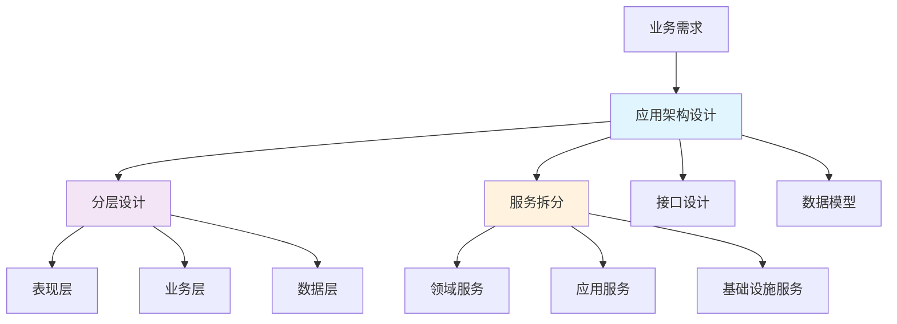
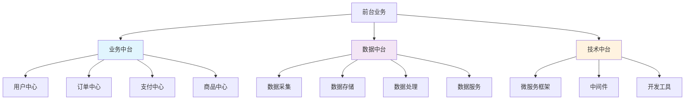
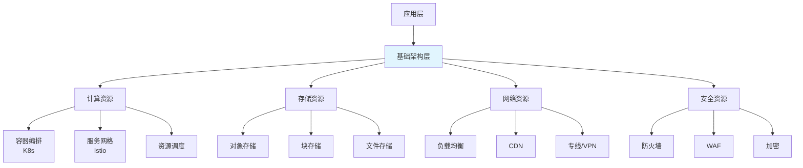
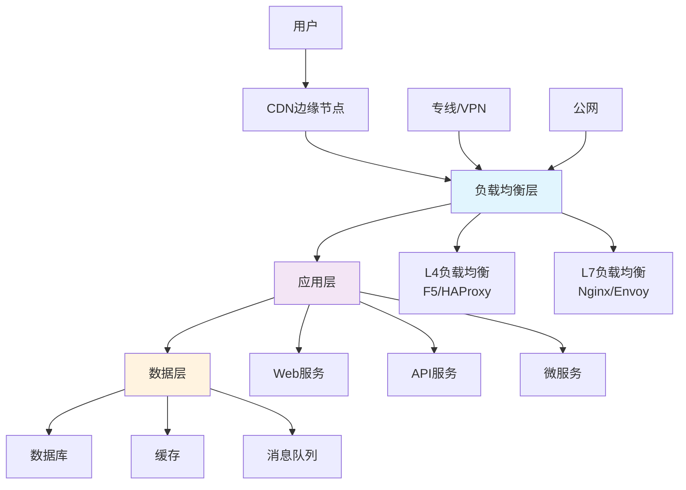
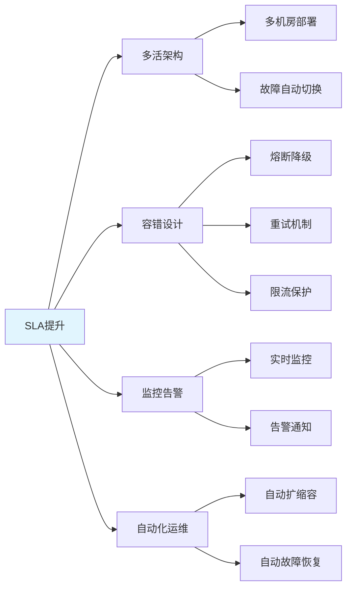
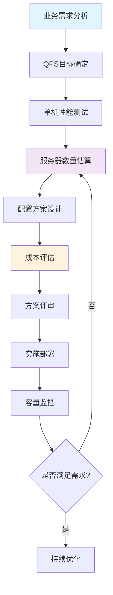
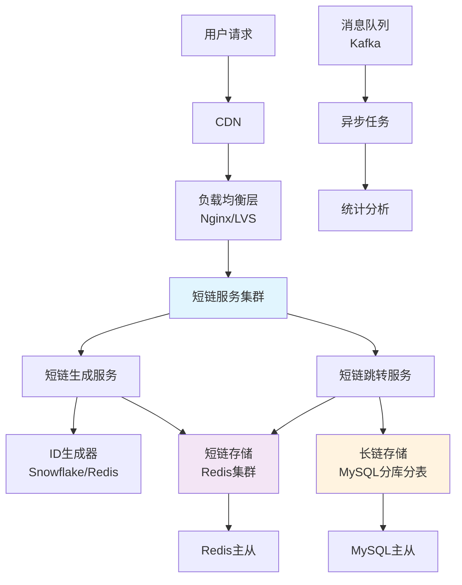
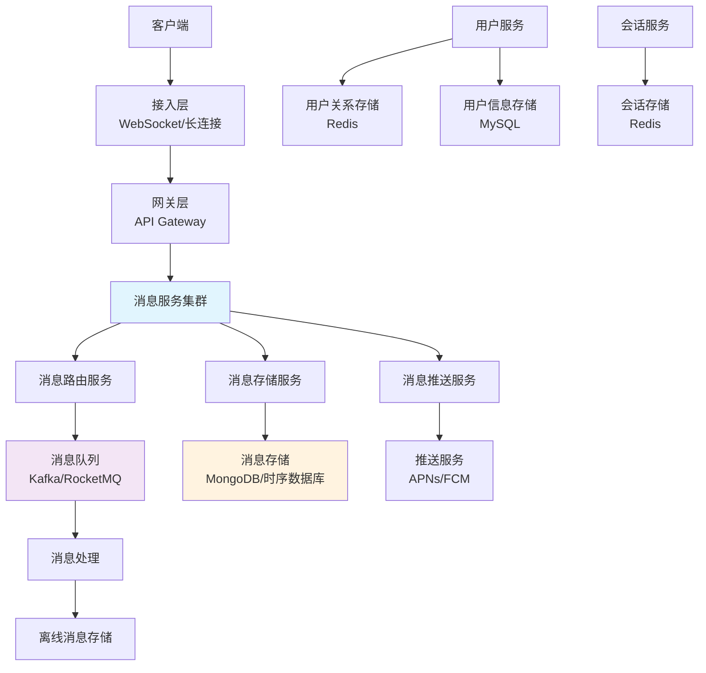
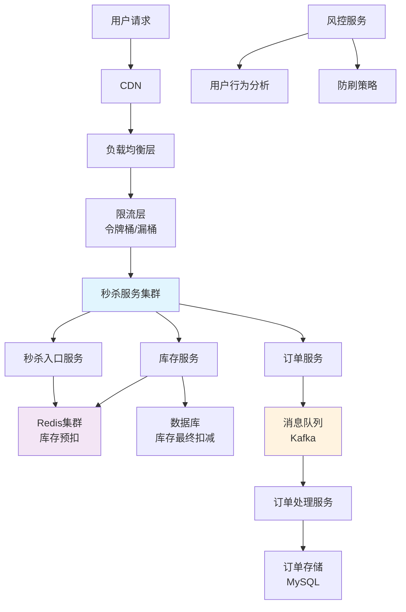
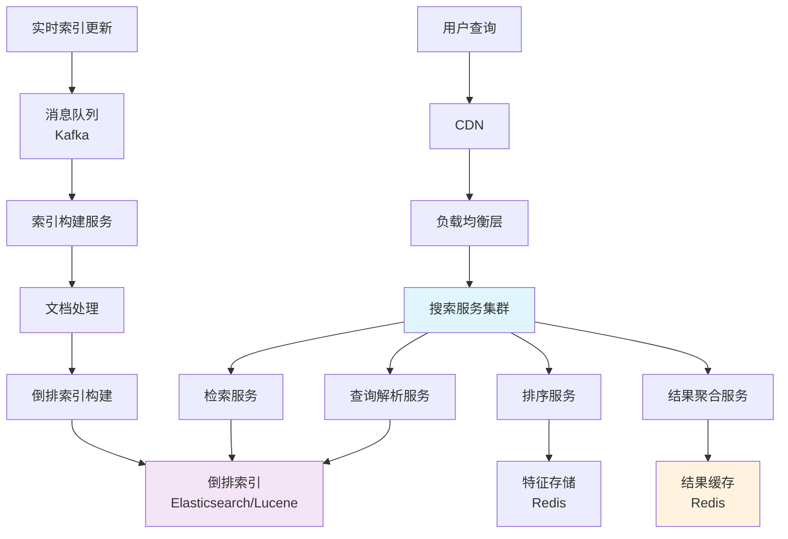

# 🏗️ 架构师工作流程与标准

> **定位**：高级架构师工作流程与标准规范  
> **目标**：建立系统化的架构设计方法论，规范架构设计流程，提升架构设计质量

---

## 📋 目录

1. [架构设计核心思路](#一架构设计核心思路)
   - [应用架构设计](#11-应用架构设计)
   - [中台架构设计](#12-中台架构设计)
   - [基础架构设计](#13-基础架构设计)
   - [网络架构设计](#14-网络架构设计)

2. [架构指标与达成手段](#二架构指标与达成手段)
   - [应用架构指标](#21-应用架构指标)
   - [中台架构指标](#22-中台架构指标)
   - [基础架构指标](#23-基础架构指标)
   - [网络架构指标](#24-网络架构指标)

3. [常见场景架构设计](#三常见场景架构设计)
   - [百万QPS短链系统](#31-百万qps短链系统)
   - [百万QPS IM系统](#32-百万qps-im系统)
   - [百万QPS秒杀系统](#33-百万qps秒杀系统)
   - [百万QPS搜索引擎系统](#34-百万qps搜索引擎系统)

---

## 一、架构设计核心思路

### 1.1 应用架构设计

#### 🎯 核心思路

应用架构关注业务功能的实现，是连接业务需求与技术实现的桥梁。核心思路是**分层解耦、服务化、可扩展**。



#### 📌 设计要点

| 维度 | 核心要点 | 说明 |
|------|---------|------|
| **分层设计** | 清晰的分层边界 | 表现层、业务层、数据层职责明确，避免跨层调用 |
| **服务拆分** | 高内聚、低耦合 | 按业务领域拆分，服务边界清晰，依赖关系简单 |
| **接口设计** | RESTful/GraphQL | 统一的接口规范，版本管理，向后兼容 |
| **数据模型** | 领域模型驱动 | DDD领域建模，数据与业务逻辑分离 |
| **异常处理** | 统一异常处理 | 异常分类、错误码规范、降级策略 |
| **安全设计** | 认证授权 | OAuth2、JWT、RBAC权限控制 |

#### 🔍 重点

1. **业务领域建模**
   - 使用DDD（领域驱动设计）方法识别核心业务领域
   - 定义聚合根、实体、值对象
   - 建立清晰的业务边界

2. **服务拆分策略**
   - 按业务能力拆分（按业务域）
   - 按数据模型拆分（按数据域）
   - 按团队结构拆分（康威定律）

3. **非功能需求设计**
   - 性能：响应时间、吞吐量、并发数
   - 可用性：SLA目标、容错机制、降级策略
   - 可扩展性：水平扩展、垂直扩展
   - 可维护性：代码质量、文档完善、监控完善

#### ⚠️ 难点

1. **服务边界划分**
   - **难点**：如何确定服务拆分粒度，避免过度拆分或拆分不足
   - **解决**：基于业务领域、数据一致性边界、团队规模综合判断

2. **分布式事务处理**
   - **难点**：跨服务的数据一致性保证
   - **解决**：最终一致性、Saga模式、TCC模式、消息事务

3. **服务治理**
   - **难点**：服务注册发现、负载均衡、熔断降级、链路追踪
   - **解决**：引入服务网格（Service Mesh）或微服务框架

4. **数据一致性**
   - **难点**：分布式环境下的数据一致性
   - **解决**：CAP理论权衡、最终一致性、分布式锁、分布式事务

---

### 1.2 中台架构设计

#### 🎯 核心思路

中台架构的核心是**能力复用、业务赋能、数据驱动**。通过将通用业务能力沉淀到中台，为前台业务提供快速支撑。



#### 📌 设计要点

| 维度 | 核心要点 | 说明 |
|------|---------|------|
| **能力抽象** | 业务能力标准化 | 识别可复用的业务能力，抽象为标准化服务 |
| **服务编排** | 灵活的服务组合 | 通过服务编排快速构建新业务 |
| **数据统一** | 数据资产化 | 统一数据模型、数据标准、数据服务 |
| **技术沉淀** | 技术能力复用 | 通用技术组件、开发框架、运维平台 |
| **运营支撑** | 运营数据化 | 业务监控、数据分析、运营决策支持 |
| **租户设计** | 多租户架构 | 租户隔离、数据隔离、资源隔离、权限隔离 |
| **成本分摊** | 成本核算 | 资源使用统计、成本分摊模型、成本优化 |

#### 🔍 重点

1. **业务能力识别**
   - 分析各业务线的共性需求
   - 识别可复用的业务能力
   - 定义能力边界和接口规范

2. **中台分层设计**
   - **业务中台**：用户、订单、支付、商品等业务能力
   - **数据中台**：数据采集、存储、处理、服务化
   - **技术中台**：微服务框架、中间件、开发工具

3. **能力开放**
   - API网关统一接入
   - 能力目录和文档
   - 版本管理和兼容性

4. **数据治理**
   - 数据标准统一
   - 数据质量保障
   - 数据安全合规

5. **租户设计（Multi-tenancy）**
   - **租户模型**：单租户、多租户（共享数据库/共享表/独立数据库）
   - **数据隔离**：行级隔离、表级隔离、库级隔离，保证数据安全
   - **资源隔离**：计算资源隔离、存储资源隔离、网络资源隔离
   - **权限隔离**：基于租户的权限控制，防止跨租户访问
   - **租户标识**：租户ID传递、租户上下文管理
   - **性能隔离**：租户间性能隔离，避免相互影响
   - **计费隔离**：按租户统计资源使用，支持独立计费

6. **成本分摊（Cost Allocation）**
   - **资源统计**：按租户、按业务、按服务统计资源使用
   - **成本模型**：CPU成本、内存成本、存储成本、网络成本
   - **分摊规则**：按使用量分摊、按比例分摊、固定成本分摊
   - **成本报表**：多维度成本报表，支持成本分析和优化
   - **成本优化**：识别高成本资源，提供优化建议
   - **预算管理**：租户预算设置、预算告警、预算控制

#### ⚠️ 难点

1. **能力抽象程度**
   - **难点**：抽象不足导致复用性差，抽象过度导致灵活性差
   - **解决**：基于实际业务场景，渐进式抽象，保持适度抽象

2. **中台与前台平衡**
   - **难点**：中台能力通用性与前台业务个性化需求的平衡
   - **解决**：中台提供基础能力，前台通过配置和扩展实现个性化

3. **数据孤岛问题**
   - **难点**：各业务系统数据分散，难以统一
   - **解决**：建立统一数据模型，通过数据中台统一数据服务

4. **组织协同**
   - **难点**：中台团队与业务团队的协作机制
   - **解决**：建立中台运营机制，明确职责边界，建立协作流程

5. **租户隔离与性能平衡**
   - **难点**：租户隔离与资源共享的平衡，既要保证隔离又要提高资源利用率
   - **解决**：合理的租户模型选择，资源池化，动态资源分配

6. **成本分摊准确性**
   - **难点**：多维度成本统计和分摊的准确性，共享资源的成本分配
   - **解决**：建立完善的成本模型，自动化成本统计，定期成本审计

---

### 1.3 基础架构设计

#### 🎯 核心思路

基础架构关注**稳定性、可扩展性、自动化**。为上层应用提供可靠的基础设施支撑。



#### 📌 设计要点

| 维度 | 核心要点 | 说明 |
|------|---------|------|
| **资源管理** | 弹性伸缩 | 根据负载自动扩缩容，资源利用率优化 |
| **高可用设计** | 多活架构 | 多机房部署、故障自动切换、数据同步 |
| **监控告警** | 全链路监控 | 基础设施监控、应用监控、业务监控 |
| **可观测性** | 三大支柱 | 指标、日志、追踪，统一可观测性平台 |
| **混沌工程** | 故障演练 | 故障注入、混沌实验、容错能力验证 |
| **AIOPS** | 智能运维 | 异常检测、智能告警、容量预测、故障自愈 |
| **自动化运维** | DevOps | CI/CD、自动化部署、自动化测试 |
| **安全防护** | 多层防护 | 网络安全、主机安全、应用安全、数据安全 |
| **成本优化** | 资源优化 | 资源利用率提升、按需付费、预留实例 |

#### 🔍 重点

1. **容器化与编排**
   - 容器化应用，统一运行环境
   - Kubernetes集群管理
   - 服务网格（Service Mesh）实现服务治理

2. **存储架构**
   - 对象存储：图片、视频等非结构化数据
   - 块存储：数据库、高性能计算
   - 文件存储：共享文件系统

3. **网络架构**
   - 多机房网络互通
   - 负载均衡策略
   - CDN加速

4. **监控体系**
   - 基础设施监控：CPU、内存、磁盘、网络
   - 应用监控：接口性能、错误率、调用链
   - 业务监控：业务指标、用户行为

5. **可观测性（Observability）**
   - **三大支柱**：指标（Metrics）、日志（Logs）、追踪（Traces）
   - **指标监控**：Prometheus、Grafana，实时监控系统状态
   - **日志聚合**：ELK Stack（Elasticsearch、Logstash、Kibana）或Loki，集中化日志管理
   - **分布式追踪**：Jaeger、Zipkin，全链路请求追踪
   - **APM（应用性能监控）**：New Relic、Datadog、SkyWalking，应用性能分析
   - **可观测性平台**：统一的可观测性平台，整合指标、日志、追踪

6. **混沌工程（Chaos Engineering）**
   - **故障注入**：模拟网络延迟、服务故障、资源耗尽等场景
   - **混沌实验**：Chaos Monkey、Chaos Mesh，定期进行故障演练
   - **故障恢复验证**：验证系统在故障场景下的恢复能力
   - **容错能力提升**：通过混沌工程发现系统薄弱环节，提升系统韧性
   - **实验管理**：混沌实验的规划、执行、监控、回滚

7. **AIOPS（智能运维）**
   - **异常检测**：基于机器学习的异常检测，提前发现潜在问题
   - **智能告警**：告警降噪、告警聚合、根因分析
   - **容量预测**：基于历史数据的容量预测，提前扩容
   - **故障自愈**：自动故障检测、自动恢复、自动降级
   - **性能优化建议**：基于数据分析的性能优化建议
   - **成本优化**：资源使用分析和成本优化建议

#### ⚠️ 难点

1. **多活架构设计**
   - **难点**：数据一致性、流量路由、故障切换
   - **解决**：数据同步机制、智能路由、自动故障切换

2. **资源利用率优化**
   - **难点**：资源利用率与性能的平衡
   - **解决**：弹性伸缩、资源池化、混部技术

3. **监控数据量**
   - **难点**：海量监控数据的采集、存储、分析
   - **解决**：采样、聚合、时序数据库、流式处理

4. **安全防护**
   - **难点**：多层安全防护的协调与统一管理
   - **解决**：统一安全策略、安全中台、零信任架构

5. **可观测性数据量**
   - **难点**：海量可观测性数据（指标、日志、追踪）的采集、存储、查询性能
   - **解决**：数据采样、数据聚合、分层存储、时序数据库、流式处理

6. **混沌工程风险控制**
   - **难点**：混沌实验可能影响生产环境，需要控制实验范围和影响
   - **解决**：实验环境隔离、实验范围限制、自动回滚机制、实验审批流程

7. **AIOPS模型准确性**
   - **难点**：机器学习模型的准确性，误报和漏报的平衡
   - **解决**：持续模型训练、特征工程优化、人工反馈机制、多模型融合

---

### 1.4 网络架构设计

#### 🎯 核心思路

网络架构关注**高可用、高性能、安全性**。确保网络基础设施稳定可靠，支撑业务高并发访问。



#### 📌 设计要点

| 维度 | 核心要点 | 说明 |
|------|---------|------|
| **网络分层** | 接入层、汇聚层、核心层 | 清晰的网络分层，便于管理和扩展 |
| **负载均衡** | L4/L7负载均衡 | 四层和七层负载均衡结合，智能路由 |
| **CDN加速** | 静态资源加速 | 图片、视频、静态页面CDN加速 |
| **专线互联** | 多机房专线 | 多机房专线互联，低延迟、高可靠 |
| **安全防护** | DDoS防护、WAF | 网络层安全防护，防止攻击 |
| **网络监控** | 网络质量监控 | 延迟、丢包率、带宽监控 |

#### 🔍 重点

1. **负载均衡策略**
   - **轮询（Round Robin）**：简单均衡
   - **加权轮询（Weighted Round Robin）**：根据服务器性能分配
   - **最少连接（Least Connections）**：优先分配给连接数少的服务器
   - **IP Hash**：基于客户端IP的会话保持
   - **一致性Hash**：减少服务器变更对路由的影响

2. **多机房网络设计**
   - 多机房专线互联
   - 智能DNS解析
   - 跨机房流量调度

3. **CDN架构**
   - 边缘节点分布
   - 缓存策略
   - 回源策略

4. **网络安全**
   - DDoS防护
   - WAF（Web应用防火墙）
   - 网络隔离（VPC）

#### ⚠️ 难点

1. **跨机房延迟**
   - **难点**：跨机房网络延迟影响用户体验
   - **解决**：CDN加速、就近接入、数据本地化

2. **流量突发**
   - **难点**：突发流量导致网络拥塞
   - **解决**：弹性带宽、流量削峰、限流降级

3. **网络故障切换**
   - **难点**：网络故障时的快速切换
   - **解决**：多路径冗余、自动故障检测、智能路由

4. **安全防护**
   - **难点**：DDoS攻击、网络入侵
   - **解决**：多层防护、流量清洗、异常检测

---

## 二、架构指标与达成手段

### 2.1 应用架构指标

#### 📊 核心指标

| 指标类型 | 指标名称 | 目标值 | 说明 |
|---------|---------|--------|------|
| **可用性** | SLA | 99.9% ~ 99.99% | 服务可用时间占比 |
| **可用性** | MTTR | < 30分钟 | 平均故障恢复时间 |
| **性能** | P99延迟 | < 200ms | 99%请求的响应时间 |
| **性能** | 吞吐量 | 根据业务需求 | QPS/TPS |
| **可靠性** | RPO | < 1小时 | 数据恢复点目标 |
| **可靠性** | RTO | < 4小时 | 数据恢复时间目标 |
| **错误率** | 错误率 | < 0.1% | 请求错误占比 |

#### 🎯 达成手段

**1. SLA（服务等级协议）提升**



**达成手段**：
- **多活架构**：多机房部署，故障自动切换
- **容错设计**：熔断、降级、限流、重试
- **健康检查**：服务健康检查，自动摘除故障节点
- **监控告警**：实时监控，及时发现问题
- **自动化运维**：自动化部署、自动化故障恢复

**2. MTTR（平均故障恢复时间）降低**

**达成手段**：
- **快速定位**：全链路追踪、日志聚合、APM监控
- **自动化恢复**：自动重启、自动切换、自动回滚
- **故障演练**：Chaos Engineering，提前发现潜在问题
- **应急预案**：完善的故障处理流程和预案

**3. P99延迟优化**

**达成手段**：
- **缓存优化**：多级缓存（本地缓存、分布式缓存）
- **数据库优化**：索引优化、查询优化、读写分离
- **异步处理**：异步消息、异步任务
- **CDN加速**：静态资源CDN加速
- **连接池优化**：数据库连接池、HTTP连接池

**4. 吞吐量提升**

**达成手段**：
- **水平扩展**：增加服务器实例，负载均衡
- **性能优化**：代码优化、算法优化、JVM调优
- **缓存策略**：热点数据缓存，减少数据库压力
- **消息队列**：异步处理，削峰填谷

**5. RPO/RTO保障**

**达成手段**：
- **数据备份**：定期全量备份、实时增量备份
- **数据复制**：主从复制、多副本存储
- **容灾演练**：定期容灾演练，验证恢复能力
- **自动化恢复**：自动化数据恢复流程

---

### 2.2 中台架构指标

#### 📊 核心指标

| 指标类型 | 指标名称 | 目标值 | 说明 |
|---------|---------|--------|------|
| **能力复用率** | 服务复用率 | > 60% | 中台服务被前台业务复用的比例 |
| **响应时间** | API响应时间 | < 100ms | 中台API的平均响应时间 |
| **可用性** | SLA | 99.95% | 中台服务可用性 |
| **数据质量** | 数据准确率 | > 99.9% | 数据中台数据准确率 |
| **服务稳定性** | 故障率 | < 0.05% | 中台服务故障率 |
| **租户隔离** | 数据隔离度 | 100% | 租户数据完全隔离 |
| **成本分摊** | 成本统计准确率 | > 95% | 成本分摊统计准确率 |
| **成本优化** | 资源利用率 | > 60% | 中台资源平均利用率 |

#### 🎯 达成手段

**1. 能力复用率提升**

**达成手段**：
- **能力抽象**：识别共性需求，抽象为通用能力
- **能力开放**：完善的API文档、SDK、示例代码
- **版本管理**：向后兼容的版本管理策略
- **运营推广**：中台能力推广，提升使用率

**2. API响应时间优化**

**达成手段**：
- **缓存策略**：热点数据缓存
- **数据库优化**：索引优化、查询优化
- **异步处理**：非实时数据异步处理
- **CDN加速**：静态资源CDN

**3. 数据质量保障**

**达成手段**：
- **数据校验**：数据采集、处理、存储各环节校验
- **数据清洗**：异常数据识别和清洗
- **数据监控**：数据质量监控和告警
- **数据治理**：统一数据标准、数据字典

**4. 租户隔离保障**

**达成手段**：
- **租户模型设计**：选择合适的租户模型（共享数据库/共享表/独立数据库）
- **数据隔离**：行级、表级或库级数据隔离，防止数据泄露
- **资源隔离**：计算、存储、网络资源隔离，避免相互影响
- **权限控制**：基于租户的细粒度权限控制
- **性能隔离**：租户间性能隔离，保证SLA

**5. 成本分摊与优化**

**达成手段**：
- **资源统计**：按租户、按业务、按服务统计资源使用
- **成本模型**：建立完善的成本模型（CPU、内存、存储、网络）
- **自动化统计**：自动化成本统计，减少人工误差
- **成本报表**：多维度成本报表，支持成本分析
- **成本优化**：识别高成本资源，提供优化建议
- **预算管理**：租户预算设置和预算控制

---

### 2.3 基础架构指标

#### 📊 核心指标

| 指标类型 | 指标名称 | 目标值 | 说明 |
|---------|---------|--------|------|
| **资源利用率** | CPU利用率 | 40% ~ 70% | CPU平均利用率 |
| **资源利用率** | 内存利用率 | 50% ~ 80% | 内存平均利用率 |
| **可用性** | 基础设施SLA | 99.99% | 基础设施可用性 |
| **弹性伸缩** | 扩容时间 | < 5分钟 | 自动扩容所需时间 |
| **成本** | 资源成本 | 持续优化 | 基础设施成本 |
| **可观测性** | 指标覆盖率 | > 95% | 系统指标监控覆盖率 |
| **可观测性** | 日志查询延迟 | < 5秒 | 日志查询响应时间 |
| **可观测性** | 追踪采样率 | 1% ~ 10% | 分布式追踪采样率 |
| **混沌工程** | 混沌实验频率 | 每周1次 | 定期进行混沌实验 |
| **混沌工程** | 故障恢复时间 | < 15分钟 | 混沌实验中的故障恢复时间 |
| **AIOPS** | 异常检测准确率 | > 90% | AI异常检测准确率 |
| **AIOPS** | 告警降噪率 | > 70% | 智能告警降噪比例 |

#### 🎯 达成手段

**1. 资源利用率优化**

**达成手段**：
- **弹性伸缩**：根据负载自动扩缩容
- **资源池化**：统一资源池，提高利用率
- **混部技术**：在线业务和离线任务混部
- **资源调度**：智能资源调度算法

**2. 基础设施SLA保障**

**达成手段**：
- **冗余设计**：多机房、多可用区部署
- **故障隔离**：故障域隔离，避免级联故障
- **监控告警**：基础设施全链路监控
- **自动化运维**：自动化故障检测和恢复

**3. 弹性伸缩**

**达成手段**：
- **指标监控**：CPU、内存、QPS等指标监控
- **自动扩缩容**：基于指标自动扩缩容
- **预热机制**：新实例预热，避免冷启动
- **预测性扩容**：基于历史数据预测性扩容

**4. 可观测性提升**

**达成手段**：
- **统一平台**：建立统一的可观测性平台，整合指标、日志、追踪
- **指标采集**：Prometheus等指标采集，覆盖所有关键指标
- **日志聚合**：ELK Stack或Loki集中化日志管理
- **分布式追踪**：Jaeger、Zipkin实现全链路追踪
- **APM监控**：应用性能监控，深度分析应用性能

**5. 混沌工程实践**

**达成手段**：
- **实验规划**：制定混沌实验计划，覆盖关键故障场景
- **工具选择**：Chaos Monkey、Chaos Mesh等混沌工程工具
- **实验执行**：定期执行混沌实验，验证系统容错能力
- **结果分析**：分析实验结果，识别系统薄弱环节
- **持续改进**：基于实验结果持续改进系统韧性

**6. AIOPS能力建设**

**达成手段**：
- **异常检测**：基于机器学习的异常检测模型
- **智能告警**：告警降噪、告警聚合、根因分析
- **容量预测**：基于历史数据的容量预测模型
- **故障自愈**：自动故障检测和恢复机制
- **持续优化**：模型持续训练和优化

---

### 2.4 网络架构指标

#### 📊 核心指标

| 指标类型 | 指标名称 | 目标值 | 说明 |
|---------|---------|--------|------|
| **网络延迟** | 跨机房延迟 | < 50ms | 跨机房网络延迟 |
| **网络质量** | 丢包率 | < 0.1% | 网络丢包率 |
| **带宽利用率** | 带宽利用率 | 60% ~ 80% | 带宽平均利用率 |
| **可用性** | 网络SLA | 99.99% | 网络可用性 |

#### 🎯 达成手段

**1. 网络延迟优化**

**达成手段**：
- **CDN加速**：静态资源CDN，就近访问
- **专线优化**：多机房专线，低延迟
- **智能路由**：基于延迟的智能路由
- **数据本地化**：数据就近存储和访问

**2. 网络质量保障**

**达成手段**：
- **多路径冗余**：多条网络路径，自动切换
- **网络监控**：实时网络质量监控
- **故障检测**：自动故障检测和切换
- **流量调度**：智能流量调度，避免拥塞

**3. 带宽优化**

**达成手段**：
- **压缩传输**：数据压缩，减少带宽占用
- **CDN加速**：静态资源CDN，减少回源流量
- **流量削峰**：消息队列削峰，平滑流量
- **弹性带宽**：按需调整带宽

---

## 三、常见场景架构设计

### 📊 容量评估方法论

在开始具体场景的容量计划评估之前，我们先建立通用的容量评估方法论，为后续的容量规划提供理论基础和实践指导。

#### 1. QPS到服务器数量计算公式

**基础公式**：
```
服务器数量 = (目标QPS × 冗余系数) / (单机QPS × 负载均衡效率)
```

**参数说明**：
- **目标QPS**：系统需要承载的QPS目标值
- **冗余系数**：通常取1.5-2.0，考虑故障切换、流量突发等因素
- **单机QPS**：单台服务器能够承载的QPS（通过压测获得）
- **负载均衡效率**：通常取0.8-0.9，考虑负载均衡的损耗

**分层计算**：
- **接入层**：主要考虑网络带宽和连接数
- **应用层**：主要考虑CPU和内存
- **数据层**：主要考虑IOPS和存储容量
- **缓存层**：主要考虑内存容量和网络带宽

#### 2. 性能基准测试方法

**压测指标**：
- **QPS**：每秒查询数
- **TPS**：每秒事务数
- **响应时间**：P50、P95、P99延迟
- **错误率**：请求错误占比
- **资源利用率**：CPU、内存、磁盘、网络利用率

**压测方法**：
- **单机压测**：测试单机性能上限
- **集群压测**：测试集群整体性能
- **压力递增**：逐步增加压力，找到性能拐点
- **长时间压测**：测试系统稳定性

**性能基准**：
- **CPU利用率**：建议控制在70%以下
- **内存利用率**：建议控制在80%以下
- **磁盘IOPS**：根据磁盘类型设定基准
- **网络带宽**：建议控制在80%以下

#### 3. 容量规划流程



**流程步骤**：
1. **业务需求分析**：明确QPS目标、延迟要求、可用性要求
2. **QPS目标确定**：基于业务增长预测确定QPS目标
3. **单机性能测试**：通过压测获得单机性能数据
4. **服务器数量估算**：使用公式计算所需服务器数量
5. **配置方案设计**：设计服务器配置、网络架构、存储方案
6. **成本评估**：评估资源成本、运维成本
7. **方案评审**：技术评审、成本评审
8. **实施部署**：按方案部署系统
9. **容量监控**：持续监控系统容量和性能
10. **持续优化**：根据监控数据持续优化

#### 4. 容量监控指标

**关键指标**：
- **QPS/TPS**：实时QPS和TPS监控
- **响应时间**：P50、P95、P99延迟监控
- **错误率**：4xx、5xx错误率监控
- **资源利用率**：CPU、内存、磁盘、网络利用率
- **连接数**：当前连接数、最大连接数
- **队列长度**：消息队列长度、任务队列长度

**告警阈值**：
- **QPS**：达到目标QPS的80%时告警
- **响应时间**：P99延迟超过目标值2倍时告警
- **错误率**：错误率超过0.1%时告警
- **资源利用率**：CPU超过80%、内存超过85%时告警

**容量预警**：
- **容量使用率**：当容量使用率达到70%时，启动扩容流程
- **增长趋势**：基于历史数据预测容量增长趋势
- **突发预案**：制定突发流量应对预案

---

### 3.1 百万QPS短链系统

#### 🎯 业务场景

短链系统将长URL转换为短URL，支持高并发访问。核心需求：
- **高并发**：百万QPS的短链生成和访问
- **低延迟**：短链访问响应时间 < 100ms
- **高可用**：99.99%可用性
- **存储容量**：支持百亿级短链存储

#### 🏗️ 架构设计图



#### 📌 设计要点

**1. 短链生成算法**

- **方案一：自增ID + Base62编码**
  - 使用分布式ID生成器（Snowflake、Redis自增）
  - ID转换为Base62编码（0-9a-zA-Z）
  - 优点：短、唯一、有序
  - 缺点：可预测，需要ID生成器

- **方案二：Hash算法**
  - MD5/SHA256对长URL哈希
  - 取前N位作为短链
  - 优点：无需存储映射关系
  - 缺点：可能冲突，需要冲突检测

- **推荐方案**：自增ID + Base62编码（可预测性可通过加盐解决）

**2. 存储设计**

- **Redis集群**：存储短链到长链的映射（热点数据）
  - 数据结构：`short_url -> long_url`
  - TTL：根据业务需求设置过期时间
  - 容量：支持百亿级短链（通过分片）

- **MySQL分库分表**：持久化存储
  - 分库：按短链hash分库
  - 分表：按时间或ID范围分表
  - 索引：短链字段唯一索引

**3. 高并发优化**

- **多级缓存**：
  - L1：本地缓存（Caffeine，热点数据）
  - L2：Redis集群（分布式缓存）
  - L3：MySQL（持久化存储）

- **读写分离**：
  - 读：优先从Redis读取，Redis miss再查MySQL
  - 写：异步写入MySQL，同步写入Redis

- **限流保护**：
  - 短链生成限流：防止恶意生成
  - 短链访问限流：防止热点短链被刷

**4. 高可用设计**

- **多活架构**：多机房部署，故障自动切换
- **数据冗余**：Redis主从、MySQL主从
- **降级策略**：Redis故障时降级到MySQL

#### 🔧 核心手段

1. **分布式ID生成**
   - Snowflake算法：64位ID，包含时间戳、机器ID、序列号
   - Redis自增：利用Redis原子性自增

2. **缓存策略**
   - **写缓存**：生成短链时写入Redis，设置TTL
   - **读缓存**：访问短链时优先读Redis，miss时查MySQL并回写
   - **缓存预热**：热点短链提前加载到Redis

3. **异步处理**
   - 短链生成：同步返回短链，异步持久化到MySQL
   - 统计分析：异步记录访问日志，用于数据分析

4. **分库分表**
   - 分库策略：按短链hash值分库（如：hash % 16）
   - 分表策略：按时间分表（如：按月分表）

#### ⚠️ 需要避免的坑

1. **❌ 短链冲突**
   - **问题**：Hash算法可能产生冲突
   - **解决**：使用唯一ID生成器，或冲突检测+重试

2. **❌ 缓存穿透**
   - **问题**：恶意请求不存在的短链，穿透到数据库
   - **解决**：布隆过滤器（Bloom Filter）过滤无效请求

3. **❌ 缓存雪崩**
   - **问题**：大量缓存同时过期，导致数据库压力激增
   - **解决**：缓存过期时间加随机值，避免同时过期

4. **❌ 热点短链**
   - **问题**：某些短链访问量巨大，导致单点压力
   - **解决**：热点数据多副本、CDN加速、限流保护

5. **❌ 存储容量**
   - **问题**：百亿级短链存储容量巨大
   - **解决**：冷热数据分离，冷数据归档，定期清理过期数据

#### 📊 容量计划评估

**1. 服务器数量估算**

**假设条件**：
- 目标QPS：100万QPS（读：90万QPS，写：10万QPS）
- 单机QPS：应用层单机5000 QPS，Redis单机10万QPS，MySQL单机1万QPS
- 冗余系数：1.5
- 负载均衡效率：0.85

**分层计算**：

| 层级 | 计算公式 | 结果 |
|------|---------|------|
| **接入层（Nginx/LVS）** | (100万 × 1.5) / (5万 × 0.85) | 36台 |
| **应用层（短链服务）** | (100万 × 1.5) / (5000 × 0.85) | 353台 → **400台** |
| **缓存层（Redis集群）** | (90万 × 1.5) / (10万 × 0.85) | 16台 → **20台**（主从） |
| **数据层（MySQL集群）** | (10万 × 1.5) / (1万 × 0.85) | 18台 → **24台**（主从） |

**说明**：
- 应用层按读多写少特点，重点考虑读QPS
- Redis集群采用主从架构，主节点20台，从节点20台
- MySQL采用主从架构，主节点12台，从节点12台

**2. 服务器配置建议**

| 层级 | CPU | 内存 | 磁盘 | 网络 | 说明 |
|------|-----|------|------|------|------|
| **接入层** | 8核 | 16GB | 100GB SSD | 10Gbps | 主要处理网络转发 |
| **应用层** | 16核 | 32GB | 200GB SSD | 10Gbps | 计算密集型，需要较高CPU |
| **Redis层** | 8核 | 64GB | 500GB SSD | 10Gbps | 内存型实例，大内存配置 |
| **MySQL层** | 16核 | 64GB | 2TB SSD | 10Gbps | 高IOPS实例，SSD存储 |

**性能基准**：
- **应用层**：单机5000 QPS，P99延迟 < 50ms
- **Redis层**：单机10万QPS，P99延迟 < 1ms
- **MySQL层**：单机1万QPS，P99延迟 < 10ms

**3. 上云方案分析**

| 方案 | 优势 | 劣势 | 适用场景 |
|------|------|------|---------|
| **自建IDC** | 成本可控、数据安全、性能稳定 | 扩容慢、运维成本高 | 核心业务、数据敏感 |
| **云上部署** | 弹性伸缩、运维简单、按需付费 | 成本较高、网络延迟 | 快速上线、弹性需求 |
| **混合云** | 核心数据自建、弹性资源上云 | 架构复杂、管理成本高 | 平衡成本和安全 |

**推荐方案：混合云**
- **核心数据层**：MySQL自建IDC，保证数据安全
- **缓存层**：Redis云服务（如阿里云Redis），弹性扩容
- **应用层**：容器化部署（K8s），支持云上弹性伸缩
- **接入层**：CDN + 云负载均衡

**云服务选型**：
- **计算**：容器服务（K8s）、弹性计算（ECS）
- **存储**：云数据库RDS（MySQL）、云数据库Redis
- **网络**：CDN、负载均衡SLB、专线/VPN
- **监控**：云监控、日志服务、APM

**4. 成本控制策略**

**资源成本估算（相对值）**：

| 资源类型 | 数量 | 单价（相对值） | 月成本（相对值） | 年成本（相对值） |
|---------|------|---------------|----------------|----------------|
| **应用服务器** | 400台 | 1.0 | 400 | 4800 |
| **Redis实例** | 40台 | 2.0 | 80 | 960 |
| **MySQL实例** | 24台 | 3.0 | 72 | 864 |
| **网络带宽** | 100Gbps | 0.5 | 50 | 600 |
| **CDN** | - | 0.3 | 30 | 360 |
| **总计** | - | - | **632** | **7584** |

**成本优化手段**：
- **预留实例**：应用层使用预留实例，节省30%成本
- **按需扩容**：Redis按需扩容，平时保持最小规模
- **读写分离**：MySQL读写分离，读从库使用低配实例
- **资源池化**：统一资源池，提高资源利用率
- **竞价实例**：非核心服务使用竞价实例，节省50%成本

**成本监控**：
- **资源使用监控**：实时监控资源使用情况
- **成本告警**：成本超预算时告警
- **成本报表**：月度成本报表，分析成本构成
- **ROI分析**：评估系统投入产出比

**5. 突发情况预防**

**弹性伸缩策略**：
- **自动扩容**：CPU利用率 > 70%时自动扩容，扩容时间 < 5分钟
- **预测性扩容**：基于历史数据预测流量，提前扩容
- **缩容策略**：CPU利用率 < 30%时自动缩容，避免资源浪费

**流量突发应对**：
- **限流保护**：
  - 短链生成限流：单用户10次/秒
  - 短链访问限流：单IP 1000次/秒
  - 热点短链限流：单短链 1万次/秒
- **降级策略**：
  - Redis故障时降级到MySQL
  - 非核心功能降级（如统计分析）
- **熔断保护**：错误率 > 5%时熔断，防止级联故障

**故障预案**：
- **多活切换**：多机房部署，故障自动切换，RTO < 5分钟
- **数据备份**：Redis每日全量备份，MySQL每日全量+实时增量备份
- **数据恢复**：RPO < 1小时，RTO < 4小时

**容量监控和预警**：
- **实时监控**：QPS、响应时间、错误率、资源利用率
- **容量预警**：容量使用率 > 70%时预警，启动扩容流程
- **趋势预测**：基于历史数据预测容量增长趋势

---

### 3.2 百万QPS IM系统

#### 🎯 业务场景

即时通讯系统支持高并发消息收发。核心需求：
- **高并发**：百万QPS的消息收发
- **低延迟**：消息延迟 < 100ms
- **高可用**：99.99%可用性
- **消息可靠性**：消息不丢失、不重复

#### 🏗️ 架构设计图



#### 📌 设计要点

**1. 连接管理**

- **长连接**：WebSocket或TCP长连接
- **连接池**：服务端维护连接池，支持百万级连接
- **心跳机制**：定期心跳检测连接状态
- **断线重连**：客户端断线自动重连

**2. 消息路由**

- **用户ID路由**：根据用户ID路由到对应的消息服务
- **一致性Hash**：使用一致性Hash保证用户路由稳定
- **负载均衡**：消息服务负载均衡

**3. 消息存储**

- **在线消息**：Redis存储最近消息（如最近1000条）
- **离线消息**：MongoDB或时序数据库存储历史消息
- **消息索引**：按会话、时间建立索引

**4. 消息推送**

- **在线推送**：通过长连接直接推送
- **离线推送**：通过APNs（iOS）、FCM（Android）推送
- **推送策略**：优先级队列、批量推送

**5. 消息可靠性**

- **消息确认**：客户端收到消息后发送ACK
- **消息重试**：未收到ACK时重试
- **消息去重**：消息ID去重，避免重复

#### 🔧 核心手段

1. **连接管理**
   - **Netty框架**：高性能网络框架，支持百万级连接
   - **连接池**：服务端连接池管理
   - **心跳检测**：定期心跳，及时清理断线连接

2. **消息队列**
   - **Kafka/RocketMQ**：高吞吐消息队列
   - **分区策略**：按用户ID分区，保证同一用户消息有序
   - **消费组**：多消费组并行消费

3. **消息存储**
   - **Redis**：在线消息缓存（最近消息）
   - **MongoDB**：历史消息存储（文档数据库，适合消息存储）
   - **时序数据库**：消息时序存储（如InfluxDB）

4. **消息推送**
   - **WebSocket推送**：在线用户实时推送
   - **APNs/FCM**：离线用户推送
   - **推送队列**：优先级队列，重要消息优先推送

5. **高可用设计**
   - **多活架构**：多机房部署
   - **消息冗余**：消息多副本存储
   - **故障切换**：自动故障检测和切换

#### ⚠️ 需要避免的坑

1. **❌ 连接数限制**
   - **问题**：单机连接数受限于文件描述符
   - **解决**：增加文件描述符限制，使用连接池，多机部署

2. **❌ 消息顺序**
   - **问题**：分布式环境下消息可能乱序
   - **解决**：按用户ID分区，保证同一用户消息有序

3. **❌ 消息丢失**
   - **问题**：网络故障、服务故障导致消息丢失
   - **解决**：消息持久化、消息确认机制、消息重试

4. **❌ 消息重复**
   - **问题**：网络重传、服务重试导致消息重复
   - **解决**：消息ID去重，幂等性设计

5. **❌ 离线消息堆积**
   - **问题**：离线用户消息堆积，占用大量存储
   - **解决**：离线消息TTL、定期清理、冷热数据分离

6. **❌ 热点用户**
   - **问题**：某些用户消息量巨大，导致单点压力
   - **解决**：热点用户多副本、限流保护、CDN加速

#### 📊 容量计划评估

**1. 服务器数量估算**

**假设条件**：
- 目标QPS：100万QPS（消息收发）
- 在线用户数：1000万（峰值）
- 单机连接数：5万（受限于文件描述符）
- 单机QPS：应用层单机3000 QPS，消息队列单机5万QPS
- 冗余系数：1.5
- 负载均衡效率：0.85

**分层计算**：

| 层级 | 计算公式 | 结果 |
|------|---------|------|
| **接入层（长连接服务器）** | (1000万 × 1.5) / (5万 × 0.85) | 353台 → **400台** |
| **应用层（消息服务）** | (100万 × 1.5) / (3000 × 0.85) | 588台 → **600台** |
| **消息队列（Kafka集群）** | (100万 × 1.5) / (5万 × 0.85) | 35台 → **40台** |
| **存储层（MongoDB集群）** | - | **20台**（按存储容量计算） |

**说明**：
- 接入层受限于文件描述符，单机最多支持5万连接
- 消息队列采用分区策略，按用户ID分区
- MongoDB采用分片架构，按用户ID分片

**2. 服务器配置建议**

| 层级 | CPU | 内存 | 磁盘 | 网络 | 说明 |
|------|-----|------|------|------|------|
| **接入层** | 16核 | 64GB | 200GB SSD | 25Gbps | 高内存、高网络带宽 |
| **应用层** | 16核 | 32GB | 200GB SSD | 10Gbps | 计算密集型 |
| **消息队列** | 16核 | 64GB | 2TB SSD | 10Gbps | 高IOPS，SSD存储 |
| **存储层** | 16核 | 128GB | 4TB SSD | 10Gbps | 高内存、大容量存储 |

**性能基准**：
- **接入层**：单机5万连接，P99延迟 < 10ms
- **应用层**：单机3000 QPS，P99延迟 < 50ms
- **消息队列**：单机5万QPS，P99延迟 < 5ms
- **存储层**：单机写入1万QPS，查询2万QPS

**3. 上云方案分析**

| 方案 | 优势 | 劣势 | 适用场景 |
|------|------|------|---------|
| **自建IDC** | 成本可控、数据安全 | 扩容慢、运维复杂 | 核心业务 |
| **云上部署** | 弹性伸缩、运维简单 | 成本较高 | 快速上线 |
| **混合云** | 平衡成本和安全 | 架构复杂 | 推荐方案 |

**推荐方案：云原生容器化部署**
- **接入层**：容器化部署（K8s），支持弹性伸缩
- **应用层**：容器化部署，利用云服务弹性伸缩
- **消息队列**：云消息队列（如阿里云Kafka），按需扩容
- **存储层**：云数据库MongoDB，自动备份和恢复

**云服务选型**：
- **计算**：容器服务（K8s）、弹性计算（ECS）
- **消息队列**：云消息队列（Kafka/RocketMQ）
- **存储**：云数据库MongoDB、对象存储OSS
- **网络**：负载均衡SLB、专线/VPN
- **推送**：云推送服务（APNs/FCM代理）

**4. 成本控制策略**

**资源成本估算（相对值）**：

| 资源类型 | 数量 | 单价（相对值） | 月成本（相对值） | 年成本（相对值） |
|---------|------|---------------|----------------|----------------|
| **接入服务器** | 400台 | 1.5 | 600 | 7200 |
| **应用服务器** | 600台 | 1.0 | 600 | 7200 |
| **消息队列** | 40台 | 2.0 | 80 | 960 |
| **存储层** | 20台 | 3.0 | 60 | 720 |
| **网络带宽** | 200Gbps | 0.5 | 100 | 1200 |
| **总计** | - | - | **1440** | **17280** |

**成本优化手段**：
- **按连接数计费优化**：接入层按实际连接数计费，非峰值时缩容
- **冷热数据分离**：热数据存储在Redis，冷数据存储在MongoDB
- **消息队列压缩**：消息压缩存储，减少存储成本
- **资源池化**：统一资源池，提高资源利用率
- **竞价实例**：非核心服务使用竞价实例

**成本监控**：
- **连接数监控**：实时监控在线连接数
- **消息量监控**：监控消息发送量，分析成本构成
- **成本告警**：成本超预算时告警
- **ROI分析**：评估系统投入产出比

**5. 突发情况预防**

**弹性伸缩策略**：
- **自动扩容**：连接数 > 80%时自动扩容，扩容时间 < 5分钟
- **预测性扩容**：基于历史数据预测连接数增长，提前扩容
- **缩容策略**：连接数 < 50%时自动缩容

**流量突发应对**：
- **连接池管理**：连接池大小限制，防止连接数爆炸
- **消息队列削峰**：消息先入队列，异步处理，削峰填谷
- **限流保护**：
  - 单用户消息限流：100条/秒
  - 单连接限流：1000条/秒
- **降级策略**：
  - 非核心功能降级（如消息已读状态）
  - 消息延迟推送

**故障预案**：
- **多机房容灾**：多机房部署，故障自动切换，RTO < 5分钟
- **数据备份**：MongoDB每日全量备份，消息队列多副本存储
- **数据恢复**：RPO < 1小时，RTO < 4小时
- **连接迁移**：故障时自动迁移连接，保证用户不断线

**容量监控和预警**：
- **实时监控**：连接数、消息QPS、响应时间、错误率
- **容量预警**：连接数使用率 > 70%时预警，启动扩容流程
- **趋势预测**：基于历史数据预测连接数和消息量增长趋势

---

### 3.3 百万QPS秒杀系统

#### 🎯 业务场景

秒杀系统支持高并发商品抢购。核心需求：
- **高并发**：百万QPS的抢购请求
- **公平性**：先到先得，防止刷单
- **高可用**：99.99%可用性
- **数据一致性**：库存扣减准确，不超卖

#### 🏗️ 架构设计图



#### 📌 设计要点

**1. 流量削峰**

- **CDN缓存**：静态页面CDN缓存，减少服务器压力
- **限流**：入口限流，防止流量过大
- **排队**：秒杀开始前排队，秒杀开始时放行
- **异步处理**：下单异步处理，先返回排队中

**2. 库存管理**

- **Redis预扣**：秒杀开始前，库存加载到Redis
- **原子扣减**：使用Redis原子操作（DECR）扣减库存
- **数据库最终扣减**：异步同步到数据库，保证数据一致性
- **库存预热**：秒杀开始前预热库存到Redis

**3. 防刷策略**

- **用户限流**：单个用户限流（如：1秒1次）
- **IP限流**：单个IP限流
- **验证码**：秒杀前验证码验证
- **风控系统**：用户行为分析，识别异常用户

**4. 订单处理**

- **异步下单**：下单请求先入消息队列，异步处理
- **订单去重**：订单ID去重，防止重复下单
- **库存回退**：订单失败时库存回退

**5. 高可用设计**

- **多活架构**：多机房部署
- **降级策略**：服务降级，保证核心功能可用
- **熔断保护**：服务熔断，防止级联故障

#### 🔧 核心手段

1. **流量削峰**
   - **CDN**：静态资源CDN，减少服务器压力
   - **限流**：令牌桶、漏桶算法限流
   - **排队**：秒杀开始前排队，控制并发
   - **异步处理**：下单异步处理，快速返回

2. **库存扣减**
   - **Redis原子操作**：使用DECR原子扣减库存
   - **Lua脚本**：使用Lua脚本保证原子性
   - **分布式锁**：防止并发扣减（可选，Redis原子操作已足够）

3. **防刷策略**
   - **限流**：用户限流、IP限流
   - **验证码**：图形验证码、滑块验证码
   - **风控**：用户行为分析、设备指纹

4. **消息队列**
   - **Kafka**：高吞吐消息队列
   - **分区策略**：按商品ID分区
   - **消费组**：多消费组并行消费

5. **数据一致性**
   - **最终一致性**：Redis预扣，异步同步到数据库
   - **补偿机制**：定时任务补偿，保证数据一致性

#### ⚠️ 需要避免的坑

1. **❌ 超卖问题**
   - **问题**：并发扣减库存导致超卖
   - **解决**：Redis原子操作（DECR）、分布式锁、数据库唯一约束

2. **❌ 库存穿透**
   - **问题**：恶意请求不存在的商品，穿透到数据库
   - **解决**：商品信息缓存、布隆过滤器

3. **❌ 热点商品**
   - **问题**：热门商品访问量巨大，导致单点压力
   - **解决**：商品信息多副本、CDN加速、限流保护

4. **❌ 数据库压力**
   - **问题**：大量请求直接访问数据库
   - **解决**：Redis预扣库存、异步下单、读写分离

5. **❌ 重复下单**
   - **问题**：用户重复点击导致重复下单
   - **解决**：前端防重复提交、订单ID去重、幂等性设计

6. **❌ 服务雪崩**
   - **问题**：秒杀开始瞬间流量激增，导致服务崩溃
   - **解决**：限流、降级、熔断、预热

#### 📊 容量计划评估

**1. 服务器数量估算**

**假设条件**：
- 目标QPS：100万QPS（秒杀峰值）
- 平时QPS：10万QPS（日常流量）
- 单机QPS：应用层单机4000 QPS，Redis单机15万QPS，MySQL单机8000 QPS
- 冗余系数：2.0（考虑秒杀流量突发特性）
- 负载均衡效率：0.85

**分层计算**：

| 层级 | 计算公式 | 结果 |
|------|---------|------|
| **接入层（CDN+负载均衡）** | (100万 × 2.0) / (10万 × 0.85) | 24台 → **30台** |
| **应用层（秒杀服务）** | (100万 × 2.0) / (4000 × 0.85) | 588台 → **600台** |
| **缓存层（Redis集群）** | (100万 × 2.0) / (15万 × 0.85) | 16台 → **20台**（主从） |
| **数据层（MySQL集群）** | (10万 × 2.0) / (8000 × 0.85) | 30台 → **36台**（主从） |

**说明**：
- 秒杀场景流量突发特性明显，冗余系数取2.0
- Redis集群采用主从架构，主节点20台，从节点20台
- MySQL采用主从架构，主节点18台，从节点18台
- 平时可缩容至30%规模，秒杀时弹性扩容

**2. 服务器配置建议**

| 层级 | CPU | 内存 | 磁盘 | 网络 | 说明 |
|------|-----|------|------|------|------|
| **接入层** | 16核 | 32GB | 200GB SSD | 25Gbps | 高网络带宽 |
| **应用层** | 32核 | 64GB | 200GB SSD | 10Gbps | 高CPU配置（计算密集型） |
| **Redis层** | 16核 | 128GB | 500GB SSD | 10Gbps | 高内存配置（库存缓存） |
| **MySQL层** | 16核 | 64GB | 2TB SSD | 10Gbps | 高IOPS实例 |

**性能基准**：
- **应用层**：单机4000 QPS，P99延迟 < 50ms
- **Redis层**：单机15万QPS，P99延迟 < 1ms
- **MySQL层**：单机8000 QPS，P99延迟 < 10ms

**3. 上云方案分析**

| 方案 | 优势 | 劣势 | 适用场景 |
|------|------|------|---------|
| **自建IDC** | 成本可控、性能稳定 | 扩容慢、无法应对突发 | 不推荐 |
| **云上部署** | 弹性伸缩、应对突发 | 成本较高 | 推荐方案 |
| **混合云** | 平衡成本和弹性 | 架构复杂 | 可选方案 |

**推荐方案：弹性伸缩 + 预留实例混合**
- **预留实例**：应用层预留30%实例（180台），保证基础容量
- **弹性实例**：秒杀时自动扩容至600台，平时缩容至180台
- **CDN**：静态页面CDN加速，减少服务器压力
- **云数据库**：Redis云服务 + MySQL云服务，自动备份

**云服务选型**：
- **计算**：弹性计算（ECS）、容器服务（K8s）
- **存储**：云数据库Redis、云数据库RDS（MySQL）
- **网络**：CDN、负载均衡SLB
- **消息队列**：云消息队列（Kafka/RocketMQ）

**4. 成本控制策略**

**资源成本估算（相对值）**：

| 资源类型 | 平时数量 | 秒杀数量 | 单价（相对值） | 月成本（相对值） | 年成本（相对值） |
|---------|---------|---------|---------------|----------------|----------------|
| **应用服务器（预留）** | 180台 | 180台 | 1.0 | 180 | 2160 |
| **应用服务器（弹性）** | 0台 | 420台 | 1.0 | 42（按小时计） | 504 |
| **Redis实例** | 20台 | 40台 | 2.0 | 40 | 480 |
| **MySQL实例** | 18台 | 36台 | 3.0 | 54 | 648 |
| **CDN** | - | - | 0.3 | 30 | 360 |
| **网络带宽** | 50Gbps | 200Gbps | 0.5 | 50 | 600 |
| **总计** | - | - | - | **396** | **4752** |

**成本优化手段**：
- **秒杀期间弹性扩容**：秒杀时扩容，平时缩容，节省70%成本
- **使用竞价实例**：非核心服务使用竞价实例，节省50%成本
- **CDN缓存**：静态页面CDN缓存，减少服务器压力
- **库存预热**：秒杀前预热库存到Redis，减少数据库压力
- **资源池化**：统一资源池，提高资源利用率

**成本监控**：
- **实时监控**：秒杀期间实时监控资源使用和成本
- **成本告警**：成本超预算时告警
- **成本报表**：月度成本报表，分析成本构成
- **ROI分析**：评估秒杀活动投入产出比

**5. 突发情况预防**

**弹性伸缩策略**：
- **自动扩容**：QPS > 80%时自动扩容，扩容时间 < 3分钟
- **预测性扩容**：秒杀开始前1小时自动扩容，提前准备
- **缩容策略**：秒杀结束后自动缩容，节省成本

**流量突发应对**：
- **流量预热**：秒杀开始前预热系统，提前加载数据
- **限流削峰**：
  - 入口限流：总QPS限制在100万
  - 用户限流：单用户1次/秒
  - IP限流：单IP 10次/秒
- **库存预热**：秒杀开始前预热库存到Redis
- **降级预案**：
  - 非核心功能降级（如商品详情）
  - 静态页面降级（返回静态页面）
  - 服务熔断：错误率 > 5%时熔断

**故障预案**：
- **多活切换**：多机房部署，故障自动切换，RTO < 3分钟
- **数据备份**：Redis每日全量备份，MySQL每日全量+实时增量备份
- **数据恢复**：RPO < 30分钟，RTO < 2小时
- **库存回退**：订单失败时自动回退库存

**容量监控和预警**：
- **实时监控**：QPS、响应时间、错误率、库存数量
- **容量预警**：QPS使用率 > 70%时预警，启动扩容流程
- **秒杀监控**：秒杀期间实时监控，及时发现问题
- **趋势预测**：基于历史数据预测秒杀流量

---

### 3.4 百万QPS搜索引擎系统

#### 🎯 业务场景

搜索引擎系统支持高并发搜索请求。核心需求：
- **高并发**：百万QPS的搜索请求
- **低延迟**：搜索响应时间 < 200ms
- **高可用**：99.99%可用性
- **搜索质量**：搜索结果准确、相关

#### 🏗️ 架构设计图



#### 📌 设计要点

**1. 索引设计**

- **倒排索引**：词条到文档的映射
- **分片策略**：索引分片，支持水平扩展
- **副本策略**：索引副本，保证高可用
- **索引更新**：增量更新、全量重建

**2. 查询处理**

- **查询解析**：解析用户查询，提取关键词
- **查询优化**：查询重写、查询扩展
- **检索**：倒排索引检索，获取候选文档
- **排序**：相关性排序、个性化排序

**3. 缓存策略**

- **查询缓存**：热门查询结果缓存
- **索引缓存**：热点索引数据缓存
- **特征缓存**：排序特征缓存

**4. 高可用设计**

- **多活架构**：多机房部署
- **索引副本**：索引多副本，故障自动切换
- **降级策略**：服务降级，保证核心功能

**5. 实时性**

- **实时索引**：实时更新索引
- **增量更新**：增量索引更新，减少全量重建
- **消息队列**：通过消息队列异步更新索引

#### 🔧 核心手段

1. **倒排索引**
   - **Elasticsearch**：分布式搜索引擎
   - **分片**：索引分片，支持水平扩展
   - **副本**：索引副本，保证高可用

2. **查询优化**
   - **查询缓存**：热门查询结果缓存
   - **查询重写**：查询优化，提升检索效率
   - **查询扩展**：同义词扩展、相关词扩展

3. **排序算法**
   - **相关性排序**：TF-IDF、BM25算法
   - **个性化排序**：用户画像、历史行为
   - **学习排序**：机器学习排序（Learning to Rank）

4. **缓存策略**
   - **查询缓存**：Redis缓存热门查询结果
   - **索引缓存**：热点索引数据缓存
   - **特征缓存**：排序特征缓存

5. **索引更新**
   - **实时更新**：通过消息队列实时更新索引
   - **增量更新**：增量索引更新
   - **全量重建**：定期全量重建索引

#### ⚠️ 需要避免的坑

1. **❌ 索引分片不均**
   - **问题**：索引分片数据不均，导致查询性能差异
   - **解决**：合理分片策略、定期rebalance

2. **❌ 索引更新延迟**
   - **问题**：索引更新延迟，搜索结果不及时
   - **解决**：实时索引更新、增量更新

3. **❌ 查询性能**
   - **问题**：复杂查询性能差，响应时间长
   - **解决**：查询优化、索引优化、缓存策略

4. **❌ 缓存失效**
   - **问题**：缓存失效导致数据库压力激增
   - **解决**：缓存预热、缓存更新策略、多级缓存

5. **❌ 索引存储**
   - **问题**：索引数据量大，存储成本高
   - **解决**：索引压缩、冷热数据分离、定期清理

6. **❌ 搜索结果质量**
   - **问题**：搜索结果不准确、不相关
   - **解决**：排序算法优化、用户反馈、A/B测试

#### 📊 容量计划评估

**1. 服务器数量估算**

**假设条件**：
- 目标QPS：100万QPS（搜索请求）
- 单机QPS：应用层单机3000 QPS，Elasticsearch单机5000 QPS
- 索引数据量：1000亿文档
- 单节点存储：500GB索引数据
- 冗余系数：1.5
- 负载均衡效率：0.85

**分层计算**：

| 层级 | 计算公式 | 结果 |
|------|---------|------|
| **接入层（负载均衡）** | (100万 × 1.5) / (5万 × 0.85) | 36台 → **40台** |
| **应用层（搜索服务）** | (100万 × 1.5) / (3000 × 0.85) | 588台 → **600台** |
| **Elasticsearch集群** | (100万 × 1.5) / (5000 × 0.85) | 353台 → **400台** |
| **存储计算** | (1000亿文档 × 1KB) / (500GB × 0.8) | **2500台** → **3000台** |

**说明**：
- Elasticsearch集群节点数量主要受限于存储容量
- 采用分片策略，每个索引1000个分片，每个分片3个副本
- 实际部署时，根据数据量和查询性能平衡节点数量

**2. 服务器配置建议**

| 层级 | CPU | 内存 | 磁盘 | 网络 | 说明 |
|------|-----|------|------|------|------|
| **接入层** | 16核 | 32GB | 200GB SSD | 10Gbps | 主要处理网络转发 |
| **应用层** | 16核 | 32GB | 200GB SSD | 10Gbps | 计算密集型 |
| **Elasticsearch** | 32核 | 128GB | 2TB SSD | 10Gbps | 高内存配置（索引缓存） |
| **缓存层（Redis）** | 16核 | 64GB | 500GB SSD | 10Gbps | 查询结果缓存 |

**性能基准**：
- **应用层**：单机3000 QPS，P99延迟 < 100ms
- **Elasticsearch**：单机5000 QPS，P99延迟 < 50ms
- **缓存层**：单机10万QPS，P99延迟 < 1ms

**索引配置建议**：
- **分片数**：每个索引1000个分片
- **副本数**：每个分片3个副本（保证高可用）
- **索引缓存**：JVM堆内存的50%用于索引缓存
- **查询缓存**：查询结果缓存，TTL 5分钟

**3. 上云方案分析**

| 方案 | 优势 | 劣势 | 适用场景 |
|------|------|------|---------|
| **自建IDC** | 成本可控、数据安全 | 扩容慢、运维复杂 | 核心业务 |
| **云上部署** | 弹性伸缩、运维简单 | 成本较高 | 推荐方案 |
| **混合云** | 平衡成本和安全 | 架构复杂 | 可选方案 |

**推荐方案：Elasticsearch云服务 + 计算层容器化**
- **Elasticsearch**：云Elasticsearch服务（如阿里云Elasticsearch），自动备份和恢复
- **计算层**：容器化部署（K8s），支持弹性伸缩
- **缓存层**：云Redis服务，查询结果缓存
- **存储层**：对象存储OSS，存储原始文档

**云服务选型**：
- **计算**：容器服务（K8s）、弹性计算（ECS）
- **搜索**：云Elasticsearch服务
- **存储**：对象存储OSS、云数据库Redis
- **网络**：CDN、负载均衡SLB
- **监控**：云监控、日志服务

**4. 成本控制策略**

**资源成本估算（相对值）**：

| 资源类型 | 数量 | 单价（相对值） | 月成本（相对值） | 年成本（相对值） |
|---------|------|---------------|----------------|----------------|
| **应用服务器** | 600台 | 1.0 | 600 | 7200 |
| **Elasticsearch节点** | 3000台 | 2.5 | 7500 | 90000 |
| **缓存层（Redis）** | 20台 | 2.0 | 40 | 480 |
| **存储（OSS）** | 1000TB | 0.1 | 100 | 1200 |
| **网络带宽** | 200Gbps | 0.5 | 100 | 1200 |
| **总计** | - | - | **8340** | **100080** |

**成本优化手段**：
- **索引压缩**：使用压缩算法压缩索引，减少50%存储成本
- **冷热数据分离**：
  - 热数据：最近3个月数据，存储在SSD
  - 温数据：3-12个月数据，存储在HDD
  - 冷数据：12个月以上数据，归档到对象存储
- **查询缓存优化**：热门查询结果缓存，减少Elasticsearch压力
- **分片优化**：合理设置分片数，避免分片过多或过少
- **资源池化**：统一资源池，提高资源利用率

**成本监控**：
- **存储监控**：实时监控索引存储使用情况
- **查询监控**：监控查询QPS和响应时间
- **成本告警**：成本超预算时告警
- **成本报表**：月度成本报表，分析成本构成
- **ROI分析**：评估搜索系统投入产出比

**5. 突发情况预防**

**弹性伸缩策略**：
- **自动扩容**：QPS > 80%时自动扩容，扩容时间 < 10分钟
- **预测性扩容**：基于历史数据预测流量增长，提前扩容
- **缩容策略**：QPS < 50%时自动缩容，节省成本

**流量突发应对**：
- **查询限流**：
  - 总QPS限制：100万QPS
  - 单用户限流：100次/分钟
  - 单IP限流：1000次/分钟
- **索引分片扩容**：流量突发时增加分片数，提升查询性能
- **结果缓存**：热门查询结果缓存，减少Elasticsearch压力
- **降级预案**：
  - 复杂查询降级（如聚合查询）
  - 非核心功能降级（如相关搜索）
  - 服务熔断：错误率 > 5%时熔断

**故障预案**：
- **多活切换**：多机房部署，故障自动切换，RTO < 10分钟
- **数据备份**：Elasticsearch每日全量备份，索引快照
- **数据恢复**：RPO < 2小时，RTO < 6小时
- **索引重建**：故障时快速重建索引

**容量监控和预警**：
- **实时监控**：QPS、响应时间、错误率、索引大小
- **容量预警**：QPS使用率 > 70%时预警，启动扩容流程
- **索引监控**：监控索引大小、分片数量、查询性能
- **趋势预测**：基于历史数据预测查询量和索引增长趋势

---

## 📊 总结

### 架构设计核心原则

1. **分层解耦**：清晰的分层架构，降低系统复杂度
2. **服务化**：微服务架构，提高系统灵活性和可扩展性
3. **高可用**：多活架构、容错设计、自动化运维
4. **高性能**：缓存、异步、分库分表、CDN加速
5. **可扩展**：水平扩展、弹性伸缩、服务治理

### 关键指标达成路径

| 指标类型 | 核心手段 |
|---------|---------|
| **SLA** | 多活架构、容错设计、监控告警、自动化运维 |
| **MTTR** | 快速定位、自动化恢复、故障演练、应急预案 |
| **P99延迟** | 缓存优化、数据库优化、异步处理、CDN加速 |
| **吞吐量** | 水平扩展、性能优化、缓存策略、消息队列 |
| **RPO/RTO** | 数据备份、数据复制、容灾演练、自动化恢复 |

### 常见场景设计要点

| 场景 | 核心挑战 | 关键手段 |
|------|---------|---------|
| **短链系统** | 高并发访问、存储容量 | 分布式ID、多级缓存、分库分表 |
| **IM系统** | 连接管理、消息可靠性 | 长连接、消息队列、消息存储 |
| **秒杀系统** | 流量削峰、库存一致性 | 限流、Redis原子操作、异步处理 |
| **搜索引擎** | 查询性能、索引更新 | 倒排索引、查询缓存、实时索引 |

---

**文档版本**：v1.0  
**最后更新**：2024年  
**维护者**：架构团队
