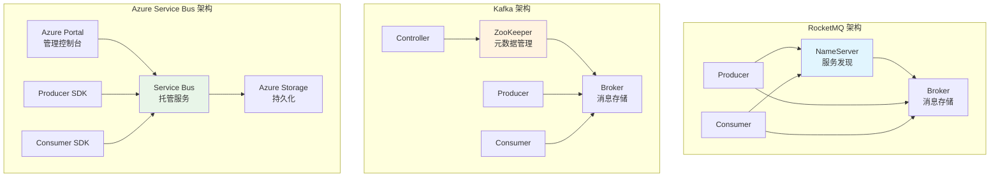
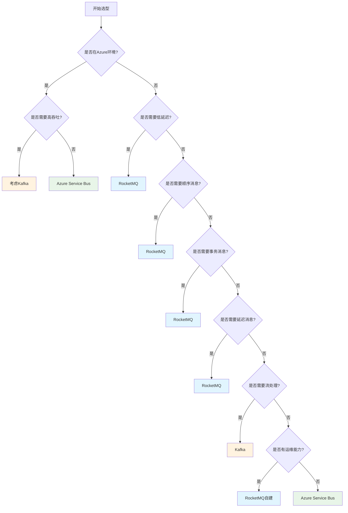

# 消息队列技术对比：RocketMQ vs Kafka vs Azure Service Bus

> **定位**：消息队列技术选型参考指南  
> **目标**：为架构师和技术负责人提供全面的技术对比和选型决策依据

---

## 📋 文档概述

### 三个消息队列的定位

| 消息队列 | 定位 | 背景 |
|---------|------|------|
| **RocketMQ** | 阿里巴巴开源的分布式消息中间件 | 2012年开源，2016年捐赠给Apache，2017年成为Apache顶级项目。面向金融、电商等对可靠性要求极高的场景 |
| **Kafka** | LinkedIn开源的分布式流处理平台 | 2011年开源，2012年成为Apache顶级项目。最初设计用于日志收集，现已成为流数据处理的事实标准 |
| **Azure Service Bus** | 微软Azure云平台的托管消息服务 | 2010年发布，完全托管的云服务。面向云原生应用，无需运维基础设施 |

### 对比目的

本文档旨在从**架构设计、性能指标、功能特性、可靠性、运维监控、生态社区、成本许可**等多个维度，全面对比这三个主流消息队列，帮助技术团队做出最适合的技术选型决策。

### 适用场景

- **技术选型**：新项目消息队列选型
- **架构设计**：分布式系统消息中间件设计
- **性能优化**：消息队列性能调优参考
- **迁移评估**：从现有消息队列迁移的可行性分析

---

## 🏗️ 架构设计对比

### 架构概览

### 架构组件对比

| 组件 | RocketMQ | Kafka | Azure Service Bus |
|------|----------|-------|------------------|
| **服务发现** | NameServer（无状态，可集群） | ZooKeeper（Kafka 2.8+ 使用KRaft，移除ZooKeeper） | Azure DNS + 服务端点 |
| **消息存储** | Broker（主从架构，支持同步/异步复制） | Broker（多副本，Leader-Follower） | Azure Storage（完全托管） |
| **元数据管理** | NameServer存储Topic路由信息 | ZooKeeper/KRaft存储分区元数据 | Azure内部管理 |
| **客户端连接** | 长连接，通过NameServer获取路由 | 直连Broker，通过ZooKeeper获取元数据 | REST API + AMQP协议 |
| **扩展性** | 水平扩展Broker和NameServer | 水平扩展Broker | 自动扩展（云服务） |

### 架构特点分析

#### RocketMQ 架构特点
- **轻量级服务发现**：NameServer无状态，部署简单
- **主从架构**：支持同步/异步复制，保证高可用
- **队列模型**：Topic下多个Queue，支持顺序消息

#### Kafka 架构特点
- **分区模型**：Topic分为多个Partition，天然支持并行处理
- **流式处理**：设计用于高吞吐量流数据处理
- **日志结构**：基于日志追加写入，性能优异

#### Azure Service Bus 架构特点
- **完全托管**：无需管理基础设施
- **多协议支持**：AMQP、HTTP/REST、.NET Messaging
- **云原生**：与Azure生态深度集成

---

## ⚡ 性能指标对比

| 性能指标 | RocketMQ | Kafka | Azure Service Bus |
|---------|----------|-------|-------------------|
| **单机吞吐量** | 10万+ TPS | 百万级 TPS | 根据定价层： Basic: 1000 msg/s Standard: 1000 msg/s Premium: 4000 msg/s |
| **P99延迟** | 1-5ms | 5-10ms | 50-100ms（网络延迟） |
| **P95延迟** | <1ms | 2-5ms | 20-50ms |
| **消息大小限制** | 4MB（默认），可配置 | 1MB（默认），可配置 | 256KB（标准层） 1MB（高级层） |
| **单Topic分区数** | 无严格限制 | 建议不超过1000 | 无分区概念（使用队列/主题） |
| **单Broker连接数** | 10万+ | 10万+ | 根据定价层限制 |
| **批量消息** | 支持，最大32MB | 支持，可配置 | 支持，最大1MB |
| **顺序消息** | 支持（单队列顺序） | 支持（单分区顺序） | 支持（会话ID） |
| **事务消息** | 支持 | 支持（0.11+） | 支持 |

### 性能特点分析

**RocketMQ**
- 低延迟优势明显，适合实时性要求高的场景
- 单机性能优秀，集群扩展性好
- 顺序消息性能优于Kafka

**Kafka**
- 吞吐量最高，适合大数据量场景
- 延迟相对较高，但可接受
- 流式处理能力强

**Azure Service Bus**
- 性能受限于云服务定价层
- 网络延迟影响较大
- 适合中小规模应用

---

## 🎯 功能特性对比

| 功能特性 | RocketMQ | Kafka | Azure Service Bus |
|---------|----------|-------|-------------------|
| **消息类型** | 普通、顺序、事务、延迟、批量 | 普通、顺序、事务、批量 | 普通、顺序、事务、延迟、批量 |
| **延迟消息** | 支持18个级别（1s-2h） | 不支持（需外部实现） | 支持，可自定义延迟时间 |
| **消息过滤** | Tag过滤、SQL92过滤 | 支持Header过滤 | 支持SQL过滤、属性过滤 |
| **消息重试** | 支持，可配置重试次数和间隔 | 支持，需手动实现 | 支持，自动重试机制 |
| **死信队列** | 支持 | 不支持（需外部实现） | 支持 |
| **消息回溯** | 支持，可回溯任意时间点 | 支持，基于offset | 支持，基于时间窗口 |
| **消息去重** | 支持（幂等Producer） | 支持（幂等Producer） | 支持（去重窗口） |
| **批量消费** | 支持 | 支持 | 支持 |
| **广播消费** | 支持 | 支持（Consumer Group） | 支持（多个订阅者） |
| **多租户** | 支持（命名空间隔离） | 支持（多租户配置） | 原生支持（命名空间） |
| **消息路由** | 支持Tag路由 | 支持Key路由 | 支持规则路由 |
| **消息压缩** | 支持（Gzip、LZ4等） | 支持（Gzip、Snappy、LZ4等） | 支持（Gzip） |
| **消息追踪** | 支持（消息轨迹） | 支持（Kafka Streams） | 支持（诊断日志） |

### 功能特性深度分析

#### 延迟消息
- **RocketMQ**：内置18个延迟级别，使用简单但灵活性有限
- **Kafka**：不原生支持，需要外部调度系统（如Quartz）实现
- **Azure Service Bus**：支持自定义延迟时间，灵活性最高

#### 消息过滤
- **RocketMQ**：SQL92过滤功能强大，支持复杂条件
- **Kafka**：主要依赖Header过滤，功能相对简单
- **Azure Service Bus**：SQL过滤语法丰富，支持复杂查询

#### 事务消息
- **RocketMQ**：两阶段提交，保证最终一致性
- **Kafka**：事务Producer，保证Exactly-Once语义
- **Azure Service Bus**：支持事务性操作，保证原子性

---

## 🛡️ 可靠性对比

| 可靠性指标 | RocketMQ | Kafka | Azure Service Bus |
|-----------|----------|-------|-------------------|
| **持久化机制** | 同步刷盘/异步刷盘 | 可配置刷盘策略 | Azure Storage持久化 |
| **高可用方案** | 主从复制（同步/异步） | 多副本（ISR机制） | 多AZ部署（自动） |
| **数据一致性** | 最终一致性 | 最终一致性（可配置强一致性） | 强一致性 |
| **容错能力** | 主从自动切换 | Leader自动选举 | 自动故障转移 |
| **SLA保证** | 无（开源版） | 无（开源版） | 99.9%-99.95%（根据定价层） |
| **数据备份** | 支持主从备份 | 支持多副本备份 | Azure自动备份 |
| **灾难恢复** | 需自行实现 | 需自行实现 | Azure Geo-Disaster Recovery |
| **消息不丢失** | 同步刷盘+同步复制 | acks=all | At-Least-Once保证 |
| **消息不重复** | 幂等Producer | 幂等Producer | 去重窗口 |

### 可靠性机制详解

#### RocketMQ 可靠性
- **同步刷盘**：消息写入磁盘后才返回，保证不丢失
- **同步复制**：消息同步到从节点后才返回，保证高可用
- **主从切换**：主节点故障时自动切换到从节点

#### Kafka 可靠性
- **ISR机制**：In-Sync Replicas，保证副本同步
- **acks配置**：acks=all保证所有副本写入
- **Leader选举**：Controller负责Leader选举

#### Azure Service Bus 可靠性
- **多AZ部署**：自动跨可用区部署
- **SLA保证**：99.9%-99.95%可用性保证
- **Geo-Disaster Recovery**：跨区域灾难恢复

---

## 🔧 运维与监控对比

| 运维指标 | RocketMQ | Kafka | Azure Service Bus |
|---------|----------|-------|-------------------|
| **部署复杂度** | 中等（需部署NameServer和Broker） | 中等（需部署ZooKeeper和Broker） | 低（完全托管） |
| **监控指标** | 内置监控（RocketMQ Console） | Kafka Manager、Kafka Monitor | Azure Monitor |
| **告警能力** | 需自行集成 | 需自行集成 | 内置告警规则 |
| **运维工具** | RocketMQ Console、mqadmin | Kafka Manager、kafka-topics.sh | Azure Portal、Azure CLI |
| **日志管理** | 需自行管理日志 | 需自行管理日志 | Azure Log Analytics |
| **性能调优** | 需手动调优 | 需手动调优 | 自动优化（部分） |
| **扩容操作** | 需手动添加Broker | 需手动添加Broker | 自动扩容（高级层） |
| **版本升级** | 需停机升级 | 支持滚动升级 | 自动升级 |
| **配置管理** | 配置文件管理 | 配置文件/ZooKeeper | Web界面/API |
| **故障排查** | 日志分析 | 日志分析 | 诊断日志和指标 |

### 运维工具对比

#### RocketMQ 运维工具
- **RocketMQ Console**：Web管理界面，支持Topic管理、消息查询
- **mqadmin**：命令行工具，功能全面
- **监控指标**：消息堆积、消费延迟、Broker状态

#### Kafka 运维工具
- **Kafka Manager**：Web管理界面（已停止维护）
- **Kafka UI**：现代化Web界面
- **kafka-topics.sh**：命令行工具
- **JMX指标**：丰富的JMX监控指标

#### Azure Service Bus 运维工具
- **Azure Portal**：完整的Web管理界面
- **Azure Monitor**：集成监控和告警
- **Azure CLI/PowerShell**：命令行管理工具
- **Application Insights**：应用性能监控

---

## 🌐 生态与社区对比

| 生态指标 | RocketMQ | Kafka | Azure Service Bus |
|---------|----------|-------|-------------------|
| **编程语言支持** | Java、C++、Go、Python、Node.js | Java、Scala、Python、Go、C/C++、.NET、Node.js | .NET、Java、Python、Node.js、PHP、Ruby |
| **客户端SDK** | 官方SDK + 社区SDK | 官方SDK + 丰富社区SDK | 官方SDK（Azure SDK） |
| **社区活跃度** | 高（Apache顶级项目） | 极高（Apache顶级项目，最活跃） | 中等（微软官方维护） |
| **文档质量** | 良好（中文文档完善） | 优秀（英文文档完善） | 优秀（多语言文档） |
| **第三方工具** | RocketMQ Console、RocketMQ Exporter | Kafka Connect、Kafka Streams、Schema Registry | Azure Functions、Logic Apps |
| **集成框架** | Spring Cloud Stream、Dubbo | Spring Kafka、Kafka Streams、Flink | Azure Functions、Event Grid |
| **学习资源** | 中文资源丰富 | 英文资源丰富 | 官方教程完善 |
| **GitHub Stars** | 20k+ | 150k+ | 部分开源（SDK） |

### 生态特点分析

#### RocketMQ 生态
- **中文友好**：中文文档和社区支持好
- **Java生态**：与Spring Cloud、Dubbo深度集成
- **阿里生态**：与阿里云产品集成良好

#### Kafka 生态
- **最丰富**：工具和框架最多
- **流处理**：Kafka Streams、Flink、Spark Streaming集成
- **数据管道**：Kafka Connect生态完善

#### Azure Service Bus 生态
- **Azure集成**：与Azure服务深度集成
- **企业级**：企业级支持和SLA
- **多语言**：官方SDK支持主流语言

---

## 💰 成本与许可对比

| 成本维度 | RocketMQ | Kafka | Azure Service Bus |
|---------|----------|-------|-------------------|
| **开源许可** | Apache 2.0 | Apache 2.0 | 部分开源（SDK） |
| **商业许可** | 免费（开源版） 商业版需授权 | 免费（开源版） Confluent商业版需付费 | 按使用量付费 |
| **云服务成本** | 阿里云RocketMQ按量付费 | AWS MSK、Confluent Cloud按量付费 | Azure按消息数和连接数付费 |
| **自建成本** | 服务器+运维成本 | 服务器+运维成本 | 无需自建 |
| **定价模型** | 开源免费 | 开源免费 | Basic: $0.05/百万消息 Standard: $0.05/百万消息 Premium: $0.10/百万消息 |
| **隐藏成本** | 运维人力成本 | 运维人力成本 | 网络出站流量费用 |
| **成本优化** | 资源利用率优化 | 资源利用率优化 | 选择合适的定价层 |

### 成本分析

#### RocketMQ 成本
- **开源版**：完全免费，但需自建和运维
- **云服务**：阿里云RocketMQ按实例规格付费
- **总成本**：服务器成本 + 运维人力成本

#### Kafka 成本
- **开源版**：完全免费，但需自建和运维
- **云服务**：AWS MSK、Confluent Cloud按集群规模付费
- **总成本**：服务器成本 + 运维人力成本

#### Azure Service Bus 成本
- **按量付费**：根据消息数和连接数计费
- **无运维成本**：完全托管，无需运维
- **总成本**：消息处理费用 + 网络流量费用

### 成本对比示例（月处理1亿消息）

| 方案 | 预估月成本 | 说明 |
|------|-----------|------|
| **RocketMQ自建** | $500-1000 | 3台服务器（$150/台）+ 运维成本 |
| **Kafka自建** | $500-1000 | 3台服务器（$150/台）+ 运维成本 |
| **Azure Service Bus Standard** | $5 | 1亿消息 × $0.05/百万 = $5 |
| **Azure Service Bus Premium** | $10 | 1亿消息 × $0.10/百万 = $10 |

---

## 🎯 选型决策矩阵

### 场景化选型建议

| 场景 | 推荐方案 | 理由 |
|------|---------|------|
| **高吞吐量场景** （百万级TPS） | Kafka | 吞吐量最高，流处理能力强 |
| **低延迟场景** （P99 < 5ms） | RocketMQ | 延迟最低，实时性好 |
| **顺序消息场景** | RocketMQ / Kafka | RocketMQ顺序消息性能更好，Kafka分区顺序稳定 |
| **事务消息场景** | RocketMQ / Azure Service Bus | RocketMQ事务消息成熟，Azure Service Bus事务支持完善 |
| **延迟消息场景** | RocketMQ / Azure Service Bus | 原生支持延迟消息，Kafka需外部实现 |
| **云原生场景** （Azure环境） | Azure Service Bus | 与Azure生态深度集成，运维简单 |
| **混合云场景** | RocketMQ / Kafka | 可跨云部署，Azure Service Bus绑定Azure |
| **金融级可靠性** | RocketMQ | 金融场景验证，可靠性高 |
| **大数据流处理** | Kafka | Kafka Streams生态完善 |
| **中小规模应用** | Azure Service Bus | 成本低，无需运维 |
| **成本敏感场景** | RocketMQ / Kafka自建 | 开源免费，但需运维能力 |
| **快速上线场景** | Azure Service Bus | 无需部署，开箱即用 |

### 选型决策流程图

---

## 💡 最佳实践建议

### RocketMQ 最佳实践

#### 1. 生产环境配置
- **同步刷盘 + 同步复制**：保证消息不丢失
- **合理设置队列数**：根据消费能力设置，避免队列过多
- **监控消息堆积**：设置告警阈值，及时处理堆积

#### 2. 性能优化
- **批量发送消息**：提高吞吐量
- **合理设置批量大小**：平衡延迟和吞吐量
- **使用Tag过滤**：减少网络传输

#### 3. 常见问题
- **消息堆积**：增加消费者实例或提高消费速度
- **顺序消息性能**：单队列顺序，多队列并行
- **事务消息超时**：合理设置事务超时时间

### Kafka 最佳实践

#### 1. 生产环境配置
- **acks=all**：保证消息不丢失
- **合理设置分区数**：根据吞吐量需求设置
- **监控ISR**：确保副本同步正常

#### 2. 性能优化
- **批量发送**：提高吞吐量
- **压缩消息**：减少网络传输
- **合理设置批次大小**：平衡延迟和吞吐量

#### 3. 常见问题
- **分区数过多**：影响性能，建议不超过1000
- **Consumer Lag**：增加消费者或提高处理速度
- **Leader选举**：避免频繁的Leader选举

### Azure Service Bus 最佳实践

#### 1. 生产环境配置
- **选择合适的定价层**：根据吞吐量需求选择
- **启用诊断日志**：便于问题排查
- **配置告警规则**：监控关键指标

#### 2. 性能优化
- **批量操作**：减少API调用次数
- **使用会话**：保证顺序消息
- **合理设置预取**：平衡延迟和吞吐量

#### 3. 常见问题
- **配额限制**：注意消息大小和连接数限制
- **网络延迟**：考虑地域选择
- **成本控制**：监控消息量，优化使用

---

## 🔄 迁移考虑

### 从其他消息队列迁移

#### 迁移到 RocketMQ

**优势**
- 低延迟，适合实时场景
- 顺序消息性能好
- 中文文档和社区支持

**注意事项**
- 需要重新设计Topic和Queue结构
- 客户端SDK需要替换
- 监控和运维工具需要重新配置

**迁移步骤**
1. 评估现有消息队列的使用情况
2. 设计RocketMQ的Topic和Queue结构
3. 开发迁移工具，逐步迁移
4. 双写验证，确保消息不丢失
5. 切换流量，下线旧系统

#### 迁移到 Kafka

**优势**
- 高吞吐量，适合大数据场景
- 流处理生态完善
- 社区活跃，工具丰富

**注意事项**
- 延迟相对较高
- 需要重新设计分区策略
- 运维复杂度较高

**迁移步骤**
1. 评估消息量和延迟要求
2. 设计Kafka的Topic和Partition结构
3. 使用Kafka Connect或自定义工具迁移
4. 验证消息顺序和一致性
5. 切换消费者，逐步迁移

#### 迁移到 Azure Service Bus

**优势**
- 无需运维，开箱即用
- 与Azure生态集成好
- SLA保证

**注意事项**
- 绑定Azure平台
- 成本可能较高
- 延迟受网络影响

**迁移步骤**
1. 评估成本和性能要求
2. 创建Service Bus命名空间和队列/主题
3. 使用Azure SDK替换客户端代码
4. 配置监控和告警
5. 逐步切换，验证功能

### 兼容性分析

| 消息队列 | 协议支持 | 客户端兼容性 | 数据格式兼容性 |
|---------|---------|-------------|---------------|
| **RocketMQ** | 自定义协议 | Java客户端为主 | 支持JSON、Protobuf等 |
| **Kafka** | 自定义协议 | 多语言客户端 | 支持JSON、Avro、Protobuf等 |
| **Azure Service Bus** | AMQP、HTTP | 多语言SDK | 支持JSON、XML等 |

---

## 📊 综合对比总结

### 核心优势对比

| 消息队列 | 核心优势 | 适用场景 |
|---------|---------|---------|
| **RocketMQ** | 低延迟、顺序消息、事务消息、中文友好 | 金融、电商、实时交易 |
| **Kafka** | 高吞吐量、流处理、生态丰富 | 大数据、日志收集、流处理 |
| **Azure Service Bus** | 完全托管、无需运维、Azure集成 | 云原生应用、Azure环境 |

### 选择建议

**选择 RocketMQ 如果：**
- 需要低延迟（P99 < 5ms）
- 需要顺序消息和事务消息
- 团队熟悉Java技术栈
- 需要中文文档和社区支持

**选择 Kafka 如果：**
- 需要极高的吞吐量（百万级TPS）
- 需要流处理能力
- 需要丰富的生态工具
- 团队有Kafka运维经验

**选择 Azure Service Bus 如果：**
- 在Azure云环境
- 需要快速上线，无运维能力
- 中小规模应用
- 需要SLA保证

---

## 📚 参考资源

### 官方文档
- [RocketMQ官方文档](https://rocketmq.apache.org/docs/)
- [Kafka官方文档](https://kafka.apache.org/documentation/)
- [Azure Service Bus文档](https://docs.microsoft.com/azure/service-bus-messaging/)

### 学习资源
- RocketMQ：GitHub、官方博客、中文社区
- Kafka：Confluent博客、Kafka Summit、官方文档
- Azure Service Bus：Microsoft Learn、Azure文档、示例代码

---

**最后更新**：2024年  
**文档版本**：v1.0
