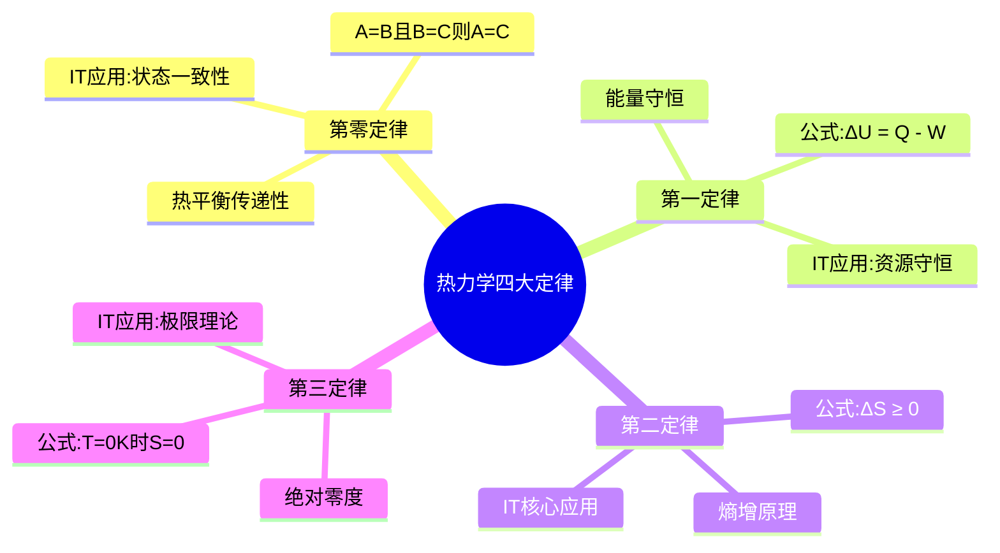
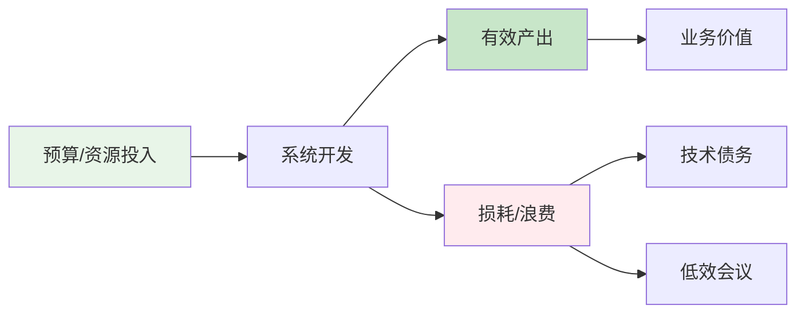
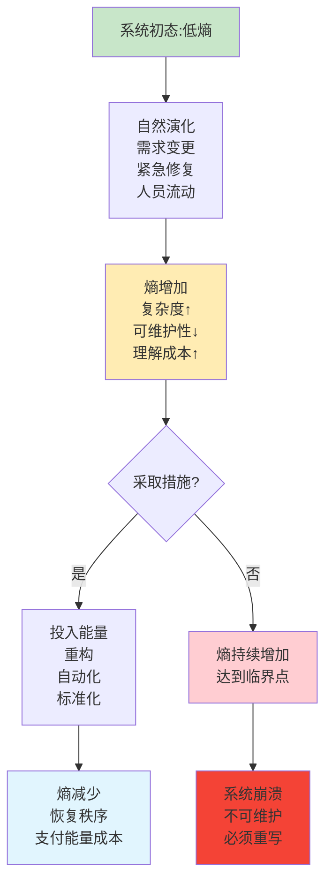
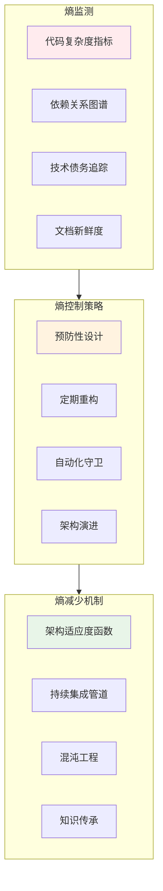
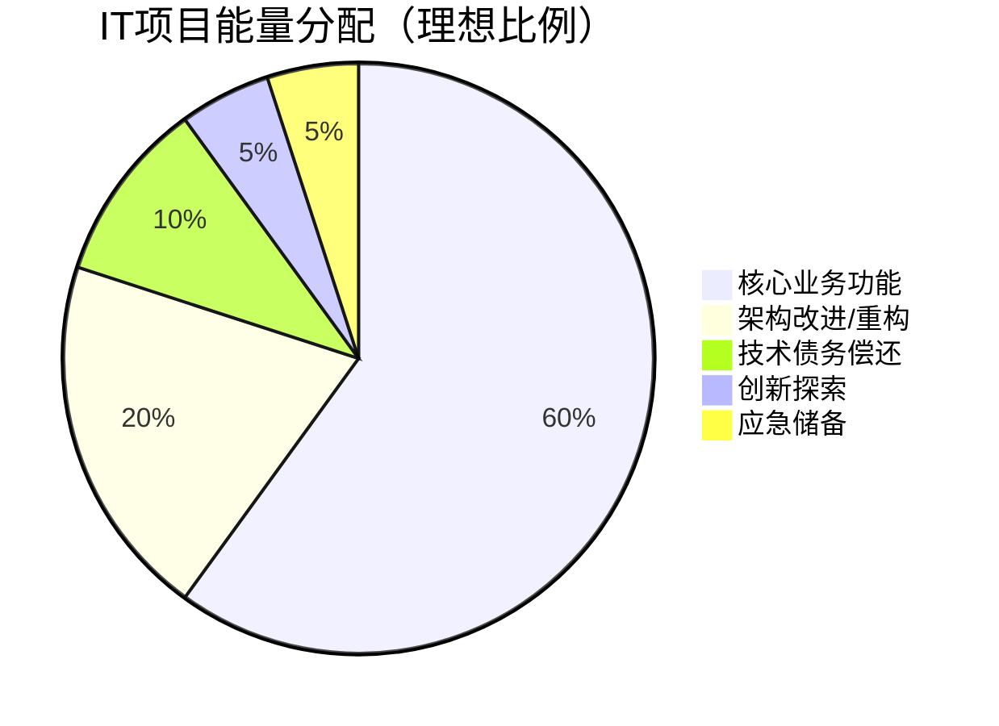
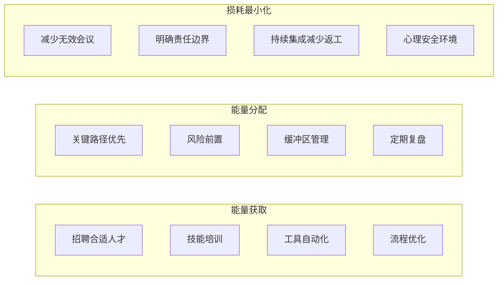
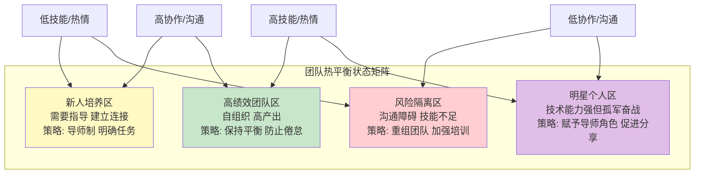
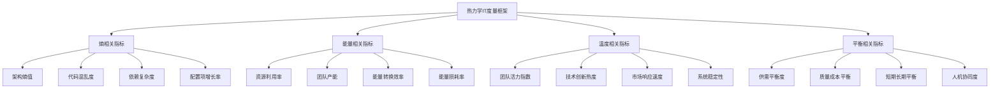

# 热力学定律及其在IT架构与项目管理中的应用

## 🌡️ 热力学四大定律概述

### 1. 第零定律（热平衡定律）

**表述**：如果两个系统分别与第三个系统处于热平衡状态，则它们彼此也处于热平衡状态。

**数学形式**：若A=B且B=C，则A=C（温度相等）

**通俗理解**：温度的"传递性"和可比性

| 物理学意义 | 类比IT概念 | 具体应用场景 |
|-----------|-----------|------------|
| 定义了温度的概念 | **系统状态一致性** | 分布式系统中的一致性协议 |
| 平衡的可传递性 | **事务的ACID属性** | 数据库事务的原子性、一致性 |
| 测量的基础 | **监控指标标准化** | APM系统、健康检查 |

**IT应用举例**：

- 微服务架构中，各服务的健康状态判断标准需一致
- 负载均衡算法需基于相同的度量标准
- 多数据中心的数据同步需保证最终一致性

### 2. 第一定律（能量守恒定律）

**表述**：在一个封闭系统中，能量的总量保持不变，只能从一种形式转换为另一种形式。

**数学形式**：ΔU = Q - W
（内能变化 = 吸收热量 - 对外做功）

| 物理学意义 | 类比IT概念 | 架构与项目管理应用 |
|-----------|-----------|------------------|
| 能量不会凭空产生或消失 | **资源守恒** | 预算有限，需合理分配计算、存储、网络资源 |
| 能量转换的效率问题 | **转换损耗** | API网关、序列化/反序列化的性能开销 |
| 输入输出平衡 | **输入=处理+输出+损耗** | 系统吞吐量 = 请求处理 + 缓存命中 + 丢弃 |

**实际工作应用**：

**项目管理对应**：

- **预算守恒**：总预算 = 人力成本 + 硬件成本 + 软件许可 + 意外储备
- **工作量守恒**：团队产能是有限的，新增功能必然挤压技术债务修复时间
- **注意力守恒**：管理者精力有限，需战略性分配关注点

### 3. 第二定律（熵增定律）- **最重要！**

**表述**：在孤立系统中，熵（无序度）永远不会减少，总是趋向于最大值。

**数学形式**：ΔS ≥ 0（等号仅适用于理想可逆过程）

**两种经典表述**：

1. **克劳修斯表述**：热量不能自发地从低温物体传到高温物体
2. **开尔文表述**：不可能从单一热源取热使之完全变为有用功而不产生其他影响

| 物理学概念 | IT世界对应 | 具体表现 |
|-----------|-----------|---------|
| **熵(S)** | **系统无序度/复杂度** | 代码混乱度、配置项数量、依赖关系复杂度 |
| **熵增** | **系统自然趋于混乱** | 技术债务积累、文档过时、配置漂移 |
| **负熵** | **施加外力引入秩序** | 重构、代码审查、自动化测试、文档更新 |

**熵在IT中的量化尝试**：

### 4. 第三定律（绝对零度定律）

**表述**：当系统温度趋近于绝对零度（0K或-273.15℃）时，系统的熵趋近于一个恒定最小值。

**数学形式**：lim(T→0) S = S₀

**IT世界的深刻洞见**：

- **绝对有序是不可能的**：就像无法达到绝对零度一样，无法实现"完美无瑕"的系统
- **渐进改善有极限**：优化改进存在收益递减点，超过某个阈值后投入产出比急剧下降
- **残余无序的存在**：即使最佳实践中，也存在必要的、无法消除的复杂度

| 物理学概念 | IT项目管理含义 | 实际应用 |
|-----------|--------------|---------|
| 绝对零度不可达 | **完美系统不存在** | 接受合理的缺陷率（如99.99%可用性） |
| 熵有下限 | **必要复杂度守恒** | 业务逻辑固有的复杂度无法通过架构消除 |
| 接近极限的成本 | **边际效益递减** | 测试覆盖率从95%到99%的成本可能远超收益 |

## 🛠️ IT架构师的应用框架

### 基于热力学的架构设计原则

#### 1. 熵管理框架

**具体实施方法**：

- **熵量化指标**：
  - 圈复杂度 > 15的函数占比
  - 违反架构规范的代码比例
  - 无测试覆盖的代码行数
  - 单点故障的数量

- **熵控制实践**：
  - **架构适应度函数**：自动化检查架构约束
  - **重构预算**：每迭代保留20%时间处理技术债务
  - **限界上下文**：控制业务复杂度的传播边界
  - **演进式架构**：设计支持增量演进的系统

#### 2. 能量守恒的资源分配模型

**架构决策的能量视角**：

- **能量输入**：开发工时、计算资源、存储成本、网络带宽
- **能量转化效率**：
  - 缓存命中率（减少重复计算）
  - 异步处理（提高吞吐）
  - 资源复用（降低冗余）
- **能量损耗**：
  - 不必要的序列化/反序列化
  - 过度设计带来的维护负担
  - 频繁的上下文切换

#### 3. 热平衡的状态管理

**分布式系统的一致性模型**：

| 一致性级别 | 热力学类比 | 适用场景 | 代价 |
|-----------|-----------|---------|------|
| **强一致性** | 即时热平衡 | 金融交易、库存扣减 | 高延迟、低可用性 |
| **最终一致性** | 缓慢热平衡 | 社交动态、购物车 | 短暂不一致、更高可用 |
| **弱一致性** | 不追求平衡 | CDN缓存、页面浏览 | 可能读到旧数据、最高性能 |

**架构模式对应**：

- **事件溯源** = 记录所有状态变化（记录能量转换全过程）
- **CQRS** = 读写分离（不同的能量转换路径）
- **Saga模式** = 分布式事务补偿（能量回退机制）

## 📋 项目管理师的应用框架

### 1. 项目熵的管理策略

**项目熵的来源**：

1. **需求熵**：频繁变更、范围蔓延
2. **沟通熵**：信息失真、理解偏差
3. **技术熵**：债务积累、架构腐化
4. **团队熵**：士气波动、人员流失

**熵管理仪表盘**：

| 熵类型 | 监控指标 | 预警阈值 | 干预措施 |
|-------|---------|---------|---------|
| 需求熵 | 需求变更频率 未闭环需求项数 | > 3次/周 > 10项积压 | 建立需求冻结期 强化变更控制流程 |
| 技术熵 | 技术债务指数 构建失败率 | > 0.3 > 5% | 分配重构sprint 设立质量门禁 |
| 团队熵 | 加班时长 满意度评分 | > 10h/周 < 3.5/5分 | 调整工作节奏 举行团队建设活动 |

### 2. 基于能量守恒的项目规划

**项目能量方程式**：
总能量 = 团队人力 × 时间周期 × 工作效率
能量分配 = 功能开发 + 质量保障 + 技术债务 + 创新学习
能量损耗 = 会议消耗 + 上下文切换 + 等待阻塞 + 返工

**能量优化策略**：

能量获取 --> 能量分配
能量分配 --> 损耗最小化

### 3. 热平衡在团队管理中的应用

**团队热平衡模型**：

| 热力学概念 | 团队管理对应 | 具体实践 |
|-----------|-------------|---------|
| **温度均衡** | 能力发展均衡 | 导师制、结对编程、知识分享会 |
| **热量传导** | 信息有效传递 | 站会、wiki、周报、演示日 |
| **温差驱动** | 合理竞争激励 | OKR公示、成就认可、适度压力 |
| **绝热过程** | 深度工作时段 | 无会议日、免打扰时间段、聚焦冲刺 |

**团队状态监控**：

## 🔬 实战案例分析

### 案例1：微服务拆分中的熵变管理

**背景**：某电商平台从单体拆分为微服务

| 阶段 | 熵变化 | 能量投入 | 管理策略 |
|-----|-------|---------|---------|
| 拆分前期 | 局部熵减，整体熵增 | 架构设计、依赖分析 | 限界上下文划分、API契约先行 |
| 拆分中期 | 熵显著增加 | 团队重组、技术选型 | 逐步迁移、特性开关、回滚方案 |
| 稳定运行 | 熵缓慢增加 | 治理工具、监控体系 | 服务网格、统一日志、链路追踪 |
| 长期演进 | 周期性熵增减 | 持续重构、架构适应 | 定期架构评审、技术雷达 |

**关键洞察**：

- 架构演进是**刻意制造暂时熵增**以获得长期熵减
- **相变能量**：重构所需的能量投入类似物质相变潜热
- **稳态维持**：需要持续投入能量维持低熵状态

### 案例2：敏捷转型中的热平衡

**问题**：传统瀑布团队转向敏捷过程中的"温度失衡"

**症状**：

- 老员工（低温体）抗拒变化
- 新方法引入（高温冲击）导致不适
- 信息传导不畅（隔热层存在）

**基于热力学的解决方案**：

1. **梯度升温**：渐进式引入实践，而非一步到位
2. **热交换界面扩大**：增加跨角色协作频率
3. **温度计校准**：统一成功度量标准
4. **保温措施**：建立心理安全感，减少热量散失

## 📈 度量指标体系

### 基于热力学的IT度量框架

### 关键指标计算公式

| 指标类别 | 具体指标 | 计算公式 | 健康范围 |
|---------|---------|---------|---------|
| **架构熵** | 技术债务密度 | ∑(债务项严重度×剩余修复时间) / 代码总行数 | < 0.1 |
| **能量效率** | 功能交付效率 | 完成story points数 / (团队规模×迭代天数) | 行业基准±20% |
| **热平衡度** | 团队负荷均衡 | 1 - max(成员工作饱和度)/avg(成员工作饱和度) | > 0.7 |
| **温差动力** | 创新采纳率 | 新技术评估数 / 技术栈总组件数 | 0.05-0.15 |

## 🎯 行动计划模板

### 月度熵检视会（30分钟）

1. **熵状态快照**（5分钟）
   - 技术债务变化趋势
   - 构建失败率波动
   - 生产事故根因分析

2. **熵源识别**（10分钟）
   - 近期引入的最大复杂度来源
   - 哪些变更破坏了原有结构
   - 哪些文档已经过时

3. **减熵行动**（10分钟）
   - 选定本月的"熵清理"任务
   - 分配重构预算
   - 更新架构适应度函数

4. **熵意识培养**（5分钟）
   - 分享一个熵增加警示故事
   - 庆祝一项成功的减熵举措
   - 设定下月熵控目标

### 季度能量审计

**审计维度**：

1. **输入能量审计**
   - 人力投入是否匹配战略重点
   - 培训投入是否产生效果
   - 工具采购ROI评估

2. **转换效率审计**
   - 会议时间vs产出比率
   - 代码审查反馈时效
   - 部署流水线成功率

3. **输出价值审计**
   - 业务功能交付价值
   - 用户体验提升度
   - 系统稳定性改善

## 💡 核心工作哲学转变

### 从"解决问题"到"管理熵流"

**传统思维**：出现问题 → 应急修复 → 问题复发

**热力学思维**：
高熵状态识别 → 熵增原因分析 → 建立减熵机制 →
持续熵监测 → 预防性熵控制 → 形成低熵文化

### 从"最大化产出"到"优化能量循环"

**效率观转变**：

- ❌ 旧观念：加班越多，产出越多
- ✅ 新观念：合理休息 → 熵降低 → 创造力恢复 → 高质量产出

### 从"追求完美"到"管理必要无序"

**现实主义的架构观**：

- 接受**Tesler定律**的复杂度守恒
- 认识到**第三定律**的完美不可达
- 专注于**第二定律**的熵增速率控制
- 利用**第一定律**的能量优化分配
- 建立**第零定律**的一致基准

---

## 🏆 终极洞察

热力学给IT专业人士的最宝贵礼物是：**系统性思维框架**和**对固有局限的清醒认识**。

1. **你不是在与混乱战斗，而是在管理混乱的流速**
2. **你不是在创造完美系统，而是在设计有韧性的耗散结构**
3. **能量不会凭空产生，明智的投资比盲目的努力更重要**
4. **平衡不是静态终点，而是动态调节的艺术**

**记住**：最好的架构不是零熵的架构，而是**熵增可控、熵减可行**的架构；最好的项目不是毫无问题的项目，而是**问题可见、响应及时**的项目。热力学教会我们与复杂性共存，而不是幻想将其消灭。

---

## 📁 文件使用说明

### 支持的Markdown查看器

1. **VS Code** + Markdown Preview Enhanced插件（推荐，完美支持Mermaid图表）

2. **Typora**（最新版支持Mermaid）
3. **Obsidian** + Mermaid插件
4. **GitHub/GitLab**（在线查看，支持基本Mermaid）
5. **MarkText**、**Notion**等现代Markdown编辑器

### 如何保存

1. 全选以上所有内容（从`# 热力学定律及其在IT架构与项目管理中的应用`开始到最后）
2. 粘贴到文本编辑器（VS Code、Sublime Text等）
3. 保存为`thermodynamics-it-management.md`

### 图表渲染说明

- 所有Mermaid图表在支持Mermaid的查看器中会自动渲染
- 如需导出为PDF/HTML，建议使用VS Code的Markdown PDF插件
- 如需打印，建议先导出为PDF确保图表正常显示

### 版本信息

- 创建时间：2024年
- 最后更新：2024年
- 内容涵盖：热力学四大定律、架构应用、项目管理应用
- 图表类型：Mermaid思维导图、流程图、状态图、饼图、象限图
- 表格数量：15+
注意：由于平台限制，Mermaid图表在部分Markdown查看器中可能需要插件支持。建议在VS Code中安装Markdown Preview Enhanced插件以获得最佳查看体验。
