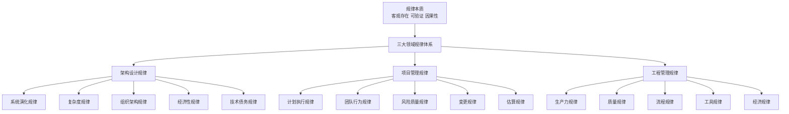
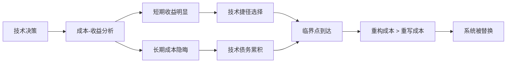
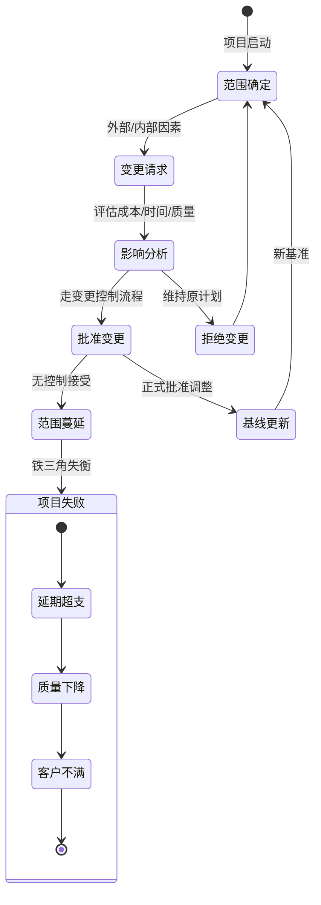
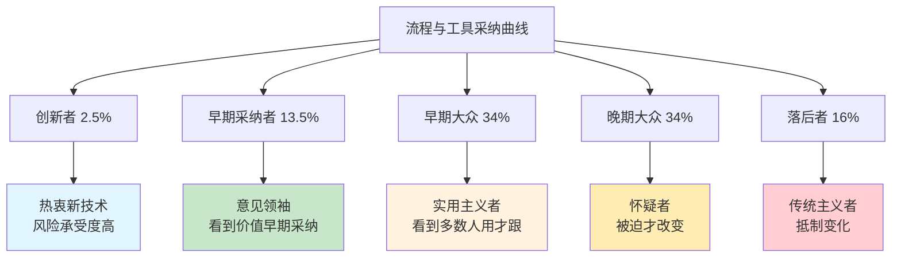
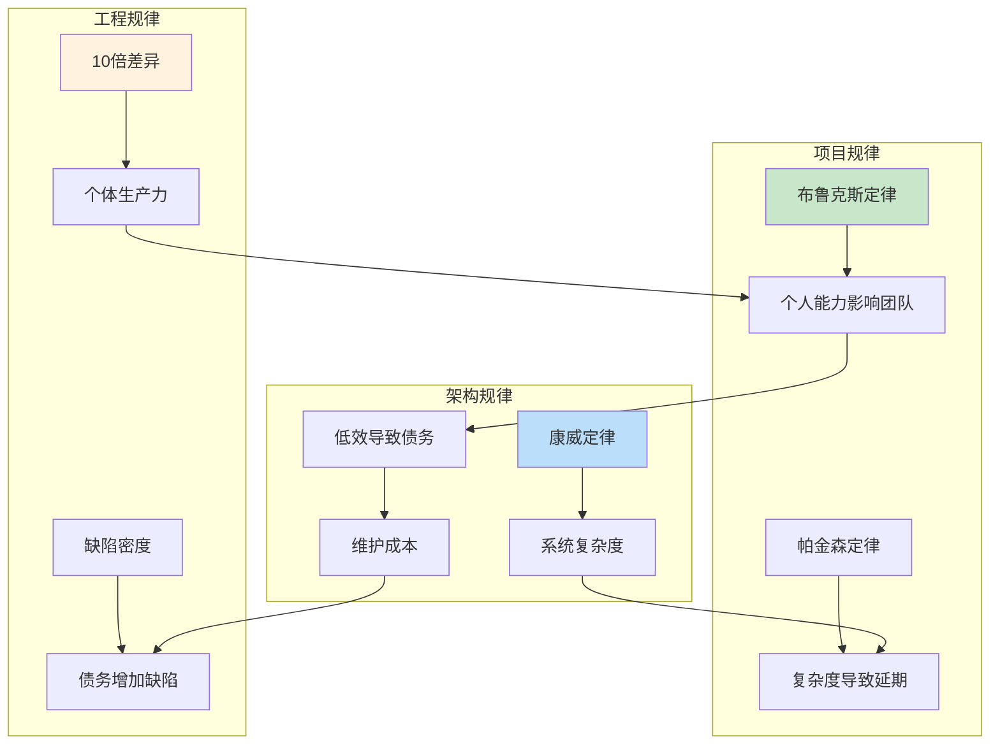

# 架构、项目与工程管理核心规律全览

基于**规律是客观存在、可验证的因果关系**的定义，我为您系统梳理了这三个领域的核心规律。

## 📊 规律分类总览

## 1. 架构设计领域核心规律

### 1.1 系统演化规律
| 规律名称 | 提出者/来源 | 核心表述 | 实际影响与案例 |
|---------|------------|---------|--------------|
| **康威定律**<br>(Conway's Law) | Melvin Conway, 1967 | "任何组织设计的系统，其结构都不可避免地复制该组织的沟通结构。" | 微服务架构需要团队按业务能力而非技术职能组织；<br>跨部门协作困难的系统通常接口也复杂 |
| **莱纳斯定律**<br>(Linus's Law) | Eric S. Raymond<br>总结自Linus | "只要有足够多的眼睛，就可让所有问题浮现。"<br>但补充："但太多眼睛会互相干扰" | 开源项目质量通常更高；<br>但过大的代码评审组反而降低效率 |
| **系统演化三段论** | 实践观察 | 1. 单体应用<br>2. 分布式系统<br>3. 最终回归简化 | 许多系统经历"微服务拆分"→"过度拆分"→"合理合并"的循环 |
| **熵增定律<br>(技术债务)** | 热力学第二定律<br>类比 | "软件系统的无序度（技术债务）会随时间自然增加，除非额外投入能量（重构）来降低它。" | 遗留系统维护成本指数增长；<br>无重构投入的系统最终不可维护 |

### 1.2 复杂度规律
| 规律名称 | 数学描述 | 实践表现 | 应对策略 |
|---------|---------|---------|---------|
| **梅特卡夫定律**<br>在架构中的体现 | 网络价值 ∝ n² | 系统间连接数以n²增长，集成复杂度爆炸 | API网关、服务网格、事件驱动解耦 |
| **规模不经济拐点** | 存在最优规模点 | 微服务拆分过度后，运维和治理成本超过收益 | 找到"合适粒度"：团队2周可重写一个服务 |
| **抽象泄漏定律**<br>(Leaky Abstraction) | Joel Spolsky, 2002 | "所有重要的抽象在某些程度上都会泄漏。" | ORM框架在复杂查询时仍需SQL调优；<br>云服务故障仍需理解底层原理 |
| **复杂度守恒定律**<br>(Tesler's Law) | Larry Tesler | "每个应用程序都有其固有的、无法降低或隐藏的复杂度。" | 复杂的业务逻辑无法通过架构完全隐藏，只能转移位置 |

### 1.3 组织-架构交互规律
| 规律名称 | 双向影响关系 | 实证观察 |
|---------|-------------|---------|
| **逆康威定律** | 通过设计系统架构来塑造组织 | Spotify的"小队-部落-分会-公会"组织模式支持其微服务架构 |
| **邓巴数与团队规模** | 人类认知上限约150人，有效协作上限5-9人 | 两个披萨团队(6-10人)是亚马逊的标准；<br>微服务团队规模通常5-8人 |
| **沟通路径公式** | 沟通路径 = n(n-1)/2 | 5人团队：10条路径；<br>10人团队：45条路径 → 需调整组织结构减少耦合 |

### 1.4 经济性规律


| 规律名称 | 经济学原理对应 | 架构表现 |
|---------|---------------|---------|
| **技术债务利息递增** | 复利效应 | 早期1天可修复的问题，3年后需1个月重构 |
| **决策成本延迟** | 时间价值 | 今天的架构妥协，未来需付出3-10倍代价修复 |
| **迁移成本锁定效应** | 沉没成本谬误 | 一旦选择特定技术栈，即使有更好选择也难更换 |

## 2. 项目管理领域核心规律

### 2.1 计划与执行规律
| 规律名称 | 核心表述 | 数学表达 | 管理启示 |
|---------|---------|---------|---------|
| **霍夫施塔特定律**<br>(Hofstadter's Law) | "事情花费的时间总是比你预期的要长，即使你考虑到了霍夫施塔特定律。" | 实际时间 = 估算时间 × 霍夫施塔特系数(>1) | 所有估算都应包含缓冲；<br>采用敏捷迭代减少长周期不确定性 |
| **帕金森定律**<br>(Parkinson's Law) | "工作会不断膨胀，直到占满所有可用时间。" | 实际耗时 = 可用时间(无论实际需要多久) | 设置明确的时间盒(Timeboxing)；<br>避免无限延长的截止日期 |
| **学生综合症**<br>(Student Syndrome) | "人们只有在最后期限临近时才开始认真工作。" | 实际开始时间 = 截止时间 - 实际需要时间 | 设置多个中间里程碑；<br>采用看板可视化任务进度 |
| **90-90规则** | "前90%的代码消耗了前90%的开发时间，剩下的10%的代码消耗了另外90%的开发时间。" | 实际进度 ≠ 线性进度 | 最后10%的任务(调试、集成)预留足够时间 |

### 2.2 团队行为规律
| 规律名称 | 观察现象 | 图表表现 |
|---------|---------|---------|
| **布鲁克斯定律**<br>(Brooks's Law) | "为延期的项目增加人手会使它更延期。"<br>原因：新人培训成本、沟通开销增加 | ```mermaid<br>graph LR<br>  A[项目延期] --> B[增加人手]<br>  B --> C[沟通成本↑]<br>  C --> D[效率↓]<br>  B --> E[培训成本↑]<br>  D & E --> F[更延期]<br>``` |
| **邓巴数与项目管理** | 项目经理能有效管理的直接汇报人数有上限(约7±2) | 项目管理最佳实践：<br>- 5-9人团队效率最高<br>- 超过15人需分层管理 |
| **彼得原理**<br>(项目管理版) | "在层级组织中，每个员工都倾向于晋升到其不能胜任的职位。" | 技术专家被提拔为项目经理后可能失败，因技能不匹配 |
| **团队形成阶段**<br>(Tuckman模型) | 形成→震荡→规范→执行，每个项目团队必经阶段 | 新组建团队需1-2个月才能高效，强行跳过震荡期有害 |

### 2.3 风险与质量规律
| 规律名称 | 概率/统计基础 | 项目管理应用 |
|---------|-------------|------------|
| **墨菲定律**<br>(Murphy's Law) | "凡是可能出错的事，就一定会出错。" | 风险管理核心：假设所有识别出的风险都会发生，并制定预案 |
| **帕累托法则<br>(80/20法则)** | 80%的效果来自20%的原因 | - 80%的延期来自20%的任务<br>- 80%的缺陷来自20%的模块<br>- 聚焦关键路径任务 |
| **缺陷放大效应** | 需求阶段1个错误 → 设计阶段3-5个错误 → 编码阶段10个错误 | 越早发现修复缺陷，成本越低(需求:1x, 设计:3-5x, 测试:10x, 上线:30-100x) |
| **风险暴露窗口** | 风险影响 = 概率 × 影响 × 时间 | 高风险任务应尽早处理，缩短其可能造成影响的持续时间 |

### 2.4 变更与范围规律

| 规律名称 | 表现形式 | 数学关系 |
|---------|---------|---------|
| **范围蔓延规律** | 项目范围随时间自然增长，平均每月1-2% | 最终范围 ≈ 初始范围 × (1 + 0.015)^月份数 |
| **变更成本指数增长** | 变更发生越晚，成本呈指数上升 | 成本增长系数 ≈ 10^阶段数(需求:1, 设计:3, 编码:10, 测试:30) |
| **镀金递减效应** | 额外功能的价值随着数量增加而边际递减 | 价值 = k × ln(功能数)，超出必要功能后价值增长极缓 |

## 3. 工程管理领域核心规律

### 3.1 生产力与效率规律
| 规律名称 | 研究发现 | 工程实践应用 |
|---------|---------|------------|
| **10倍程序员差异**<br>(Sackman等, 1968) | 顶尖程序员生产力是普通程序员的10-20倍 | 但团队协作更重要，单个"10x工程师"可能破坏团队平衡 |
| **流状态(Flow)效率** | 进入深度工作状态后，效率提升5倍 | 减少会议、中断，保证程序员有连续2-4小时不被打扰时间 |
| **上下文切换成本** | 每次任务切换损失15-30分钟生产力 | 减少多任务并行，每日专注1-3个主要任务 |
| **代码行数反规律** | 更多代码 ≠ 更高生产力，通常质量更差 | 衡量产出用价值而非代码量，鼓励重构减少代码 |

### 3.2 质量与缺陷规律
| 规律名称 | 经验数据 | 质量保障启示 |
|---------|---------|------------|
| **缺陷密度基准** | 平均每千行代码(KLOC)有15-50个缺陷 | 可用作质量基准，但应追求更低 |
| **缺陷发现曲线** | 测试发现缺陷数随时间指数衰减 | 应设置"缺陷收敛"标准作为发布依据 |
| **自动化测试ROI** | 自动化测试投入在第3-4个迭代开始正收益 | 短期项目可能不值得，长期项目必须做 |
| **代码审查有效性** | 代码审查可发现30-70%的缺陷，成本远低于测试 | 必须作为强制性流程，但每次审查代码不宜过多(200-400行) |

### 3.3 流程与工具规律

| 规律名称 | 表现形式 | 工程管理启示 |
|---------|---------|------------|
| **工具采纳生命周期**<br>(Rogers曲线) | 创新者→早期采纳者→早期大众→晚期大众→落后者 | 新技术推广需找到"早期采纳者"作为支点 |
| **流程复杂度过载** | 流程步骤数超过7±2后，遵从度急剧下降 | 简化流程，自动化合规检查 |
| **自动化拐点** | 手动操作重复3次就应考虑自动化 | 建立"三次法则"文化，鼓励自动化 |
| **文档衰减率** | 文档与代码同步度每月下降5-10% | 文档即代码，靠近源码，自动生成 |

### 3.4 经济性规律
| 规律名称 | 经济学原理 | 工程决策应用 |
|---------|-----------|------------|
| **技术选型S曲线** | 技术采纳经历引入→增长→成熟→衰退 | 避免在衰退期投资，在增长期进入最佳 |
| **学习曲线效应** | 每次产量翻倍，单位成本下降固定百分比(通常10-30%) | 标准化、复用、知识共享可加速学习曲线 |
| **机会成本隐性** | 做A意味着不能做B，B的价值是A的机会成本 | 技术债务修复 vs 新功能开发，需量化比较 |
| **边际效益递减** | 投入资源到某活动，超过某点后收益增加越来越少 | 测试覆盖率从90%到95%的投入可能大于收益 |

## 🔄 规律之间的相互作用

### 跨领域规律网络

## 🎯 规律应用指南

### 如何利用这些规律？

| 规律类型 | 应用场景 | 具体策略 |
|---------|---------|---------|
| **不可避免的负面规律**<br>(如墨菲定律、技术债务) | 风险管理 | 1. 承认其存在<br>2. 建立早期检测机制<br>3. 预留应对缓冲 |
| **可优化的中性规律**<br>(如康威定律、帕累托法则) | 优化设计 | 1. 利用而非对抗<br>2. 设计组织结构匹配架构<br>3. 聚焦20%高价值工作 |
| **可强化的正面规律**<br>(如流状态、学习曲线) | 效率提升 | 1. 创造触发条件<br>2. 建立正向反馈循环<br>3. 规模化成功模式 |

### 决策检查清单
在关键决策时，问这些问题：
1. **这违背了哪些已知规律？** (如：新架构是否违背康威定律？)
2. **这利用了哪些正面规律？** (如：团队结构是否利用邓巴数优化沟通？)
3. **负面规律的缓解措施是什么？** (如：如何应对霍夫施塔特定律导致的延期？)
4. **是否存在规律间的矛盾？如何权衡？** (如：快速交付 vs 技术债务累积)

---

## 💡 核心洞察

1. **规律是客观的，但应用是主观的**：认识规律不是为了认命，而是为了更明智地决策
2. **规律是概率性的，而非确定性的**：它们描述趋势，不保证具体结果
3. **规律有适用边界**：在特定上下文(团队规模、技术栈、业务域)下强度不同
4. **最重要的规律可能是**：**所有规律都有例外，包括这条规律本身**——保持批判性思维，结合具体情境

这些规律构成了软件工程领域的"物理定律"，理解它们能帮助我们在复杂系统中做出更理性的决策，避免重复前人错误。

---
## 📁 文件使用说明

### 支持的Markdown查看器
1. **VS Code** + Markdown Preview Enhanced插件（推荐，完美支持Mermaid图表）
2. **Typora**（最新版支持Mermaid）
3. **Obsidian** + Mermaid插件
4. **GitHub/GitLab**（在线查看，支持基本Mermaid）
5. **MarkText**、**Notion**等现代Markdown编辑器

### 如何保存
1. 全选以上所有内容（从`# 架构、项目与工程管理核心规律全览`开始到最后）
2. 粘贴到文本编辑器（VS Code、Sublime Text等）
3. 保存为`engineering-laws-summary.md`

### 图表渲染说明
- 所有Mermaid图表在支持Mermaid的查看器中会自动渲染
- 如需导出为PDF/HTML，建议使用VS Code的Markdown PDF插件
- 如需打印，建议先导出为PDF确保图表正常显示

### 版本信息
- 创建时间：2024年
- 最后更新：2024年
- 内容涵盖：架构、项目管理、工程管理三大领域
- 图表类型：Mermaid流程图、状态图、思维导图
- 表格数量：20+
