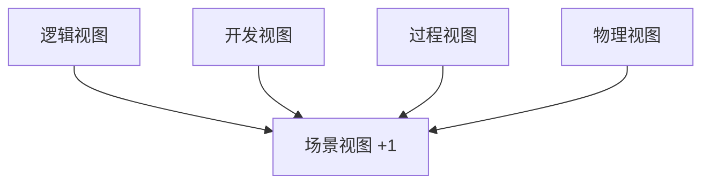
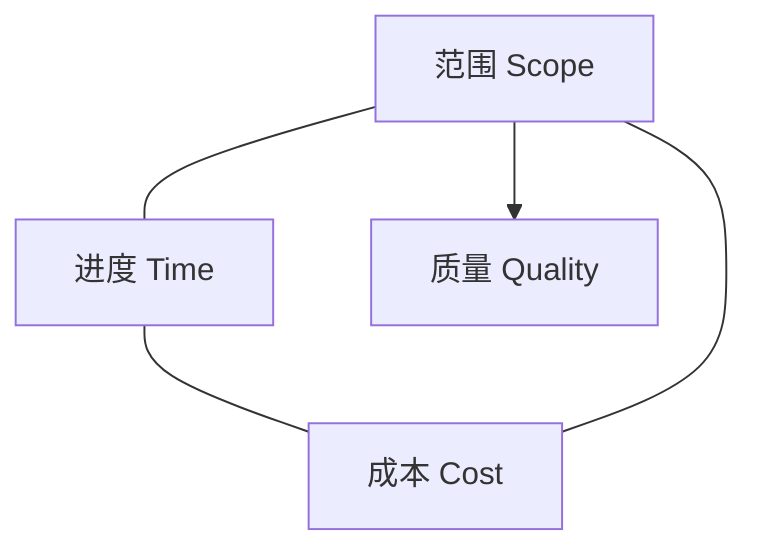
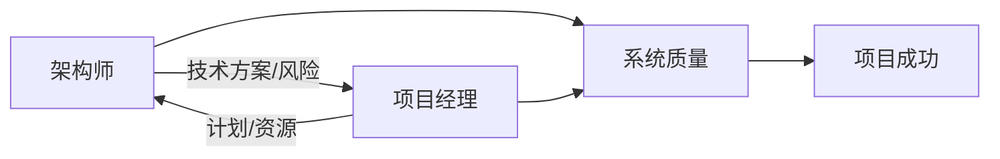

# 🏗️ 高级架构师 & 📊 高级项目管理师

> **定位**：技术系统长期演进的设计者 & 项目目标按期高质量达成的负责人  
> **目标**：构建一套 *可复用、可对比、可落地* 的方法论体系

---

## 一、必须遵守 vs 建议遵守的规律（方法论底座）

### 1. 架构 / 设计 / 实现领域

| 维度 | **必须严格遵守（Hard Rules）** | **建议遵守（Soft Rules）** | 说明示例 |
|---|---|---|---|
| 架构原则 | **高内聚、低耦合** **依赖倒置（DIP）** **单一职责（SRP）** **分层 / 分区隔离** | KISS（保持简单） YAGNI（不做无用功） 可演进架构 | 订单服务不应直接依赖数据库实现，而依赖接口 |
| 非功能需求 | **性能 / 可用性 / 安全性 / 扩展性** | 成本最优 运维友好 | 秒杀系统必须先满足可用性，再谈优雅 |
| 设计一致性 | **统一领域模型** **接口契约稳定** | 命名规范、文档完备 | API 版本化是硬要求 |
| 工程实践 | **代码评审** **自动化测试** **CI/CD** | 静态扫描、代码美学 | 没有回归测试不允许上线 |

---

### 2. 项目管理领域

| 维度 | **必须严格遵守** | **建议遵守** | 说明示例 |
|---|---|---|---|
| 项目约束 | **范围 / 进度 / 成本受控** | 质量与价值最大化 | 范围不冻结，项目一定失控 |
| 变更管理 | **变更评估 + 审批流程** | 变更缓冲池 | 需求临时插入必须评估影响 |
| 风险管理 | **风险识别、登记、跟踪** | 情景推演、预案 | 关键人离职是高风险 |
| 沟通机制 | **干系人定期沟通** | 可视化看板 | 周报是最低要求 |

---

## 二、岗位职责对比（系统化拆解）

## 🎯 高级架构师职责模型

| 层级 | 职责 | 重点 | 难点 | 示例 |
|---|---|---|---|---|
| 战略层 | 技术愿景 & 路线图 | 对齐业务战略 | 技术语言转业务语言 | 三年技术演进规划 |
| 架构层 | 系统拆分与边界 | 正确抽象 | 领域边界冲突 | DDD 限界上下文 |
| 设计层 | 架构决策 & 技术选型 | 非功能需求 | 性能/成本/安全平衡 | 选 Kafka 还是 MQ |
| 治理层 | 架构评审 & 技术债 | 长期健康 | 抗短期诱惑 | 架构红线机制 |

---

## 📊 高级项目管理师职责模型

| 知识域 | 职责 | 重点 | 难点 | 示例 |
|---|---|---|---|---|
| 范围管理 | 需求边界控制 | 防止范围蔓延 | 干系人博弈 | 需求冻结点 |
| 进度管理 | 计划 & 里程碑 | 关键路径 | 资源冲突 | CPM 关键路径 |
| 成本管理 | 预算与控制 | 成本偏差 | 隐性成本 | EV 分析 |
| 风险管理 | 识别与应对 | 前置风险 | 黑天鹅事件 | 应急储备 |
| 沟通管理 | 干系人对齐 | 信息透明 | 预期管理 | Steering Meeting |

---

## 三、架构师领域核心模型与视图

## 1️⃣ 4A 架构模型

| 维度 | 关注点 | 解决什么问题 | 示例 |
|---|---|---|---|
| Application | 应用系统结构 | 功能如何组织 | 微服务拆分 |
| Data | 数据模型与流向 | 数据一致性 | 主数据管理 |
| Technology | 技术平台 | 技术标准化 | 云原生平台 |
| Integration | 系统集成 | 系统协作 | API / MQ |

---

## 2️⃣ 4+1 架构视图

| 视图 | 面向对象 | 关注点 |
|---|---|---|
| 逻辑视图 | 业务/开发 | 功能与职责 |
| 开发视图 | 开发人员 | 模块组织 |
| 过程视图 | 架构师 | 并发与通信 |
| 物理视图 | 运维 | 部署拓扑 |
| 场景视图 | 所有人 | 验证正确性 |

---

## 3️⃣ 其他重要架构模型（对比）

| 模型 | 核心思想 | 优势 | 局限 | 适用场景 |
|---|---|---|---|---|
| **C4 模型** | 逐层放大 | 易沟通 | 不管治理 | 微服务 |
| **TOGAF** | 企业级方法 | 治理强 | 偏重流程 | 集团企业 |
| **Zachman** | 全视角矩阵 | 覆盖全面 | 落地难 | 架构蓝图 |
| **DDD** | 领域驱动 | 业务贴合 | 成本高 | 复杂业务 |
| **MDA** | 模型驱动 | 自动化 | 灵活性低 | 工业软件 |

---

## 四、项目管理领域核心模型

## 1️⃣ 项目铁三角

> **结论**：三者不可同时无限制放大，任何变化都必须联动调整

---

## 2️⃣ 其他重要项目管理模型（对比）

| 模型 | 核心关注 | 优势 | 适用场景 |
|---|---|---|---|
| **PMBOK** | 全流程管理 | 全面系统 | 传统项目 |
| **敏捷价值三角** | 价值优先 | 灵活 | 软件研发 |
| **PRINCE2** | 阶段控制 | 治理强 | 政企项目 |
| **EV（挣值）** | 量化监控 | 客观 | 大型项目 |
| **RACI** | 职责清晰 | 防扯皮 | 多角色协作 |
| **风险矩阵** | 风险优先级 | 简单有效 | 通用 |
| **看板 / 燃尽图** | 可视化进度 | 透明 | 敏捷团队 |

---

## 五、架构师 × 项目经理协同模型

| 维度 | 架构师 | 项目经理 |
|---|---|---|
| 关注周期 | 中长期 | 短中期 |
| 核心目标 | 系统可演进 | 项目可交付 |
| 风险类型 | 技术风险 | 计划风险 |

---

## ✅ 终极总结

> **优秀架构师解决“做对的系统”**  
> **优秀项目经理确保“系统按时做完”**  
> **真正的高手，能在两者之间持续做权衡与取舍**

